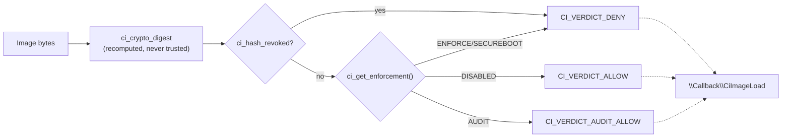

<!-- docs: covers=todo/02-kernel-core/TODO-19-code-integrity-trust-policy.md sources=include/kernel/ci/ci.h,src/kernel/ci/ci_policy.c,include/kernel/ci/ci_image.h,src/kernel/ci/ci_image.c,include/kernel/ci/ci_crypto.h,src/kernel/ci/ci_crypto.c,src/kernel/test/test_ci.c reviewed=2026-09-28 order=19 -->
# Code Integrity and Trust Policy

## What is it?

Code Integrity (CI) is the kernel's single decision point for whether a block of executable bytes may run, in ring 0 or ring 3. It answers one question every loader will eventually have to ask before mapping code: allow, audit-allow, or deny, and why. The decision engine, the crypto bridge it verifies signatures with, and the policy object that carries the current enforcement mode are built and unit-tested. No loader calls it yet: `ci_init()` and `ci_image_init()` are never invoked from any boot path, so every accessor lives permanently in its fail-closed pre-publish state.

## How does it work?

`ci_policy_t` (`ci.h`) is a flat, fixed-size struct: an ordered `enforcement` scalar (`CI_ENFORCE_DISABLED` through `CI_ENFORCE_SECUREBOOT`), separate `test_signing` and `measurement` permissive flags, a tri-state Secure Boot reading, up to 16 role-separated trust anchors (compiled-in, boot-added, firmware, revoked), and a flat list of up to 64 revoked hashes. `ci_policy_build_defaults()` is a pure builder: given a Secure Boot state and the config flags, it produces a candidate policy with no I/O, which is what lets the unit tests drive every branch without live boot state. `ci_init()` would call it once, in Phase 3, then publish the result with a release store so `ci_policy_get()` and friends need no lock on the hot path. Until that call exists, `ci_policy_sealed()` returns false and every accessor denies: `ci_get_enforcement()` reports `CI_ENFORCE_ENFORCE`, `ci_hash_revoked()` returns true for any hash (including NULL), by design (`ci_policy.c`).

`ci_validate_image()` (`ci_image.c`) is the decision engine on top of that policy. It never trusts a caller-supplied digest: it recomputes the hash over the image bytes itself, checks revocation first (which overrides every other outcome), and then maps an unverified image to a verdict by enforcement mode: `CI_ENFORCE_DISABLED` allows, `CI_ENFORCE_AUDIT` audit-allows and logs, `CI_ENFORCE_ENFORCE` and `CI_ENFORCE_SECUREBOOT` deny. `ci_validate_dynamic_code()` covers the JIT / W-to-X case: a writable-and-executable request is refused outright (`CI_REASON_WX`), and a non-W+X request is treated as unverified and mapped the same way. `ci_validate_image()` fires the `\Callback\CiImageLoad` notification object through `ExNotifyCallback` when `ci_image_init()` has created it, so a driver can observe image admission decisions once the object exists; `ci_validate_dynamic_code()` deliberately fires nothing, because the callback's contract needs an image.

`ci_crypto.c` is the allocation-free bridge the rest of the CI plane hashes and verifies through: SHA-256, SHA-384 and BLAKE2b-256 digests over `crypto_hash` and Monocypher, and native PureEd25519 signature verification. An unsupported algorithm, a malformed length or a NULL pointer denies rather than faulting. It does not probe pointers: callers must pass readable kernel input buffers and writable output storage. `CI_SIG_RSA_PKCS1` is reserved and always denies: real Authenticode-style verification needs an ASN.1/PKCS#7 parser this bridge does not have.



## What are its interfaces?

| Interface | Purpose |
| --- | --- |
| `ci_policy_t`, `ci_policy_build_defaults()`, `ci_init()` | The policy data model and the pure builder + (unwired) publisher ([`ci.h`](../../include/kernel/ci/ci.h)) |
| `ci_policy_get()`, `ci_get_enforcement()`, `ci_is_test_signing()`, `ci_is_measurement()`, `ci_policy_sealed()` | Lockless read-only accessors; fail closed before publish |
| `ci_hash_revoked()` | Revocation predicate; denies (returns true) on NULL, unsealed, or a listed hash |
| `ci_image_info_t`, `ci_decision_t`, `ci_verdict_t`, `ci_deny_reason_t` | The admission request/response shapes ([`ci_image.h`](../../include/kernel/ci/ci_image.h)) |
| `ci_validate_image()` | The image-admission decision engine ([`ci_image.c`](../../src/kernel/ci/ci_image.c)) |
| `ci_validate_dynamic_code()` | The JIT/W-to-X admission engine; refuses W+X outright |
| `ci_image_init()` | Creates the `\Callback\CiImageLoad` notification object |
| `ci_crypto_digest()`, `ci_crypto_digest_len()` | SHA-256/SHA-384/BLAKE2b-256 digest bridge ([`ci_crypto.h`](../../include/kernel/ci/ci_crypto.h)) |
| `ci_crypto_verify()` | Ed25519 signature verification (RSA reserved, always denies) |

## How do I use it?

Nothing calls CI today, so there is no enforcement to enable. The engine and its fixtures are exercised entirely by the unit suite:

```bash
bash scripts/test.sh SUITE=security   # or: make test-security
```

`test_ci.c` registers 14 `TEST_CAT_SECURITY` suites: the policy builder's fail-closed paths, the pre-publish accessor state, `ci_validate_image`'s allow/audit/deny/revoke matrix, the digest and Ed25519 verify bridge. They build in-memory `ci_policy_t` and `ci_image_info_t` fixtures through `ci_policy_publish_for_test()` and never touch live boot state, per the kernel test-side-effect policy. The Windows batch runner is `scripts\debug\kernel\run-security-tests.bat` (`SUITE=security`).

## What is not implemented yet?

- `ci_init()` and `ci_image_init()` are never called at boot, so every accessor stays permanently fail-closed and no loader observes a real verdict ([Code Integrity Policy Object](../../todo/02-kernel-core/TODO-19-code-integrity-trust-policy.md#1-code-integrity-policy-object)).
- Embedded signature validation for EIF, PE and ELF images is blocked on a signer-key delivery decision: the EIF signature block has no pubkey field to verify against ([Embedded Signature Validation](../../todo/02-kernel-core/TODO-19-code-integrity-trust-policy.md#4-embedded-signature-validation)).
- The catalog database (hash-to-signer mapping loaded from disk) has no on-disk format decision yet ([Catalog Database](../../todo/02-kernel-core/TODO-19-code-integrity-trust-policy.md#5-catalog-database)).
- Revocation is enforced in the engine, but there is no registry-backed population path or update notification for the revoked-hash list ([Revocation and Deny Lists](../../todo/02-kernel-core/TODO-19-code-integrity-trust-policy.md#6-revocation-and-deny-lists)).
- The policy digest is not recorded in a TPM PCR event log, and Secure Boot state is read but not bound to driver enforcement ([Measured-Boot and Secure Boot Binding](../../todo/02-kernel-core/TODO-19-code-integrity-trust-policy.md#7-measured-boot-and-secure-boot-binding)).
- No driver or `.kmod` image is validated at load, and no loader calls `ci_validate_image` for a user-mode image either ([Driver/Module Enforcement](../../todo/02-kernel-core/TODO-19-code-integrity-trust-policy.md#8-drivermodule-enforcement), [User-Mode Image Enforcement](../../todo/02-kernel-core/TODO-19-code-integrity-trust-policy.md#9-user-mode-image-enforcement)).
- There is no `NtQuerySystemInformation(SystemCodeIntegrityInformation)` or policy-refresh syscall, and no tamper-evident audit log; decisions currently reach only klog ([CI Audit, Telemetry, and Syscalls](../../todo/02-kernel-core/TODO-19-code-integrity-trust-policy.md#10-ci-audit-telemetry-and-syscalls)).

## How does it compare with Windows 11 and Linux?

Windows 11 enforces code integrity through `ci.dll` (CI/WDAC) with audit and enforce modes, Authenticode and catalog signatures, and HVCI binding to Secure Boot. Linux's closest equivalent is IMA/EVM appraisal, with measurement and enforcement modes and a keyring-based trust model. Impossible OS's decision engine and crypto bridge match the shape of both: an ordered enforcement scalar, revocation that overrides any allow, and role-separated trust anchors going beyond a flat certificate store. It is ahead of both in one respect only: `ci_crypto_verify` does native Ed25519 rather than routing every signature through RSA or ECDSA. Everywhere else it is behind, because nothing calls the engine yet: no catalog signatures, no measured-boot PCR binding, no driver or user-image enforcement, and no query syscall.

## See also

- [Code Integrity and Trust Policy roadmap](../../todo/02-kernel-core/TODO-19-code-integrity-trust-policy.md)
- [Object Manager](object-manager.md)
- [Kernel Security Hardening](kernel-security-hardening.md)
- [Native API and SSDT](native-api-ssdt.md)
