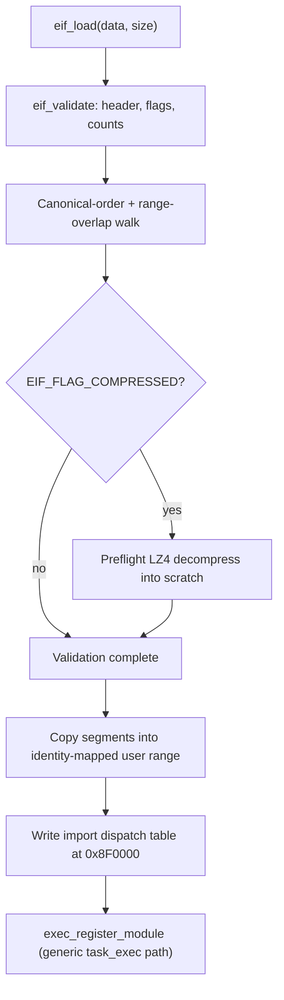

<!-- docs: covers=todo/02-kernel-core/TODO-20-eif-full-implementation.md sources=include/kernel/eif.h,src/kernel/eif.c,specs/eif-format.md,src/kernel/test/test_exec.c reviewed=2026-09-28 order=20 -->
# EIF Executable Format

## What is it?

EIF (Executable Impossible Format) is the native binary format for Impossible OS user-mode programs and modules: a 64-byte header, integer-only SSDT imports (no name-based symbol resolution), and an optional LZ4-compressed segment layout. It is not a replacement for the kernel's own image format: the kernel stays ELF indefinitely, and EIF is strictly the user-mode and module surface. The basic loader (segment copy, import dispatch table) shipped in `TODO-17-binary-system.md` section 5; this page documents the hardening layered on top of it in TODO-20: range-overlap validation, API version gating, metadata parsing, transparent decompression, and reserved CET flags. Segment permission enforcement, ASLR, per-process isolation, and code signing are still open.

## How does it work?

`eif_load()` (`eif.c`) validates before it mutates anything. `eif_validate()` walks the header first: magic, version, architecture, the segment and import counts against `EIF_MAX_SEGMENTS` (64) and `EIF_MAX_IMPORTS` (1024), and the flag bits against `EIF_FLAG_KNOWN_MASK`: any bit outside that mask is a hard reject, so a newer producer's flag can never be silently ignored by an older loader. It then walks segment, import, metadata and signature ranges in a single ascending cursor, enforcing the spec's canonical file order (segment table, import table, segment data, metadata, signature) and rejecting any overlap in one O(n) pass. Only after every segment, import and the entry point pass does `eif_load` copy a single byte, so a rejected file leaves the loader's own targets unwritten. That does not preserve the old image through `task_exec`: by the time the loader runs, `task_exec` has already remapped the image window onto fresh frames, so a rejected binary terminates the process with `TASK_EXIT_EXEC_IMAGE_DESTROYED`.

`api_version` is checked against `EIF_CURRENT_API_VERSION` (currently 1): a binary that declares a newer API than the loader provides is rejected before the segment copy. The optional metadata section is a bounded key-value walk (`eif_parse_metadata()`) capped at `EIF_MAX_METADATA_RECORDS` (64) records, decoding `name`, `version`, `author`, `min_os` and a raw `build_id` blob into `eif_metadata_t`; the parsed `name` is what a first-load `task_exec` uses for the crash-registry module name. `EIF_FLAG_COMPRESSED` segments carry an LZ4 stream: `eif_decompress_segment()` preflights every compressed segment during validation (one scratch buffer, verified length) so a corrupt stream is caught before the mutation phase re-decodes it directly into the user range. A `EIF_FLAG_SIGNED` binary is currently rejected outright: signature verification is not implemented.

Once validation passes, segments are copied into the user image window and the import dispatch table is written to a fixed address inside it, `EIF_DISPATCH_TABLE_ADDR` (`0x8F0000`), one `eif_dispatch_entry_t` per import (`{syscall_id, available}`). The program reads the service number from its entry and issues `SYSCALL` itself; the table holds integers, not callable addresses. `task_exec` registers the image in the global module table tagged `EXEC_FMT_EIF` only when no module already covers its entry address, so a re-exec in the same window can leave the previous image's name and format in that table.



## What are its interfaces?

| Interface | Purpose |
| --- | --- |
| `eif_header_t`, `eif_segment_t`, `eif_import_t` | The 64/32/8-byte on-disk structures ([`eif.h`](../../include/kernel/eif.h)) |
| `eif_load()` | The loader entry point; returns the entry address or 0 ([`eif.c`](../../src/kernel/eif.c)) |
| `eif_flags_known()` | Public mask check against `EIF_FLAG_KNOWN_MASK`, shared with producers |
| `eif_parse_metadata()` | Pure key-value metadata decoder into `eif_metadata_t` |
| `eif_decompress_segment()` | Pure LZ4 decompress-and-verify for one compressed segment |
| `EIF_DISPATCH_TABLE_ADDR`, `eif_dispatch_entry_t` | The fixed shared import dispatch table (`0x8F0000`, 1024 entries) |
| `EIF_FLAG_CET_IBT`, `EIF_FLAG_CET_SHSTK` | Reserved, validated, unenforced CET compatibility bits |
| `specs/eif-format.md` | The normative on-disk format specification |

## How do I use it?

EIF loading is always on: any process exec'd against a valid EIF image goes through this path with no configuration.

```bash
bash scripts/test.sh SUITE=exec   # or: make test-exec
```

The EIF tests currently live inside [`test_exec.c`](../../src/kernel/test/test_exec.c) under `TEST_CAT_EXEC` (moving them into a dedicated `test_eif.c` is an open item in the TODO's Unit Tests section): header/flag validation, range-overlap rejection, API version gating, metadata parsing and its truncation/overflow rejects, and LZ4 round-trip plus corruption rejects. The Windows batch runner is `scripts\debug\kernel\run-exec-tests.bat` (`SUITE=exec`).

## What is not implemented yet?

- Segment permissions (NX on data, read-only on rodata) are not enforced: `vmm_set_ro`/`vmm_set_nx` only operate on the kernel PML4, so anything `eif_load` set would be invisible under the per-process PML4 a task actually runs on ([Segment Permission Enforcement](../../todo/02-kernel-core/TODO-20-eif-full-implementation.md#2-segment-permission-enforcement-rwx-via-pte)).
- Loader-owned module registration with the true load range is not built: registration today uses the generic `task_exec` path, which records the whole user ELF window rather than the actual segment span ([Module Registration for EIF](../../todo/02-kernel-core/TODO-20-eif-full-implementation.md#3-module-registration-for-eif)).
- Optional imports have no callable stub: an unavailable optional import has no `STATUS_NOT_IMPLEMENTED` dispatch slot yet ([Optional Import Stubs](../../todo/02-kernel-core/TODO-20-eif-full-implementation.md#7-optional-import-stubs)).
- ASLR for `load_base=0` binaries is not implemented; it needs process-private image frames before randomizing the base would carry any real entropy ([EIF ASLR](../../todo/02-kernel-core/TODO-20-eif-full-implementation.md#8-eif-aslr-load_base0-randomization)).
- The import dispatch table at `0x8F0000` is only as private as the image window: a task that exec'd from an existing process has the window on its own frames, but a launcher-spawned task's window is still backed by shared identity-mapped frames ([Per-Process Dispatch Table Isolation](../../todo/02-kernel-core/TODO-20-eif-full-implementation.md#9-per-process-dispatch-table-isolation)).
- `EIF_FLAG_SIGNED` binaries are rejected outright: the signature block has no signer-key field to verify against yet ([EIF Signature-Block ABI](../../todo/02-kernel-core/TODO-20-eif-full-implementation.md#11-eif-signature-block-abi-signer-key-delivery)).
- There is no resource section, so an EIF cannot carry an SVG app icon yet ([Resource Section with SVG Icons](../../todo/02-kernel-core/TODO-20-eif-full-implementation.md#12-resource-section-with-svg-icons)).

## How does it compare with Windows 11 and Linux?

Windows PE and Linux ELF both check segment permissions and file ranges only partially at load time, and both pay a slow name-resolution cost (IAT fixups, PLT/GOT) that EIF's integer SSDT imports avoid entirely. EIF's shipped hardening already exceeds both here: strict canonical-order and range-overlap validation (rule 2), an explicit `api_version` gate neither format has, a built-in metadata section, and transparent LZ4-compressed segments that neither loader supports natively. Where PE and ELF are still ahead is exactly the parity work this TODO has not shipped: real per-segment R/W/X enforcement, ASLR, and a working code-signing pipeline (Authenticode and PE/module-appended signatures respectively), all still open here.

## See also

- [EIF Full Implementation roadmap](../../todo/02-kernel-core/TODO-20-eif-full-implementation.md)
- [Code Integrity and Trust Policy](code-integrity-trust-policy.md)
- [Native API and SSDT](native-api-ssdt.md)
