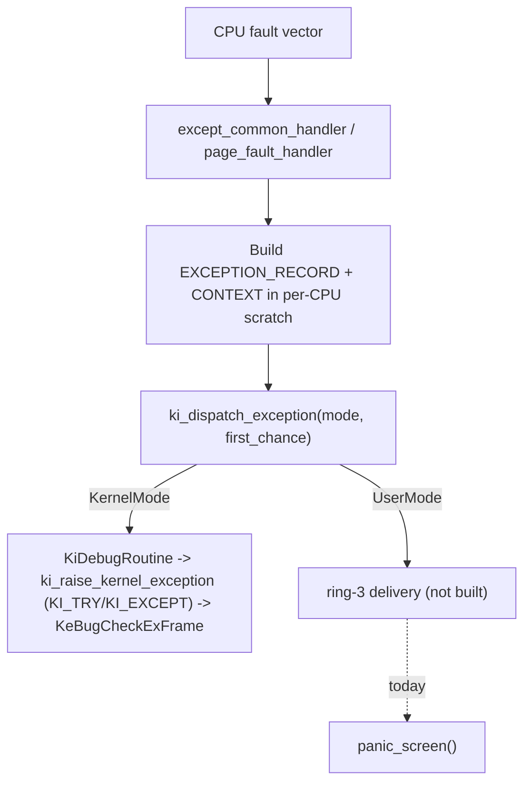

<!-- docs: covers=todo/02-kernel-core/TODO-23-exception-dispatch-seh.md sources=include/kernel/except.h,src/kernel/except.c,src/kernel/except_seh.asm,include/kernel/rtl/unwind.h,src/kernel/rtl/unwind.c,src/kernel/mm/vmm.c,src/kernel/cpu_security.c,include/kernel/nt/zw.h,src/kernel/nt/ssdt.c,src/kernel/wer.c,include/kernel/wer.h,src/kernel/test/test_except.c reviewed=2026-09-28 order=23 -->
# Exception Dispatch and SEH

## What is it?

Impossible OS replaces "every CPU exception panics" with a Windows-shaped exception pipeline: a captured `CONTEXT` and `EXCEPTION_RECORD`, a page-fault triage layer that tells a recoverable fault from a fatal one, x64 table-based unwinding, kernel-mode `__try`/`__except`, and fault-recoverable copies to and from user memory. It is the kernel half of the contract only: the ring-3 half (`KiUserExceptionDispatcher`, VEH/SEH/VCH walking, the top-level filter) belongs to ntdll and has not landed, so a faulting user-mode process still terminates the whole kernel today rather than just itself.

## How does it work?

Every CPU fault vector the kernel cares about is registered by `except_init()` and, for #PF, by `vmm_register_page_fault_handler()`, both called from `boot_phase1()` ([`except.c`](../../src/kernel/except.c)). Each handler builds an `EXCEPTION_RECORD` and a control/integer `CONTEXT` ([`context_from_frame()`](../../include/kernel/except.h)) in cache-line-aligned per-CPU scratch, not on the faulting stack, then calls the master dispatcher `ki_dispatch_exception(rec, ctx, frame, mode, first_chance)`. For a kernel-mode fault the dispatcher notifies an attached kernel debugger (`KiDebugRoutine`, currently always NULL), then kernel-mode SEH (`ki_raise_kernel_exception()`), then bugchecks via `KeBugCheckExFrame()` (STOP `0x1E` or `0x3B` if a syscall was in flight). For a user-mode fault the dispatcher offers the fault to an attached user-mode debug port (`DbgkForwardException()`), then declines, because the ring-3 delivery leg (`KiUserExceptionDispatcher`, section 5) is unbuilt. The fault handler then writes a WER report and calls `panic_screen()`, which halts the whole system; terminating only the faulting process is still deferred work.



Kernel-mode `__try`/`__except` (`KI_TRY`/`KI_EXCEPT`, [`except.h`](../../include/kernel/except.h)) works today: a per-thread registration list on the kernel stack, walked by `ki_raise_kernel_exception()`, which rewrites the trap frame so `IRETQ` resumes inside the `KI_EXCEPT` block rather than re-faulting. A fault re-entering the walk escalates straight to `KeBugCheckExFrame(0x1E)`. Separately, `try_copy_from_user()`/`try_copy_to_user()` ([`zw.h`](../../include/kernel/nt/zw.h)) give any syscall handler a byte-oriented, fault-recoverable copy: a static, RIP-keyed exception table in `cpu_security.c` redirects a #PF taken at a guarded copy instruction to its fixup, so an unmapped user pointer returns `STATUS_ACCESS_VIOLATION` instead of crashing the kernel. Both helpers probe with an alignment of 1, so they accept a misaligned pointer; a syscall whose ABI needs an aligned structure must check alignment itself (an explicit `ProbeForRead()` alignment failure returns `STATUS_DATATYPE_MISALIGNMENT`). This is fault recovery, not isolation: a mapped pointer in the user range is copied whatever it aliases.

The x64 table-based unwind engine (`RtlLookupFunctionEntry`, `RtlVirtualUnwind`, `RtlUnwindEx`) and kernel-mode stack walking (`RtlCaptureStackBackTrace`, an RBP chain walk through the fault-safe `__kstack_read_u64`) are both shipped and proven against synthetic `RtlAddFunctionTable` tables, since the kernel is ELF and has no `.pdata` of its own ([`unwind.c`](../../src/kernel/rtl/unwind.c)). Vectored Exception/Continue Handlers (VEH/VCH) are represented only as a shared 24-byte `VECTORED_HANDLER_ENTRY` node ABI in the kernel; the actual process-global lists, `AddVectoredExceptionHandler`, and the walk all live in ntdll, which does not exist yet, so no kernel code ever anchors or walks a VEH/VCH list. User-mode dispatch outcomes (resolved by the debug port, or unhandled) are logged as `exception_dispatch` JSON events via `except_log_dispatch()`, which drops events once a per-process or system-wide budget for the current window is spent; kernel-mode decisions return or bugcheck without that event.

## What are its interfaces?

| Interface | Purpose |
| --- | --- |
| `EXCEPTION_RECORD`, `CONTEXT`, `EXCEPTION_POINTERS` | The Windows-ABI exception types (`CONTEXT` is 1232 bytes) ([`except.h`](../../include/kernel/except.h)) |
| `context_from_frame()`, `frame_from_context()` | Convert between an ISR `interrupt_frame` and a `CONTEXT` |
| `ki_dispatch_exception()`, `ki_raise_kernel_exception()` | The master dispatcher and the kernel-SEH entry it calls |
| `KI_EXCEPTION_FRAME(reg)`, `KI_TRY(reg)`, `KI_EXCEPT(reg)`, `KI_END_TRY` | Kernel-mode structured exception handling for drivers |
| `ProbeForRead()`, `ProbeForWrite()` | Range/alignment check plus a page-touch for write (`src/kernel/nt/ssdt.c`) |
| `try_copy_from_user()`, `try_copy_to_user()` | Fault-recoverable user-memory copies ([`zw.h`](../../include/kernel/nt/zw.h)) |
| `RtlLookupFunctionEntry()`, `RtlVirtualUnwind()`, `RtlUnwindEx()` | x64 table-based unwind ([`unwind.h`](../../include/kernel/rtl/unwind.h)) |
| `RtlCaptureStackBackTrace()`, `RtlWalkFrameChain()` | Kernel-mode stack walking |
| `RtlAddFunctionTable()`, `RtlDeleteFunctionTable()`, `RtlInstallFunctionTableCallback()` | Dynamic/JIT unwind table registration |
| `WerpReportFault()` | Serial-only crash-report stub ([`wer.h`](../../include/kernel/wer.h)) |
| `except_log_dispatch()` | Budgeted JSON exception-dispatch telemetry for user-mode faults |

## How do I use it?

The fault handlers, `KI_TRY`/`KI_EXCEPT`, and `try_copy_*_user()` are always active; there is no configuration.

```bash
bash scripts/test.sh SUITE=except   # or: make test-except
```

A driver guarding an MMIO or DMA read declares `KI_EXCEPTION_FRAME(reg);`, then writes `KI_TRY(reg)` followed by the guarded statements, `KI_EXCEPT(reg)` followed by the recovery statements, and `KI_END_TRY;` (no braces; the header's own example is the reference), at `PASSIVE_LEVEL` or `APC_LEVEL` only. A syscall handler copying a user buffer should call `try_copy_from_user()`/`try_copy_to_user()` rather than a raw `memcpy`, since only the guarded path recovers from an unmapped page. The suite lives in [`test_except.c`](../../src/kernel/test/test_except.c) under `TEST_CAT_EXCEPT`, including a live test that triggers a real #PF against `KI_TRY` and confirms the kernel keeps running.

## What is not implemented yet?

- **Ring-3 exception delivery (`KiUserExceptionDispatcher`).** Blocked on a per-CPU current-thread cursor and a real ntdll mapping that publishes the dispatcher's VA; every unhandled user-mode fault still resolves to `panic_screen()` instead of terminating only the faulting process ([KiUserExceptionDispatcher -- Ring-3 Exception Delivery](../../todo/02-kernel-core/TODO-23-exception-dispatch-seh.md#5-kiuserexceptiondispatcher----ring-3-exception-delivery)).
- **`RtlDispatchException` and `__C_specific_handler` (the ring-3 SEH scope-table walk).** Re-owned to ntdll; the kernel never runs a user handler ([SEH Chain Walk and `__try`/`__except` Frame Dispatch](../../todo/02-kernel-core/TODO-23-exception-dispatch-seh.md#8-seh-chain-walk-and-__try__except-frame-dispatch)).
- **Guard-page stack auto-grow.** Needs the same per-CPU thread cursor plus a reserved-VA lazy-commit stack layout; stacks today are contiguous identity-mapped allocations with no headroom to grow into ([Guard-Page Stack Auto-Grow](../../todo/02-kernel-core/TODO-23-exception-dispatch-seh.md#17-guard-page-stack-auto-grow----commitreserve-tracking-guard-re-arm-terminal-overflow)).
- **POSIX signal delivery for the Linux compat layer.** `CONFIG_LINUX_COMPAT`, `compat_mode`, and `rt_sigaction` do not exist anywhere in `src/kernel/`; this section additionally depends on an entirely open Linux-compat TODO ([POSIX Signal Delivery from Exceptions](../../todo/02-kernel-core/TODO-23-exception-dispatch-seh.md#15-posix-signal-delivery-from-exceptions-linux-compat)).
- **The `NtRaiseException`/`NtContinue` full-frame syscalls.** Depend on the same ring-3 delivery infrastructure as `KiUserExceptionDispatcher` ([KiUserExceptionDispatcher](../../todo/02-kernel-core/TODO-23-exception-dispatch-seh.md#5-kiuserexceptiondispatcher----ring-3-exception-delivery)).
- **Full `EXCEPTION_COLLIDED_UNWIND` recovery in `RtlUnwindEx`.** Only the in-place single-level collision is adopted; a nested collision with a distinct context record fails safe with `STATUS_BAD_STACK` ([RtlUnwindEx](../../todo/02-kernel-core/TODO-23-exception-dispatch-seh.md#9-rtlunwindex----unwind-to-a-target-frame)).

## How does it compare with Windows 11 and Linux?

The types, dispatcher shape, unwind engine, VEH/VCH node ABI, and fault-recoverable usercopy all follow Windows' kernel-mode exception model directly (Linux has no equivalent to `CONTEXT`, SEH, or vectored handlers, relying instead on signals and `__ex_table`). Where Impossible OS is furthest behind both is the delivery half: Windows and Linux both get a faulting user process a chance to handle its own fault (via SEH/VEH or a signal handler) and, failing that, terminate only that process; here, an unhandled user-mode fault still brings down the whole kernel, because ring-3 delivery, ntdll, and the Linux-compat signal layer are all unbuilt. One piece is exclusive to Impossible OS: user-mode exception dispatch outcomes recorded as structured JSON (neither WER nor a Linux core dump records the dispatch decision), with per-process and system-wide budgets so an exception-flooding process cannot flood the log. The budget only limits logging; it does not throttle or terminate the flooding process.

## See also

- [Exception Dispatch & SEH roadmap](../../todo/02-kernel-core/TODO-23-exception-dispatch-seh.md)
- [IRQL, DPCs and APCs](irql-dpc.md)
- [PEB, TEB and the User-Mode ABI](peb-teb-user-abi.md)
