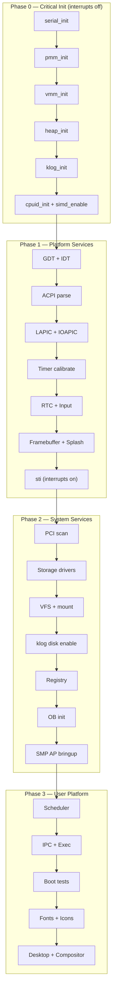

# Kernel Init Sequencing

> Four-phase dependency-gated boot sequence with typed results, subsystem readiness oracle, POST codes, and degraded-boot recovery UI.

## Overview

Impossible OS boots through four sequential phases, each with explicit dependency gates and typed results. Every subsystem init returns `boot_result_t` (`BOOT_OK`, `BOOT_DEGRADED`, `BOOT_FATAL`). A subsystem readiness oracle (`kernel_subsystem_ready()`) tracks which subsystems are online. Fatal failures halt or show a recovery screen; degraded failures log and continue.

---

## Boot Result Type

Defined in `include/kernel/boot_init.h`:

| Value | Name | Meaning |
|---|---|---|
| 0 | `BOOT_OK` | Subsystem initialized successfully |
| 1 | `BOOT_DEGRADED` | Initialized with reduced capability — log and continue |
| 2 | `BOOT_FATAL` | Cannot proceed — halt or show recovery screen |

---

## Subsystem Readiness Oracle

21 tracked subsystems in `kernel_subsys_t`:

| ID | Name | Phase | Critical? |
|---|---|---|---|
| 0 | `SUBSYS_SERIAL` | 0 | Yes |
| 1 | `SUBSYS_PMM` | 0 | Yes |
| 2 | `SUBSYS_VMM` | 0 | Yes |
| 3 | `SUBSYS_HEAP` | 0 | Yes |
| 4 | `SUBSYS_KLOG` | 0 | Yes |
| 5–6 | `SUBSYS_GDT`, `SUBSYS_IDT` | 1 | Yes |
| 7–9 | `SUBSYS_ACPI`, `SUBSYS_LAPIC`, `SUBSYS_IOAPIC` | 1 | Yes/Degraded |
| 10–12 | `SUBSYS_TIMER`, `SUBSYS_RTC`, `SUBSYS_FB` | 1 | Yes/Degraded |
| 13–14 | `SUBSYS_VFS`, `SUBSYS_REGISTRY` | 2 | Yes |
| 15–18 | `SUBSYS_SCHED`, `SUBSYS_IPC`, `SUBSYS_SMP`, `SUBSYS_EXEC` | 2–3 | Yes/Degraded |
| 19–20 | `SUBSYS_DESKTOP`, `SUBSYS_OB` | 2–3 | Degraded |

**API:**

| Function | Purpose |
|---|---|
| `kernel_subsystem_ready(subsys)` | Returns true if subsystem completed init |
| `kernel_subsystem_set_ready(subsys, ok)` | Record readiness state |
| `kernel_subsystem_dump()` | Print all subsystem states to serial |
| `BOOT_REQUIRE(subsys)` | Guard macro — returns `BOOT_FATAL` if dependency not ready |

---

## Phase Details

### Phase 0 — Critical Init (Interrupts Off)

**File:** `src/kernel/main/boot_hw.c`

Runs with interrupts disabled. Only serial, memory, and logging. Any failure calls `boot_halt()` — framebuffer is not yet available.

| Step | POST Code | Dependency | Failure |
|---|---|---|---|
| `serial_init()` | 0x0010 | None | FATAL |
| UEFI runtime + vars + time + SecureBoot + TPM | 0x0012–0x0019 | Serial | DEGRADED |
| `pmm_init()` | 0x0020 | None | FATAL |
| `vmm_init()` | 0x0030 | PMM | FATAL |
| `heap_init()` | 0x0040 | VMM | FATAL |
| `klog_init()` | 0x0050 | HEAP | FATAL |
| `cpuid_init()` + `simd_enable()` | 0x0060–0x0090 | KLOG | DEGRADED |

### Phase 1 — Platform Services

**File:** `src/kernel/main/boot_interrupts.c`

Hardware abstraction: GDT/IDT, interrupt controllers, timer, display. Interrupts enabled with `sti` at the end.

| Step | POST Code | Dependency | Failure |
|---|---|---|---|
| GDT + IDT + IRQ | 0x1000–0x1011 | None | FATAL |
| ACPI (MADT/FADT) | 0x1020 | IDT | FATAL |
| LAPIC + IOAPIC | 0x1030 | ACPI | FATAL/DEGRADED |
| RTC | 0x1050 | IDT | DEGRADED |
| Keyboard + Mouse | 0x1060–0x1070 | IDT | DEGRADED |
| Framebuffer + Splash | 0x1080 | None | DEGRADED |
| SMBIOS | 0x10A0 | None | DEGRADED |
| Timer calibrate | 0x1040 | IDT | FATAL |

### Phase 2 — System Services

**File:** `src/kernel/main/boot_storage.c`

Storage, VFS, registry, Object Manager, network, SMP. Fatal only if VFS or registry are completely broken.

| Step | POST Code | Dependency | Failure |
|---|---|---|---|
| PCI scan | 0x2000 | None | DEGRADED |
| Storage drivers (ATA/AHCI/NVMe) | 0x2050 | None | DEGRADED |
| VFS + partition mount | 0x2060–0x2070 | HEAP | FATAL |
| klog disk enable | — | VFS | DEGRADED |
| Object Manager | 0x20B0 | HEAP | FATAL |
| Registry | 0x2080 | VFS | FATAL |
| SMP AP bringup | 0x2090 | HEAP + REGISTRY | DEGRADED |

### Phase 3 — User Platform

**File:** `src/kernel/main/boot_desktop.c`

Scheduler, IPC, exec, desktop. Failures fall back to serial console, not BSOD.

| Step | POST Code | Dependency | Failure |
|---|---|---|---|
| Scheduler | 0x3000 | HEAP + TIMER | FATAL |
| IPC (pipe/shmem/signal) | — | SCHED | DEGRADED |
| Exec loader | — | VFS | DEGRADED |
| Boot tests (debug=1 only) | — | SCHED | — |
| Fonts + Icons + Cursors | 0x3020–0x3025 | VFS | DEGRADED |
| Desktop + Compositor | 0x3030 | FB | DEGRADED |

---

## Failure Policy

| Phase | Failure | Action |
|---|---|---|
| 0 | Any | `boot_halt()` — serial message + halt (no framebuffer) |
| 1 | FATAL | BSOD + halt (FB available by end of Phase 1) |
| 1 | DEGRADED | `klog(WARN)` + mark not ready, continue |
| 2 | FATAL | Recovery screen if VFS up, else BSOD |
| 2 | DEGRADED | `klog(WARN)` + continue |
| 3 | Any | `klog(ERROR)` + serial console fallback |

### Degraded-Boot Recovery Screen

When a Phase 2 subsystem fails, `boot_recovery_show()` renders a graphical recovery panel directly on the framebuffer (no compositor needed). Shows the failed subsystem, POST code, and a three-option menu:

- **[R] Retry** — re-attempt the failed init
- **[C] Serial console** — drop to serial-only mode
- **[P] Power off** — ACPI shutdown

**Files:** `src/kernel/main/boot_recovery.c`, `include/kernel/boot_recovery.h`

---

## POST Codes & UEFI NVRAM

Every phase boundary writes the current POST code to:
1. **Serial log** — `[PHASEn] step (0xNNNN)` format
2. **VPD** (Visual POST Display) — on-screen hex code
3. **UEFI NVRAM** — `ImpossiblePOST` variable survives reboot

On successful boot: final code `0xFF00` (`POST16_BOOT_OK`). On halt/panic: `0xFFFE` (`POST16_BOOT_FAILED`). On next boot, Phase 0 reads the prior code: `[BOOT] Last boot succeeded` or `[BOOT] Last boot failed`.

---

## Key Files

| File | Purpose |
|---|---|
| `include/kernel/boot_init.h` | `boot_result_t`, `kernel_subsys_t`, `BOOT_REQUIRE`, POST constants |
| `src/kernel/main/boot_init.c` | Readiness oracle, `boot_progress()`, subsystem dump |
| `src/kernel/main.c` | `kernel_main()` → 4 phase calls |
| `src/kernel/main/boot_hw.c` | Phase 0 — serial, memory, logging |
| `src/kernel/main/boot_interrupts.c` | Phase 1 — GDT/IDT, APIC, timer, display |
| `src/kernel/main/boot_storage.c` | Phase 2 — storage, VFS, registry, OB, SMP |
| `src/kernel/main/boot_desktop.c` | Phase 3 — scheduler, IPC, desktop |
| `src/kernel/main/boot_recovery.c` | Degraded-boot recovery screen |
| `src/kernel/main/boot_halt.c` | Emergency halt with serial + subsystem dump |
| `src/kernel/boot_timing.c` | TSC-based phase timing + FPDT |
| `src/kernel/test/test_boot_init.c` | 8 test suites, 19 assertions |
| `resources/boot/boot.conf` | `debug=`, `test=`, `postcode=` flags |

---

## Gotchas

> [!CAUTION]
> **Phase 0 has no framebuffer.** Any failure before `fb_init()` (end of Phase 1) must use `boot_halt()` which writes to serial only. Calling `panic()` or `printk()` to the framebuffer will crash.

> [!WARNING]
> **`boot_progress()` is NULL-safe.** Passing NULL for the step name produces `(null)` in the serial log. This was a real bug fixed during test development (2026-04-01).

> [!NOTE]
> **`BOOT_REQUIRE` uses `return`.** The macro expands to `return BOOT_FATAL`, so it can only be used inside functions that return `boot_result_t`. Test it via wrapper functions.

> [!NOTE]
> **Some init functions still return `void`.** `task_init()`, `pipe_init()`, `pmm_init()`, `vmm_init()`, `heap_init()`, `vfs_init()` have not yet been migrated to `boot_result_t`. Tracked in their respective subsystem TODOs.

---

## OS Comparison

| Feature | Win11 | Linux | Impossible OS |
|---|---|---|---|
| Formal phase model | Phase 0/1 boot drivers | initcall levels (0–7) | 4 phases (0–3) with explicit boundaries |
| Dependency ordering | Boot load groups | initcall dependency | `BOOT_REQUIRE(subsys)` macro |
| Typed init results | NTSTATUS | initcall_t (int) | `boot_result_t` (OK/DEGRADED/FATAL) |
| Readiness oracle | Private internal | `system_state` global | Public `kernel_subsystem_ready()` API |
| Halt on critical fail | KeBugCheck | panic() | `boot_halt()` (Phase 0) / BSOD (Phase 1+) |
| Degraded boot | Safe Mode (separate boot) | Emergency shell | In-kernel recovery screen (same boot) |
| POST to UEFI NVRAM | Firmware-only | Not implemented | `ImpossiblePOST` variable survives reboot |
| Boot serial log | DebugPrint/ETW | early_printk | `[PHASEn] step (0xNNNN)` with timestamps |

---

## References

- Source: `src/kernel/main/`, `include/kernel/boot_init.h`
- Tests: `src/kernel/test/test_boot_init.c` (8 suites, 19 assertions)
- Boot config: `resources/boot/boot.conf`
- Related: [Development Tooling](../infrastructure/development-tooling.md), [Kernel Test Framework](../infrastructure/kernel-test-framework.md)
