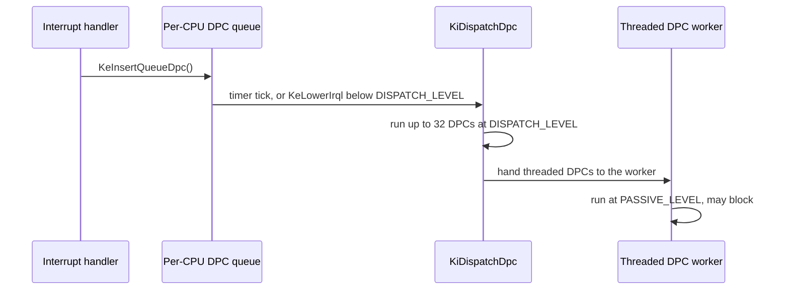

<!-- docs: covers=todo/02-kernel-core/TODO-07-irql-model-dpcs.md sources=include/kernel/sched/irql.h,src/kernel/sched/irql.c,include/kernel/sched/dpc.h,src/kernel/sched/dpc.c,include/kernel/sched/dpc_config.h,include/kernel/sched/apc.h,src/kernel/sched/apc.c,include/kernel/sched/ktimer.h,src/kernel/sched/ktimer.c,include/kernel/sched/kinterrupt.h,src/kernel/sched/kinterrupt.c,include/kernel/sched/kworker.h,src/kernel/sched/kworker.c,src/kernel/idt.c,src/kernel/drivers/lapic.c,src/kernel/test/test_sched.c,src/kernel/test/test_kworker.c reviewed=2026-09-28 order=7 -->
# IRQL, DPCs and APCs

## What is it?

Impossible OS uses the Windows Interrupt Request Level (IRQL) to answer one question everywhere in the kernel: what is legal right now. `KIRQL` is a per-CPU level from `PASSIVE_LEVEL` (thread code, everything allowed) through `APC_LEVEL`, `DISPATCH_LEVEL` and device levels to `HIGH_LEVEL` (almost nothing allowed). A Deferred Procedure Call (DPC) is the bottom half at `DISPATCH_LEVEL`: an interrupt handler acknowledges its device, queues a DPC and returns, and the DPC does the rest moments later. An Asynchronous Procedure Call (APC) is the per-thread counterpart: work queued onto one thread that runs when that thread reaches a delivery point.

## How does it work?

Each CPU keeps its own `current_irql`, starting at `PASSIVE_LEVEL`. `KeRaiseIrql()` rejects a raise to a lower level and writes the LAPIC Task Priority Register only when the mapped priority actually changes, so moving between `PASSIVE_LEVEL` and `APC_LEVEL` (both priority 0) costs no hardware write. `KeLowerIrql()` restores a saved level and, as it drops, drains pending DPCs and APCs ([`irql.c`](../../src/kernel/sched/irql.c)).

Interrupt entry in `isr_handler()` ([`idt.c`](../../src/kernel/idt.c)) raises `current_irql` to the vector's level and restores it on exit, in software only; the LAPIC's own in-service priority already masks lower vectors during delivery.

A DPC is a `KDPC` (routine, context, two arguments and a queue link) queued on a per-CPU FIFO, each protected by an irqsave spinlock and cache-line aligned so the interrupt path does not false-share ([`dpc.h`](../../include/kernel/sched/dpc.h)). `KeInsertQueueDpc()` allocates nothing and is safe from interrupt handlers; high-importance DPCs go to the head. `KiDispatchDpc()` raises to `DISPATCH_LEVEL`, takes up to 32 DPCs per pass (`DPC_BATCH_LIMIT`) under the lock and runs them after releasing it. It runs from the LAPIC and PIT timer interrupts after end-of-interrupt ([`lapic.c`](../../src/kernel/drivers/lapic.c)), and whenever `KeLowerIrql()` drops below `DISPATCH_LEVEL`.

Threaded DPCs (`KeInitializeThreadedDpc`) are for work that must block or page. The dispatcher moves them to a per-CPU threaded list and one worker thread, started at boot, runs every CPU's threaded DPCs at `PASSIVE_LEVEL`. `KeFlushQueuedDpcs()` is a completion barrier: it waits until every CPU's normal and threaded queues are empty and nothing is in flight, and bugchecks with `DPC_WATCHDOG_VIOLATION` rather than return early if a DPC never settles.

APCs follow the same design one level up. A `KAPC` ([`apc.h`](../../include/kernel/sched/apc.h)) is queued on the target thread under its lock: special kernel APCs to the head, normal ones to the tail, and nothing onto a thread that is exiting. When IRQL drops below `APC_LEVEL`, special APCs run; normal APCs additionally run at `PASSIVE_LEVEL`. `KeEnterCriticalRegion` holds off normal APCs and `KeEnterGuardedRegion` holds off special ones too. A dying thread's queued APCs get their rundown routine.

Two helpers sit on top. `KeSetTimerEx()` ([`ktimer.h`](../../include/kernel/sched/ktimer.h)) queues a DPC automatically when a timer expires. `kworker` ([`kworker.h`](../../include/kernel/sched/kworker.h)) is a single thread for periodic callbacks of a second or more that may call slow paths such as UEFI runtime services.

A fairness layer watches both queues: a per-CPU budget of 256 DPCs per tick (`DPC_BUDGET_PER_TICK`, carry-over capped at 512) flags monopolization, and a watchdog fires when one DPC runs longer than 100 microseconds (`DPC_WATCHDOG_SINGLE_DPC_US` in [`dpc_config.h`](../../include/kernel/sched/dpc_config.h)), warning by default or bugchecking in strict mode.



## What are its interfaces?

| Interface | Purpose |
| --------- | ------- |
| `KeGetCurrentIrql()`, `KeRaiseIrql()`, `KeLowerIrql()` | Read and change the current CPU's IRQL ([`irql.h`](../../include/kernel/sched/irql.h)) |
| `IRQL_REQUIRE_AT_MOST(level)`, `IRQL_REQUIRE_AT_LEAST(level)` | Contract checks that log and count a violation, or bugcheck in strict mode |
| `KeInitializeDpc()`, `KeInsertQueueDpc()`, `KeRemoveQueueDpc()`, `KeRequestDpcFromIsr()` | Create, queue, cancel and request DPCs ([`dpc.h`](../../include/kernel/sched/dpc.h)) |
| `KeSetTargetProcessorDpc()`, `KeSetImportanceDpc()`, `KeFlushQueuedDpcs()` | Target a CPU, set importance, wait for all DPCs |
| `KeInitializeThreadedDpc()` | Run a DPC at `PASSIVE_LEVEL` on the worker thread |
| `KeInitializeApc()`, `KeInsertQueueApc()`, `KeRemoveQueueApc()` | Per-thread APCs ([`apc.h`](../../include/kernel/sched/apc.h)) |
| `KeEnterCriticalRegion()`, `KeEnterGuardedRegion()`, `KeAreApcsDisabled()` | Hold off APC delivery |
| `KeInitializeInterrupt()`, `KeConnectInterrupt()`, `KeSynchronizeExecution()` | Interrupt objects and synchronizing with an interrupt handler ([`kinterrupt.h`](../../include/kernel/sched/kinterrupt.h)) |
| `KeInitializeTimer()`, `KeSetTimerEx()`, `KeCancelTimer()` | Timers with an optional expiry DPC ([`ktimer.h`](../../include/kernel/sched/ktimer.h)) |
| `kworker_register()`, `kworker_unregister()` | Long-period periodic callbacks ([`kworker.h`](../../include/kernel/sched/kworker.h)) |

## How do I use it?

The IRQL, DPC and APC machinery is always on; there is no setting.

```bash
bash scripts/test.sh SUITE=sched    # IRQL, DPC, APC, timer and kworker tests
```

A driver's interrupt handler should acknowledge the device and call `KeInsertQueueDpc()`; work that must block uses a threaded DPC instead. Code that must run within an IRQL range should state it with `IRQL_REQUIRE_AT_MOST` or `IRQL_REQUIRE_AT_LEAST`, so a violation is logged instead of deadlocking silently. The tests live in [`test_sched.c`](../../src/kernel/test/test_sched.c) and [`test_kworker.c`](../../src/kernel/test/test_kworker.c).

## What is not implemented yet?

- The timer and IPI vectors enter at `DISPATCH_LEVEL` and `HIGH_LEVEL` rather than the named `CLOCK_LEVEL` and `IPI_LEVEL` ([Interrupt Entry/Exit IRQL Integration](../../todo/02-kernel-core/TODO-07-irql-model-dpcs.md#3-interrupt-entryexit-irql-integration)).
- The timer-interrupt drain caps the number of DPCs per pass but not their total runtime ([Timer/APIC Scheduling Path for DPC Dispatch](../../todo/02-kernel-core/TODO-07-irql-model-dpcs.md#6-timerapic-scheduling-path-for-dpc-dispatch)).
- A DPC targeted at an idle CPU has no inter-processor interrupt to wake it ([DPC Targeting, Importance, and Flush](../../todo/02-kernel-core/TODO-07-irql-model-dpcs.md#7-dpc-targeting-importance-and-flush)).
- User-mode APC delivery and alertable waits wait on the exception dispatch work ([APC Delivery Mechanism](../../todo/02-kernel-core/TODO-07-irql-model-dpcs.md#12-apc-delivery-mechanism-kideliverapc)).
- Only monotonic raise and lower are enforced; a full per-CPU transition-stack validator is not built ([IRQL Violation Traps and Structured Telemetry](../../todo/02-kernel-core/TODO-07-irql-model-dpcs.md#13-irql-violation-traps-and-structured-telemetry)).
- The cumulative time-at-`DISPATCH_LEVEL` watchdog is not built ([Budgeted DPC/APC Fairness and Starvation Watchdog](../../todo/02-kernel-core/TODO-07-irql-model-dpcs.md#14-budgeted-dpcapc-fairness-and-starvation-watchdog)).
- Threaded DPCs share one worker with no CPU affinity ([Per-CPU Threaded DPC Worker Affinity](../../todo/02-kernel-core/TODO-07-irql-model-dpcs.md#17-per-cpu-threaded-dpc-worker-affinity)).
- The kworker consumers for UEFI variable-store health and resume are deferred ([System Worker Thread Pool](../../todo/02-kernel-core/TODO-07-irql-model-dpcs.md#18-system-worker-thread-pool-long-period-periodic-callbacks)).

## How does it compare with Windows 11 and Linux?

Windows defines the model this page follows: `KIRQL`, `KDPC` at `DISPATCH_LEVEL`, `KAPC`, and `KeSynchronizeExecution`. Linux covers the same ground with preempt, softirq and hardirq contexts, softirqs, tasklets and NAPI for bottom halves, and signal delivery on return to user mode; it has no kernel APC equivalent.

Impossible OS matches the core contract: IRQL transitions, per-CPU DPC queues with automatic draining, targeting, four importance levels, threaded DPCs, interrupt objects, and kernel APCs with critical and guarded regions. Its violation counters, DPC budget watchdog and locked queue snapshots are always on, where Windows keeps similar checks in Driver Verifier. It is behind Windows on CPU-affine DPC workers and user-mode APCs.

## See also

- [IRQL Model and DPCs roadmap](../../todo/02-kernel-core/TODO-07-irql-model-dpcs.md)
- [Interrupt Architecture and Timers](../boot/interrupt-timer-architecture.md)
- [Executive Support Runtime](executive-support-runtime.md)
