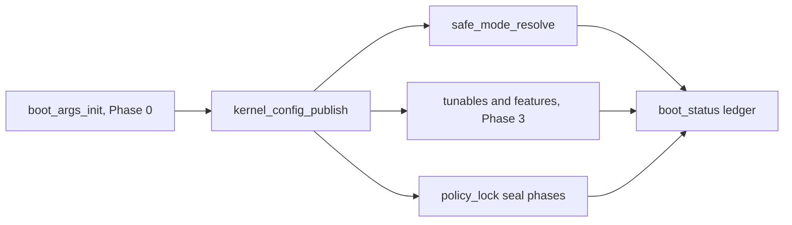

<!-- docs: covers=todo/02-kernel-core/TODO-02-kernel-configuration-policy.md sources=include/kernel/config.h,src/kernel/config.c,include/kernel/tunables.h,src/kernel/tunables.c,include/kernel/feature.h,src/kernel/feature.c,include/kernel/policy_lock.h,src/kernel/policy_lock.c,include/kernel/boot_status.h,src/kernel/main/boot_status.c,include/kernel/nt/sysconfig_info.h,src/kernel/nt/nt_syscall.c,src/kernel/test/test_kernel_config.c reviewed=2026-09-28 order=2 -->
# Kernel Configuration and Policy Plane

## What is it?

The configuration and policy plane is the kernel's single authoritative source for boot arguments, safe mode, runtime tunables, feature flags, security policy locking and boot success tracking. Instead of scattered globals and ad-hoc parser branches, every consumer reads one typed, validated object.

The plane is built in layers. A pure parser turns the bootloader's raw command line into typed, validated key/value pairs. Those pairs flatten into one immutable snapshot published once in Phase 0. Safe mode, runtime tunables, feature-flag cohorts, phase-sealed security policy and a boot-acceptance ledger are built on top of that snapshot. A Registry-backed policy merge and a control-set/LastKnownGood selection layer are designed but not yet reachable, because both need Registry substrate that has not shipped.

## How does it work?

Boot argument parsing runs first, in Phase 0, before any consumer reads a raw string. `boot_args_init()` projects the bootloader's typed `boot_config` fields as a BOOTCFG layer, then parses the raw command line as a CMDLINE layer that overrides it, normalizing aliases (`/debug` to `debug=1`, `safemode=minimal|network`, `testsigning=on` and others) and validating every key against a static descriptor table in [`config.h`](../../include/kernel/config.h). An unknown `kernel.*` key halts boot unless `boot.allow_unknown=1` is set, because Phase 0 has no degraded-continue path.

`kernel_config_publish()` then builds the immutable `kernel_config_t` snapshot from the validated boot arguments and boot-decision provenance, and writes it once on the BSP after the boot-entry ladder is accepted. The `ready` flag is written last behind a release barrier, so `kernel_config_get()` never hands a half-filled snapshot to a late reader. The struct is pinned at exactly 172 bytes (`KERNEL_CONFIG_SIZE_V1`) with `_Static_assert` guards on the magic, the version and several field offsets, so a layout change cannot drift silently.

Everything downstream reads that snapshot rather than re-deriving it. `safe_mode_resolve()` computes a monotonic safe-mode floor: a boot-policy safe or recovery boot floors the level to at least minimal, and a lower-precedence command-line `safemode=off` can never lower it back. Safe mode also mirrors into `KUSER_SHARED_DATA` (`SafeBootMode`, `KdDebuggerEnabled` and an effective `MitigationPolicies` bitmask) so user-mode code sees the same policy the kernel enforces ([`kusd_time.c`](../../src/kernel/time/kusd_time.c)).

The runtime tunable registry ([`tunables.c`](../../src/kernel/tunables.c)) gives subsystems one typed registration surface instead of one-off globals: each entry carries a type, access flags (read-only, boot-only, runtime, privileged, debug-only), a clamped range, an owner and a source. Writes clamp out-of-range values and log the clamp; change callbacks always run at PASSIVE_LEVEL, inline if the caller is already passive and deferred to the system work queue otherwise. Three tunables are wired to real consumers today: `klog.level`, `panic.timeout` and `handle.quota_default`.

The feature-flag registry ([`feature.c`](../../src/kernel/feature.c)) resolves each `feature.<name>` or `experiment.<name>` flag once per boot, in order: an explicit command-line override, then a staged-rollout cohort computed as `sha256(machine_uuid || name) % 100 < rollout_percent` (stable per machine, falling back to the default when no valid machine UUID exists), then the registered default. A `FEATURE_SECURITY` flag can only be disabled when Secure Boot is known to be off; an active or unreadable Secure Boot state fails the override closed.

Policy lock phases ([`policy_lock.c`](../../src/kernel/policy_lock.c)) give security-sensitive settings a point past which they become read-only. Four monotonic phases (`PRE_MEMORY`, `POST_SECURITY_INIT`, `POST_REGISTRY`, `POST_USER_MODE`) advance forward only, and a registered policy seals at one of them. After sealing, a ratchet-class policy can only move toward more restriction. A KernelMode attempt to downgrade a Secure Boot or Code Integrity policy after its seal calls `KeBugCheckEx`; the same attempt from UserMode returns `STATUS_ACCESS_DENIED` and is recorded in a 64-entry tamper-audit ring. `kernel_lockdown_level_get()` exposes a Linux-style `none`/`integrity`/`confidentiality` level derived from the same registry.

The boot-status ledger ([`boot_status.c`](../../src/kernel/main/boot_status.c)) turns "did the boot succeed" into an explicit, monotonic five-stage state machine (`PENDING` through `ACCEPTED`). The first caller to advance the ledger past the configured acceptance stage wins an exactly-once transition that fires every bless side effect: A/B mark-good, per-entry MarkGood, and a CRC32-checked record written to NVRAM for the next boot to read.



## What are its interfaces?

| Interface | Purpose |
| --------- | ------- |
| `boot_args_init()`, `boot_args_parse_cmdline_n()` | Phase 0 boot argument parser ([`config.h`](../../include/kernel/config.h)) |
| `kernel_config_publish()`, `kernel_config_get()` | Publish and read the immutable Phase 0 snapshot ([`config.h`](../../include/kernel/config.h)) |
| `kernel_safe_mode()`, `kernel_safe_mode_reason()`, `kernel_safe_mode_allows()` | Effective safe-mode level, reason and per-component gating ([`config.h`](../../include/kernel/config.h)) |
| `kernel_tunable_register()`, `kernel_tunable_set()`, `kernel_tunable_get()`, `kernel_tunable_dump()` | Typed runtime tunable registry ([`tunables.h`](../../include/kernel/tunables.h)) |
| `kernel_feature_register()`, `kernel_feature_enabled()`, `kernel_feature_dump()` | Feature-flag gates and rollout cohorts ([`feature.h`](../../include/kernel/feature.h)) |
| `kernel_policy_register()`, `kernel_policy_set()`, `kernel_policy_lock_phase_advance()`, `kernel_lockdown_level_get()` | Phase-sealed security policy and lockdown level ([`policy_lock.h`](../../include/kernel/policy_lock.h)) |
| `boot_status_init()`, `boot_status_accept_advance()`, `boot_status_last_record()` | Boot-status policy and the boot acceptance ledger ([`boot_status.h`](../../include/kernel/boot_status.h)) |
| `SystemKernelConfigInformation` (0x1000) on `NtQuerySystemInformation` | Read-only 28-byte snapshot of version, safe mode, lock phase, lockdown level, boot reason and tunable/feature counts ([`sysconfig_info.h`](../../include/kernel/nt/sysconfig_info.h), dispatched in [`nt_syscall.c`](../../src/kernel/nt/nt_syscall.c)) |
| `config_dump()` | Operator diagnostic that logs the whole configuration plane, redacting `TUNABLE_PRIVILEGED` values ([`config.c`](../../src/kernel/config.c)) |

## How do I use it?

```bash
bash scripts/test.sh SUITE=boot          # configuration suites in test_kernel_config.c
```

On a normal boot, serial shows `[CONF] parsed boot args: N keys (M unknown ignored)` before any Phase 0 consumer runs, then `[CONF] snapshot ready: version=1 phase=0`, then `[CONF] safe_mode=<level> reason=<reason>` when a safe mode is in effect. Boot with an unrecognized `kernel.*` key and no override and serial shows `[CONF] unknown boot key: <key>` before the halt.

A debug boot also runs `config_dump()`, which logs `[CONF] dump:` lines covering the snapshot, safe mode, lockdown level and lock phase, the tamper count, the boot-status acceptance stage and every registered tunable, with privileged values shown as `****`.

Writing an out-of-range value through `kernel_tunable_set()` clamps it to the tunable's declared range and logs `[CONF] tunable clamp: <name>`. A `feature.<name>=off` override of a security feature is refused with `[CONF] secure feature override blocked: <name>` whenever Secure Boot is active or its state cannot be read.

Regression coverage lives in [`test_kernel_config.c`](../../src/kernel/test/test_kernel_config.c), registered by `test_register_kernel_config()` in the boot category.

## What is not implemented yet?

- Merging Registry-backed policy (`HKLM\SYSTEM\CurrentControlSet\Control\Kernel`) into the effective configuration is parked: the `CurrentControlSet` link it reads does not exist yet, and the merge needs control-set selection first ([Registry-Backed Policy Merge](../../todo/02-kernel-core/TODO-02-kernel-configuration-policy.md#3-registry-backed-policy-merge)).
- `kernel_select_control_set()` (Current, Default, Failed, LastKnownGood) and persisting the chosen control set are parked on the same missing `SYSTEM\Select` and `ControlSetNNN` Registry substrate ([ControlSet and LastKnownGood Selection](../../todo/02-kernel-core/TODO-02-kernel-configuration-policy.md#4-controlset-and-lastknowngood-selection)).
- The native configuration set path (`NtSetSystemInformation`) and its `SeSystemProfilePrivilege` gate are designed but unimplemented; the current blocker is kernel image size ([Native Query/Set Config Syscalls](../../todo/02-kernel-core/TODO-02-kernel-configuration-policy.md#8-native-queryset-config-syscalls)).
- The privileged production write path for tunables has no non-test caller, so no `quota.user.<type>` cap can be enforced yet ([Post-Ship Follow-Up Backfill](../../todo/02-kernel-core/TODO-02-kernel-configuration-policy.md#12-post-ship-follow-up-backfill-orphan-cohort-2026-07-31)).
- Policy changes are already published as ETW events (`ETW_EVT_POLICY_TAMPER` for a blocked write, `ETW_EVT_POLICY_CHANGE` for an applied one) to running trace sessions; what is not built is fan-out through the kernel notification facility ([Policy Lock Phases and Tamper Audit](../../todo/02-kernel-core/TODO-02-kernel-configuration-policy.md#9-policy-lock-phases-and-tamper-audit)).
- Updating LastKnownGood at the accepted boot transition, and the failed-boot rollback path, both wait on control-set selection ([Boot Status Policy and Boot Success Ledger](../../todo/02-kernel-core/TODO-02-kernel-configuration-policy.md#10-boot-status-policy-and-boot-success-ledger)).

## How does it compare with Windows 11 and Linux?

Impossible OS matches Windows 11 and Linux on safe and recovery boot modes, the boot success and failure ledger, and early immutable security policy gates. It also matches Linux's single named lockdown level (`none`/`integrity`/`confidentiality`), which Windows 11 does not expose as one value; there the equivalent posture is spread across HVCI and VBS settings.

Two things go beyond both: a phase-sealed tamper-audit ring that makes every blocked policy write observable (Windows uses scattered ETW security events, Linux its audit subsystem and LSM hooks), and per-key provenance plus rollout cohorts as a kernel-native concept.

It is behind both on the boot entry policy store and control-set style rollback: Windows has BCD plus `Current`/`LastKnownGood` semantics and Linux has GRUB or systemd-boot plus distribution fallback tooling, while here the control-set layer is still parked. Runtime tunables are partial too: Windows exposes Registry, Group Policy and BCD knobs and Linux has `sysctl`, `/proc`, `/sys` and module parameters, while Impossible OS has the registry and the read-only query shipped but not the set path.

## See also

- [Kernel Configuration and Policy Plane roadmap](../../todo/02-kernel-core/TODO-02-kernel-configuration-policy.md)
- [Kernel Init Sequencing](kernel-init-sequencing.md)
- [Boot Entries, Menu and Policy](../boot/boot-entries-menu-policy.md)
- [A/B Dual-Slot Boot and Rollback](../boot/ab-boot-rollback.md)
