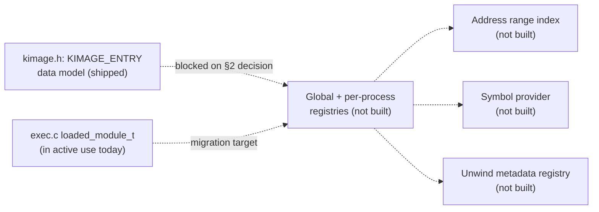

<!-- docs: covers=todo/02-kernel-core/TODO-18-kernel-image-module-registry.md sources=include/kernel/kimage.h,src/kernel/test/test_kimage.c reviewed=2026-09-28 order=18 -->
# Kernel Image and Module Registry

## What is it?

The Kernel Image and Module Registry is the planned single source of truth for every loaded image in the system: the kernel itself, boot modules, drivers, kernel modules, process main images, DLLs, and EIF modules. Today it is a data model only: `include/kernel/kimage.h` defines the `KIMAGE_ENTRY` record every later stage will populate, but nothing constructs, stores, or looks up a `KIMAGE_ENTRY` yet. The [Binary Format System](binary-format-system.md) has its own, narrower `loaded_module_t` registry in active use; this record is designed to supersede it once the migration strategy is decided.

## How does it work?

`kimage_entry_t` ([`kimage.h`](../../include/kernel/kimage.h)) is an 832-byte, 64-byte-aligned record: load address, size, entry point, an embedded `EX_RUNDOWN_REF` lifetime gate, a `kimage_type_t` role (kernel, HAL, boot module, driver, kmod, process, DLL, EIF module, synthetic), a `kimage_format_t` (ELF/PE/EIF, deliberately distinct from the role and from the exec-dispatcher's own `EXEC_FMT_*` ids), a code-integrity decision, six optional metadata handles (symbols, unwind ranges, exports, imports, relocations, debug info) that stay zero until a later stage fills them, a SHA-256 content hash, and a durable build/debug identity (ELF build-id, PE CodeView GUID, or EIF build_id) meant to survive into a tombstone record after the live image is gone.

Two invariants are load-bearing enough to be enforced by `_Static_assert` rather than left to convention. First, the lifetime gate is one atomic 64-bit CAS word (rundown bit plus refcount), not a separate flag and counter, because a check-then-increment split would race an in-progress unload. Second, `kimage_format_t` starts its own enumeration at `UNKNOWN = 0` rather than reusing the exec dispatcher's `EXEC_FMT_ELF = 0`, so a zero-initialized (not-yet-populated) record reads as unknown rather than silently misclassifying as an ELF image; `kimage_format_from_exec_fmt()` bridges the two id spaces explicitly and maps anything it does not recognize to `KIMAGE_FMT_UNKNOWN`. A worked example the header calls out directly: the ELF kernel image registers itself as `EXEC_FMT_PE` today purely for WinDbg presentation, so a naive field copy from the exec-side record would mislabel the kernel's own format; the loader-integration stage (not yet built) is responsible for setting type=KERNEL, format=ELF explicitly rather than converting the presentation value.

Nothing downstream of the data model exists in the tree: there is no global or per-process registry storing `KIMAGE_ENTRY` values, no address-range index, no symbol or unwind provider, and no loader calls `kimage_register()` (that function is not defined anywhere). The roadmap's own status callout explains why: the registries section is blocked on an operator-reserved decision about whether `KIMAGE_ENTRY` becomes the backing store the existing `exec_register_module()` delegates to, or a superset that every consumer is rewired onto, plus three related questions about the fatal Phase-1 kernel self-registration path and per-process storage shape. Every section from address lookup through provenance and the consistency verifier is explicitly deferred behind that one decision.



## What are its interfaces?

| Interface | Purpose |
| --- | --- |
| `kimage_entry_t` | The 832-byte per-image record ([`kimage.h`](../../include/kernel/kimage.h)) |
| `kimage_type_t`, `kimage_format_t`, `kimage_identity_kind_t`, `kimage_ci_decision_t` | The four independent classification enums on a record |
| `kimage_format_from_exec_fmt()` | Bridges the exec dispatcher's `EXEC_FMT_*` presentation id to the canonical `kimage_format_t` |
| `KIMAGE_FLAG_*` | Single-bit, non-overlapping status flags (global/per-process, stripped, signed, has-unwind, alias, going, tombstone) |

No registration, lookup, symbol, or unwind functions exist yet; every verb-shaped API (`kimage_register`, `image_lookup_by_address`, `ksym_lookup_addr`, and the rest) is named only in the roadmap text, not in any header.

## How do I use it?

There is nothing to use yet. The data model is exercised only by its own unit tests.

```bash
bash scripts/test.sh SUITE=exec     # kimage tests run under TEST_CAT_EXEC
```

[`test_kimage.c`](../../src/kernel/test/test_kimage.c) covers exactly the section-1 invariants against in-memory fixtures: the flags bitmask is single-bit and non-overlapping, a zero-initialized entry classifies as `UNKNOWN` (never `ELF`), the embedded rundown gate acquires on a live entry and refuses a new acquire once rundown completes, and populated fields round-trip. The tests deliberately do not call any loader or boot infrastructure, since there is no registry for a loader to call into.

## What is not implemented yet?

- The global and per-process image registries themselves: blocked on an unresolved architectural decision (does `KIMAGE_ENTRY` become the backing store `exec_register_module()` delegates to, or a superset every consumer is rewired onto) ([Global and Per-Process Image Registries](../../todo/02-kernel-core/TODO-18-kernel-image-module-registry.md#2-global-and-per-process-image-registries)).
- Address-range lookup (`image_lookup_by_address`), so there is no fast, lock-safe way to resolve an instruction pointer to an image via this registry yet; the exec dispatcher's own `exec_find_module_by_pc()` is the only such lookup in the tree today ([Address Range Index](../../todo/02-kernel-core/TODO-18-kernel-image-module-registry.md#3-address-range-index)).
- A symbol provider abstraction (`ksym_lookup_addr`, `ksym_lookup_name`) unifying kernel symtab, PE export tables, ELF symtab, and EIF metadata behind one interface ([Symbol Provider Abstraction](../../todo/02-kernel-core/TODO-18-kernel-image-module-registry.md#4-symbol-provider-abstraction)).
- A unified, normalized unwind metadata registry; PE `.pdata` and (once built) ELF `.eh_frame` unwind data are registered separately by their own loaders today, not through this registry ([Unwind Metadata Registry](../../todo/02-kernel-core/TODO-18-kernel-image-module-registry.md#5-unwind-metadata-registry)).
- Loader integration: no format loader calls into this registry, so the kernel's own true-format-vs-presentation-format distinction (ELF kernel registered as `EXEC_FMT_PE`) exists only as a comment in the header, not as enforced behavior ([Loader Integration](../../todo/02-kernel-core/TODO-18-kernel-image-module-registry.md#6-loader-integration)).
- Image load/unload notifications, KD and crash-dump integration (including the bounded recently-unloaded tombstone ring), and unified provenance/code-integrity/hotpatch metadata are all unimplemented, each downstream of the same blocked registry decision ([Image Notifications and Callbacks](../../todo/02-kernel-core/TODO-18-kernel-image-module-registry.md#7-image-notifications-and-callbacks), [KD/Crash Dump Integration](../../todo/02-kernel-core/TODO-18-kernel-image-module-registry.md#8-kdcrash-dump-integration), [Provenance, CI, and Hotpatch Metadata](../../todo/02-kernel-core/TODO-18-kernel-image-module-registry.md#9-provenance-ci-and-hotpatch-metadata)).

## How does it compare with Windows 11 and Linux?

Windows maintains `PsLoadedModuleList` with `KLDR`-style address ranges, `DbgHelp`/PDB symbol resolution, `RtlLookupFunctionEntry` unwind lookup, `PsSetLoadImageNotifyRoutine` callbacks, and `MmUnloadedDrivers` history. Linux covers the same ground with `/proc/modules`, `__module_address`, `kallsyms`, the kernel's ORC unwinder, and a module notifier chain, but has no unloaded-module history. Impossible OS's roadmap targets a single format-agnostic registry spanning PE, ELF, and EIF, which neither Windows (PE only) nor Linux (ELF only) has, plus a bounded tombstone ring matching Windows's `MmUnloadedDrivers` (a Linux gap) and a unified provenance/code-integrity record neither system keeps as one object. None of that exists in the tree today: the only code present is the record shape it will all be built on.

## See also

- [Kernel Image and Module Registry roadmap](../../todo/02-kernel-core/TODO-18-kernel-image-module-registry.md)
- [Binary Format System](binary-format-system.md)
- [Object Manager](object-manager.md)
