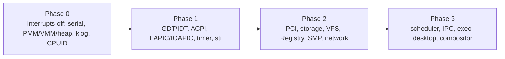

<!-- docs: covers=todo/02-kernel-core/TODO-01-kernel-init-sequencing.md sources=src/kernel/main.c,src/kernel/main/boot_hw.c,src/kernel/main/boot_interrupts.c,src/kernel/main/boot_storage.c,src/kernel/main/boot_desktop.c,src/kernel/main/boot_init.c,include/kernel/boot_init.h,src/kernel/main/boot_recovery.c,include/kernel/boot_recovery.h,src/kernel/main/boot_halt.c,src/kernel/boot_timing.c,src/kernel/test/test_boot_init.c reviewed=2026-09-28 order=1 -->
# Kernel Init Sequencing

## What is it?

Kernel init sequencing is the phase-gated startup model: four explicit phases, a typed result for every subsystem init, and a readiness oracle other code can query. `kernel_main()` calls exactly four functions in order, `boot_phase0()`, `boot_phase1()`, `boot_phase2()` and `boot_phase3()` (which never returns), in [`main.c`](../../src/kernel/main.c). Every subsystem that other code depends on registers a readiness bit, so a later init step, a driver or the panic path can ask "is VFS up yet?" instead of assuming an ordering that might have changed.

The model also adds three things neither Windows nor Linux ship: a graphical recovery screen for a failed boot, POST codes persisted to UEFI NVRAM for post-mortem diagnosis without a serial cable, and boot-performance regression detection between reboots.

## How does it work?

Each phase is a plain C function under `src/kernel/main/`: `boot_phase0()` in [`boot_hw.c`](../../src/kernel/main/boot_hw.c), `boot_phase1()` in [`boot_interrupts.c`](../../src/kernel/main/boot_interrupts.c), `boot_phase2()` in [`boot_storage.c`](../../src/kernel/main/boot_storage.c) and `boot_phase3()` in [`boot_desktop.c`](../../src/kernel/main/boot_desktop.c).



Every subsystem a later step can depend on has a slot in `kernel_subsys_t`, an enum of 30 entries (`SUBSYS_SERIAL` through `SUBSYS_KNF`, closed by the `SUBSYS_COUNT` sentinel) in [`boot_init.h`](../../include/kernel/boot_init.h). A `_Static_assert` keeps `SUBSYS_COUNT` at 32 or below because the degraded-subsystem bitmask is a `uint32_t`. The readiness table in [`boot_init.c`](../../src/kernel/main/boot_init.c) is a plain byte array read and written with acquire/release atomics: only the BSP writes it during init, and APs only read it.

An init function returns a `boot_result_t`: `BOOT_OK`, `BOOT_DEGRADED`, `BOOT_FATAL` or `BOOT_DEFERRED`. Macros turn that result into readiness state and failure policy. `BOOT_REQUIRE(subsys)` returns `BOOT_FATAL` if a prerequisite is not ready; `BOOT_STEP(subsys, fn)` runs an init function and marks it ready only on OK or DEGRADED; `BOOT_TRY(subsys, fn, name)` is the non-critical wrapper that always continues, logging a warning and setting the degraded-mask bit on anything but OK; `BOOT_ASSERT(cond, msg)` halts on an impossible state. `boot_progress(phase, step, postcode)` writes a `[PHASEn] step (0xNNNN)` line to serial and records a timing sample at every milestone.

**Phase 0** runs with interrupts disabled and touches only serial, the physical and virtual memory managers, the heap, early logging, CPU feature probing and hardening. Any failure here is fatal: there is no framebuffer yet, so `boot_halt()` stops on serial only. **Phase 1** brings up the GDT, IDT, ACPI table parsing, LAPIC and IOAPIC, the timer, the RTC and the framebuffer, and runs `sti` only after the timer and interrupt controllers are ready. **Phase 2** brings up storage, VFS, the Registry, the Object Manager, SMP AP bringup and networking; only a broken VFS or Registry is meant to be fatal, and everything else degrades with a warning. **Phase 3** starts the scheduler, IPC, the exec loader and the desktop compositor.

On a fatal failure, `kernel_subsystem_dump()` logs every subsystem's OK or FAIL state before the halt, so the serial log shows the full readiness snapshot at the moment of failure. It is called from `boot_halt()` in [`boot_halt.c`](../../src/kernel/main/boot_halt.c), from `panic()`, and from several Phase 2 and 3 fatal guards. A Phase 2 or 3 fatal failure with the framebuffer up shows the recovery screen instead of a bare halt: a framebuffer panel drawn without the compositor or the heap, offering Retry, Halt to serial log, or Power off ([`boot_recovery.h`](../../include/kernel/boot_recovery.h)).

Non-critical subsystems defer their init past the first desktop frame instead of blocking it. `boot_defer(name, fn)` records a function in a fixed 16-slot table and `boot_run_deferred()` runs them inline in Phase 3, after `desktop_init()` and before `compositor_run()`; not on a worker thread, because the compositor starves cooperatively scheduled kernel threads. Network (`rtl8139`, `net_init`, `dhcp_discover`) and secondary input are deferred this way, each logging `[DEFERRED] <name> +<ms>ms`, and `deferred=0` in `boot.conf` turns it off for debugging.

Phase 2 can also run independent storage steps across CPUs when `async_init=1` is set in `boot.conf`. `boot_async_group()` sends steps to APs over IPI vector `0xFC`, the BSP runs one itself, and a 10-second barrier (`BOOT_ASYNC_BARRIER_MS`) bounds the wait. The default is `async_init=0`, fully sequential; the parallel path is experimental.

## What are its interfaces?

| Interface | Purpose |
| --------- | ------- |
| `boot_phase0()` to `boot_phase3()` | The four phase entry points, called in order from `kernel_main()` ([`main.c`](../../src/kernel/main.c)) |
| `kernel_subsystem_ready()`, `kernel_subsystem_set_ready()` | Read or write one subsystem's readiness bit ([`boot_init.h`](../../include/kernel/boot_init.h)) |
| `kernel_subsystem_dump()` | Logs every subsystem's state; called before a halt ([`boot_init.c`](../../src/kernel/main/boot_init.c)) |
| `kernel_subsystem_apply_result()` | Applies a `boot_result_t` to the readiness oracle and the degraded mask in one call |
| `BOOT_REQUIRE`, `BOOT_STEP`, `BOOT_TRY`, `BOOT_ASSERT` | Turn an init result into readiness state, a degraded bit or a halt ([`boot_init.h`](../../include/kernel/boot_init.h)) |
| `boot_progress(phase, step, postcode)` | Serial progress line plus timing sample |
| `boot_post_write16()`, `boot_post_nvram_write16()`, `boot_post_read16()` | 16-bit POST code to port 0x80, to the `ImpossiblePOST` NVRAM variable, and read back |
| `boot_defer()`, `boot_run_deferred()` | Register and later run a non-critical init after the desktop appears |
| `boot_async_group()`, `boot_async_group_ex()` | Run independent Phase 2 steps across APs behind a bounded barrier |
| `boot_recovery_show()`, `boot_recovery_act()` | Draw the recovery panel and carry out the chosen action ([`boot_recovery.h`](../../include/kernel/boot_recovery.h)) |
| `boot.conf` keys `debug`, `test`, `postcode`, `deferred`, `async_init` | Gate boot self-tests, POST and NVRAM writes, deferred init and parallel Phase 2 init |

## How do I use it?

```bash
bash scripts/build.sh
bash scripts/test.sh SUITE=boot     # readiness oracle, macros, POST codes, deferred and async init
bash scripts/test-smoke.sh          # boots to C:\> through the real phase sequence
```

On a normal boot, serial shows `[PHASE0]` through `[PHASE3]` progress lines in dependency order, then `[DEFERRED]` lines for network and secondary input shortly after the desktop appears. With `debug=1` or `test=1` in `boot.conf`, the kernel test suite runs inline in Phase 3 and prints a `=== N tests passed, 0 failed, ... ===` summary; a release boot shows none of that. The unit tests for this subsystem are in [`test_boot_init.c`](../../src/kernel/test/test_boot_init.c).

## What is not implemented yet?

- Several Phase 2 inits (`vfs_init()`, the storage, network and mouse chain) still return `void`, so `SUBSYS_VFS` and `SUBSYS_REGISTRY` are marked ready without a typed result ([Phase 2 System Services](../../todo/02-kernel-core/TODO-01-kernel-init-sequencing.md#4-phase-2----system-services)). The memory-manager signature change belongs to [03-memory-concurrency TODO-01](../../todo/03-memory-concurrency/TODO-01-vmm-memory-protection.md) and `vfs_init()`'s to [05-storage-filesystems TODO-06](../../todo/05-storage-filesystems/TODO-06-ixfs-core-win32-compat.md).
- The recovery screen's interactive serial console option only halts with a banner today, and the screen never fires on a real Phase 2 mount or Registry failure, because the `void` inits above give it nothing typed to observe ([Degraded-Boot Recovery Screen](../../todo/02-kernel-core/TODO-01-kernel-init-sequencing.md#9-degraded-boot-recovery-screen)).
- The ACPI-before-LAPIC dependency is not enforced at runtime, and some fatal paths skip `kernel_subsystem_dump()` before halting ([Dependency Gates](../../todo/02-kernel-core/TODO-01-kernel-init-sequencing.md#6-dependency-gates)).
- There is no single panic-safe fatal primitive yet: some fatal paths bypass the failure-policy matrix, the panic path can still block on firmware `SetVariable` or live VFS writes, and the `restart_on_halt` key documented in `boot_halt.c` is not a real `boot.conf` field ([Failure Policy](../../todo/02-kernel-core/TODO-01-kernel-init-sequencing.md#7-failure-policy)).
- Deferred init still runs before the compositor's first frame, so the PS/2 mouse handshake delays that frame ([Deferred Init for Non-Critical Subsystems](../../todo/02-kernel-core/TODO-01-kernel-init-sequencing.md#11-deferred-init-for-non-critical-subsystems)).
- The `bootperf` shell command and a wear budget for the `ImpossibleBootPerf` NVRAM write are not built ([Boot Performance Regression Detection](../../todo/02-kernel-core/TODO-01-kernel-init-sequencing.md#12-boot-performance-regression-detection)).
- Parallel Phase 2 init stays experimental: a timed-out AP is not quiesced before the sequential fallback re-runs its step, and the async storage work runs inside an interrupts-disabled IPI handler ([Async Subsystem Init](../../todo/02-kernel-core/TODO-01-kernel-init-sequencing.md#13-async-subsystem-init-smp-parallel)).

## How does it compare with Windows 11 and Linux?

Impossible OS matches Windows and Linux on the phase model itself: an interrupts-off first phase, dependency-ordered init, halt on critical failure, a degraded continuation path, a boot serial log, boot-config gating, and self-tests kept out of release boots. Windows uses NTSTATUS-style results and Linux uses `initcall` levels; `boot_result_t` is the same idea but is not yet returned by every Phase 2 init, so that row is partial parity.

Four things are Impossible OS only: a graphical in-kernel recovery screen (Windows boots a separate WinRE, Linux drops to a text shell), POST codes persisted to UEFI NVRAM, a public subsystem-readiness oracle, and boot-performance regression detection across reboots (both others need manual ETW or bootchart analysis).

## See also

- [Kernel Init Sequencing roadmap](../../todo/02-kernel-core/TODO-01-kernel-init-sequencing.md)
- [Kernel Configuration and Policy Plane](kernel-configuration-policy.md)
- [Boot Diagnostics](../boot/boot-diagnostics.md)
- [Boot Performance and Health](../boot/boot-performance-health.md)
