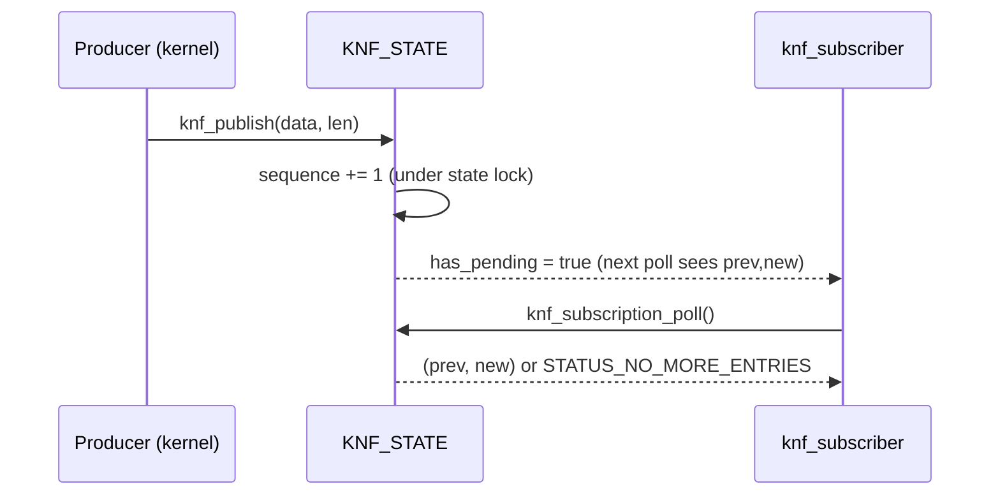

<!-- docs: covers=todo/02-kernel-core/TODO-16-kernel-notification-facility.md sources=include/kernel/knf/knf.h,src/kernel/knf/knf.c,include/kernel/nt/knf_syscall_info.h,src/kernel/nt/nt_syscall.c,src/kernel/test/test_knf.c reviewed=2026-09-28 order=16 -->
# Kernel Notification Facility

## What is it?

The Kernel Notification Facility (KNF) is a Windows Notification Facility (WNF) style publish/subscribe primitive: a named, typed piece of kernel state that carries a monotonically increasing sequence number, so a consumer can tell "has this changed since I last looked" without polling the underlying subsystem. A `KNF_STATE` lives under `\Notifications\<Category>\<Name>` in the Object Manager namespace. Producers publish a payload and bump the sequence; in-kernel subscribers baseline at a sequence and poll for advances. It exists so power, device, session, security and registry state changes have one kernel-owned fanout path instead of each subsystem inventing its own queue.

## How does it work?

`ob_knf_type_init()` registers a `NotificationState` Object Manager type, and `knf_init()` builds `\Notifications` plus four category directories, `Kernel`, `Power`, `Security` and `Session` ([`knf.c`](../../src/kernel/knf/knf.c)). `knf_init()` runs from `boot_storage.c` in boot Phase 2, after the registry is up and before the scheduler starts, so the namespace build races nothing. A partial namespace (some but not all categories created) reports the `SUBSYS_KNF` subsystem as degraded rather than a false OK; zero categories is fatal.

`knf_create_state()` / `knf_create_state_ex()` create or open a state under a category directory. A state's `KNF_LIFETIME` is one of WellKnown, Permanent, Persistent or Temporary; creating a non-Temporary state from user mode requires `SE_CREATE_PERMANENT_PRIVILEGE` (LUID 16, [`privileges.h`](../../include/kernel/security/privileges.h)), matching WNF's own permanent-name gate. A state can carry an optional 16-byte `KNF_TYPE_ID` (a GUID) that types its payload blob; once set, `knf_publish()` rejects a mismatched or missing tag with `STATUS_OBJECT_TYPE_MISMATCH`.

`knf_publish()` copies up to `KNF_MAX_PAYLOAD` (4096) bytes under the state's spinlock and advances its `atomic64_t sequence`. It accepts an optional `matching_change_stamp` for a compare-and-swap style conditional publish (mirroring WNF's conditional update), and it is safe to call from `DISPATCH_LEVEL`: the payload buffer is never grown while the lock is held, so a caller that needs a larger buffer at raised IRQL must pre-size it first with `knf_reserve_payload()` at `PASSIVE_LEVEL`. A publish above `DISPATCH_LEVEL` is rejected before any work runs. `knf_subscribe()` allocates a `struct knf_subscriber` node, takes an Object Manager reference on the state (so the state body cannot be freed while a subscription is live), and baselines the subscriber at the current sequence. `knf_subscription_poll()` is a non-blocking check: if the sequence has advanced since the subscriber's last-seen value it reports `(prev, new)`, otherwise `STATUS_NO_MORE_ENTRIES`. A publish that lands while a notification is already pending coalesces (level-triggered): the subscriber's `missed` counter increments instead of queuing a second wakeup, and `knf_query_last_kernel()` lets a kernel caller retrieve the retained last payload after a miss.

Two per-state bitmasks sit beside the sequence. `KNF_TRACE_ETW` / `KNF_TRACE_KLOG` (set via `knf_set_trace_flags()`) mirror a publish to ETW and klog, off the state lock and only below `DISPATCH_LEVEL`, guarded against re-entry by a per-thread flag so a klog/ETW re-publish cannot recurse. `KNF_MODE_SECRET` (via `knf_set_mode()`) marks a payload that a future user-mode query surface must redact; the kernel-private `knf_query_last_kernel()` ignores it today.



## What are its interfaces?

| Interface | Purpose |
| --- | --- |
| `ob_knf_type_init()`, `knf_init()` | Register the `NotificationState` type and build `\Notifications` ([`knf.h`](../../include/kernel/knf/knf.h)) |
| `knf_create_state()`, `knf_create_state_ex()`, `knf_lookup_state()`, `knf_delete_state()` | Create, open by name, and delete a state |
| `knf_open_state()` | Resolve an existing state without creating one |
| `knf_publish()` | Publish a payload and advance the change stamp, with optional CAS and type-ID check |
| `knf_reserve_payload()` | Pre-size a state's payload buffer at `PASSIVE_LEVEL` for a later `DISPATCH_LEVEL` publish |
| `knf_subscribe()`, `knf_unsubscribe()`, `knf_subscription_poll()` | In-kernel, non-waitable subscription lifecycle |
| `knf_query_last_kernel()` | KernelMode-only query-after-miss of the retained last payload |
| `knf_set_trace_flags()`, `knf_set_mode()` | Opt in to the ETW/klog bridge; mark a state's payload secret |
| `knf_subscription_missed_count()` | Read-and-reset a subscriber's coalesced-update counter |
| `SystemNotificationInformation` (class `0x1002`) via `NtQuerySystemInformation` | Live state/subscriber counts, cumulative publish/coalesced/denial counters ([`knf_syscall_info.h`](../../include/kernel/nt/knf_syscall_info.h)) |

## How do I use it?

KNF starts automatically in boot Phase 2; there is no setting to enable it.

```bash
bash scripts/test.sh SUITE=knf     # or: make test-knf
```

A kernel producer creates or opens a state under one of the four built-in categories, publishes with `knf_publish()`, and a kernel consumer subscribes and polls (or calls `knf_query_last_kernel()` after a coalesced miss). There is no user-mode entry point yet: the WNF-compatible `Nt*WnfStateData` syscalls are reserved SSDT slots (`0x01E0`-`0x01E6`) but unimplemented, so only kernel code can publish or subscribe today. The tests live in [`test_knf.c`](../../src/kernel/test/test_knf.c), including a 400-state / 100-subscriber stress test that asserts the diagnostics counters return to baseline after teardown (no leak).

## What is not implemented yet?

- Subscription handles are not waitable objects: `NtWaitForSingleObject` cannot block on a KNF subscription, because the wait primitive needs a race-free wait and rundown-pinned wake that the current kernel `event_t` does not provide ([Waitable User Subscriptions](../../todo/02-kernel-core/TODO-16-kernel-notification-facility.md#3-waitable-user-subscriptions)).
- No access control: publish and subscribe are not gated by a security descriptor, because the `SeAccessCheck` engine they depend on does not exist yet ([Security and Namespace Policy](../../todo/02-kernel-core/TODO-16-kernel-notification-facility.md#4-security-and-namespace-policy)).
- The built-in state-name catalog (power, device, session, security, system, registry state names) is not provisioned, ordered behind the access-control gate above ([Built-In State-Name Catalog](../../todo/02-kernel-core/TODO-16-kernel-notification-facility.md#5-built-in-state-name-catalog)).
- The WNF-compatible `Nt*WnfStateData` syscalls are reserved SSDT slots only; the `WNF_STATE_NAME` ABI compatibility level (byte-compatible Windows encoding vs internal name mapping) is an unresolved, ship-blocking decision ([Native WNF-Compatible Syscall Surface](../../todo/02-kernel-core/TODO-16-kernel-notification-facility.md#8-native-wnf-compatible-syscall-surface)).
- `KNF_MODE_SECRET` is recorded but not enforced: nothing yet redacts a secret state's payload before a hypothetical user-mode read, since that surface does not exist ([Coalescing and Payload Retention](../../todo/02-kernel-core/TODO-16-kernel-notification-facility.md#7-coalescing-and-payload-retention)).
- Persistent-lifetime states are not written to or restored from the registry, so `KNF_LIFETIME_PERSISTENT` does not survive a reboot yet ([Coalescing and Payload Retention](../../todo/02-kernel-core/TODO-16-kernel-notification-facility.md#7-coalescing-and-payload-retention)).
- Edge-triggered delivery (every update, not just the latest) is not built; every state today is level-triggered/coalescing ([Coalescing and Payload Retention](../../todo/02-kernel-core/TODO-16-kernel-notification-facility.md#7-coalescing-and-payload-retention)).

## How does it compare with Windows 11 and Linux?

Windows implements this as WNF: named states, lifetime classes, a change stamp, and `Nt*WnfStateData` syscalls, mostly undocumented outside kernel debugging. Linux has no unified equivalent; netlink and inotify each solve a narrower slice (network/device events and filesystem changes respectively) with no shared naming or sequence-number contract.

Impossible OS matches WNF's core publish/subscribe shape: named states with lifetime classes, an atomic64 change stamp, conditional (CAS) publish, and typed payloads, all working today from kernel code. It is behind Windows on the two things a real deployment needs: waitable user-mode subscriptions and per-state access control, both blocked on prerequisites owned elsewhere ([IRQL, DPCs and APCs](irql-dpc.md) for the wait primitive, and the Security Reference Monitor for access checks). The live diagnostics counters exposed through `SystemNotificationInformation` go beyond both Windows (debugger-only) and Linux (no equivalent).

## See also

- [Kernel Notification Facility roadmap](../../todo/02-kernel-core/TODO-16-kernel-notification-facility.md)
- [Object Manager](object-manager.md)
- [IRQL, DPCs and APCs](irql-dpc.md)
- [Native API and SSDT](native-api-ssdt.md)
