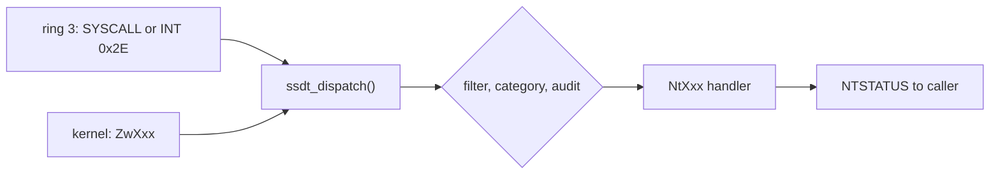

<!-- docs: covers=todo/02-kernel-core/TODO-12-native-api-ssdt.md sources=include/kernel/nt/ssdt.h,src/kernel/nt/ssdt.c,include/kernel/nt/service_numbers.h,include/kernel/nt/ntstatus.h,include/kernel/nt/nt_types.h,include/kernel/nt/zw.h,include/kernel/nt/nt_audit.h,include/kernel/nt/syscall_filter.h,src/kernel/nt/nt_audit.c,src/kernel/nt/syscall_filter.c,src/kernel/sched/syscall_fast.c,src/kernel/sched/syscall_entry.asm,user/include/syscall.h,src/kernel/test/test_nt_types.c,src/kernel/test/test_nt_audit.c reviewed=2026-09-28 order=12 -->
# Native API and the SSDT

## What is it?

The Native API is the kernel's `NtXxx` and `ZwXxx` entry-point contract: every call returns an `NTSTATUS`, and every call is dispatched through a numbered System Service Descriptor Table (SSDT), the mechanism Windows uses inside `ntoskrnl.exe`. `ssdt_dispatch()` takes a service number, splits it into a table and an index, and calls the registered handler.

Two hardware paths reach it: the `SYSCALL`/`SYSRET` fast path and the older `INT 0x2E` software interrupt. The earlier Linux-style `SYS_*` calls on `INT 0x80` still work beside it as a separate number space.

There are two tables. Table 0, the main table, holds kernel `NtXxx` services from `0x0000` (`SSDT_NtClose` is `0x0000`) and is largely populated. Table 1, the shadow table from `0x1000`, is reserved for the Win32k `NtGdiXxx` and `NtUserXxx` services and is still all stubs; [08-graphics-ui TODO-15](../../todo/08-graphics-ui/TODO-15-win32k-shadow-ssdt.md) fills it.

## How does it work?

`ssdt_init()` in [`ssdt.c`](../../src/kernel/nt/ssdt.c) fills both 1024-slot tables with a stub that returns `STATUS_NOT_IMPLEMENTED` and logs `SSDT initialized: N main slots (last=0x...), shadow stub ready`. Subsystems then call `ssdt_register(service_number, handler)` to install real handlers; 25 kernel source files do so today.

`ssdt_dispatch()` is the single point both hardware paths go through. For each call it checks the index against the table's capacity, applies the per-process system-call filter (free when no process has installed one), applies a coarse category check, and then calls the handler, wrapped in audit hooks only if an audit hook is registered. A per-thread previous-mode flag records whether the caller was user mode (`NtXxx`) or kernel mode (`ZwXxx` in [`zw.h`](../../include/kernel/nt/zw.h), which calls `ssdt_dispatch()` directly). Probing user buffers with `ProbeForRead` and `ProbeForWrite` is each handler's job, not the dispatcher's, and not every handler does it yet.



`syscall_init_fast()` in [`syscall_fast.c`](../../src/kernel/sched/syscall_fast.c) programs the `IA32_STAR`, `IA32_LSTAR` and `IA32_FMASK` MSRs and sets `EFER.SCE`, but only after confirming the GDT user segments are in the order `SYSRET` requires. The entry code in [`syscall_entry.asm`](../../src/kernel/sched/syscall_entry.asm) runs `swapgs`, switches to the per-CPU kernel stack and calls into `ssdt_dispatch()`. Both paths use the Windows x64 register convention: RAX holds the service number and R10, RDX, R8 and R9 the first four arguments.

## What are its interfaces?

| Interface | Purpose |
| --------- | ------- |
| `ssdt_dispatch()`, `ssdt_register()`, `ssdt_get_table()` | Dispatch, register and inspect ([`ssdt.h`](../../include/kernel/nt/ssdt.h)) |
| `SSDT_NtXxx` constants, `SSDT_MAIN_COUNT`, `SSDT_LAST_MAIN_INDEX` | Service numbers ([`service_numbers.h`](../../include/kernel/nt/service_numbers.h)) |
| `NTSTATUS`, `NT_SUCCESS`, `NT_ERROR` | Return codes and severity macros ([`ntstatus.h`](../../include/kernel/nt/ntstatus.h)) |
| `HANDLE`, `IO_STATUS_BLOCK`, `OBJECT_ATTRIBUTES`, `UNICODE_STRING`, `CLIENT_ID` | Shared NT types ([`nt_types.h`](../../include/kernel/nt/nt_types.h)) |
| `ZwClose`, `ZwCreateFile`, `ZwReadFile` and others | Kernel-mode aliases without user-buffer probes ([`zw.h`](../../include/kernel/nt/zw.h)) |
| `ProbeForRead()`, `ProbeForWrite()` | User-buffer validation |
| `nt_audit_register()`, `nt_audit_unregister()` | System-call audit hooks for kernel code ([`nt_audit.h`](../../include/kernel/nt/nt_audit.h)) |
| `ProcessSystemCallFilterPolicy` on `NtSetInformationProcess` | Per-process allow-list of system calls ([`syscall_filter.h`](../../include/kernel/nt/syscall_filter.h)) |
| `RtlNtStatusToDosError()` | Translate an `NTSTATUS` to a Win32 error code |

## How do I use it?

`ssdt_init()` runs in Phase 3 before the fast path is enabled; there is no setting.

```bash
bash scripts/test.sh SUITE=abi     # NTSTATUS, dispatch, ZwXxx, audit and filter tests
```

Kernel code calls a `ZwXxx` alias directly, for example `ZwClose(handle)`. User programs do not yet have `NtXxx` stubs: [`user/include/syscall.h`](../../user/include/syscall.h) still wraps the legacy `INT 0x80` calls. A test program can load an `SSDT_NtXxx` number into RAX and execute `syscall` directly. The tests include [`test_nt_types.c`](../../src/kernel/test/test_nt_types.c) and [`test_nt_audit.c`](../../src/kernel/test/test_nt_audit.c).

## What is not implemented yet?

- **ntdll and user-mode `NtXxx` stubs** do not exist yet; they belong to [12-user-platform-sdk TODO-04](../../todo/12-user-platform-sdk/TODO-04-ntdll-user-runtime.md).
- **Kernel-to-user callbacks** (`KeUserModeCallback`) have no consumer or continuation mechanism yet ([Kernel-to-User-Mode Callback Dispatch](../../todo/02-kernel-core/TODO-12-native-api-ssdt.md#26-kernel-to-user-mode-callback-dispatch)).
- **Write-protecting the SSDT** needs a cross-CPU TLB shootdown first ([SSDT Integrity Protection](../../todo/02-kernel-core/TODO-12-native-api-ssdt.md#27-ssdt-integrity-protection)).
- **The shadow table** is all stubs until [08-graphics-ui TODO-15](../../todo/08-graphics-ui/TODO-15-win32k-shadow-ssdt.md) fills it.
- **Registry, token, timer, ALPC, debug and directory handlers** are partly done, waiting on their owning roadmap files ([Native API roadmap](../../todo/02-kernel-core/TODO-12-native-api-ssdt.md)).
- **User-buffer validation is incomplete**: some handlers write through caller pointers without probing them, for example the `IO_STATUS_BLOCK` in `NtFlushBuffersFile` ([`nt_file.c`](../../src/kernel/nt/nt_file.c)); a shared checked write-back helper is planned in [section 6](../../todo/02-kernel-core/TODO-12-native-api-ssdt.md#6-ntcreatefile--ntopenfile--ntclose--ntreadfile--ntwritefile).
- **Calls with more than four arguments**: the `SYSCALL` entry passes only the four register arguments and sets the fifth and sixth to zero, instead of reading them from the user stack at `[RSP+0x28]` as Windows does ([`syscall_entry.asm`](../../src/kernel/sched/syscall_entry.asm)). A handler that needs more must take a packed structure; reading stack arguments is planned in [section 3](../../todo/02-kernel-core/TODO-12-native-api-ssdt.md#3-int-0x2e-compatibility-path).

## How does it compare with Windows 11 and Linux?

Windows has the SSDT and the shadow SSDT; Linux has `sys_call_table[]`. Impossible OS matches the dispatch model and adds two things neither offers: a low-cost system-call audit hook (Windows relies on ETW, Linux on seccomp and ptrace) and a documented `ZwXxx` kernel alias contract, which Windows keeps internal. Per-process system-call filtering matches the Windows system-call disable policy and Linux seccomp. Asynchronous `IO_STATUS_BLOCK` completion, device I/O control and Registry calls are still open, and neither table is write-protected yet.

## See also

- [Native API Layer roadmap](../../todo/02-kernel-core/TODO-12-native-api-ssdt.md)
- [SSDT master table](../../todo/02-kernel-core/TODO-A-SSDT-Master-Table.md)
- [Object Manager](object-manager.md)
- [PEB, TEB and the User-Mode ABI](peb-teb-user-abi.md)
