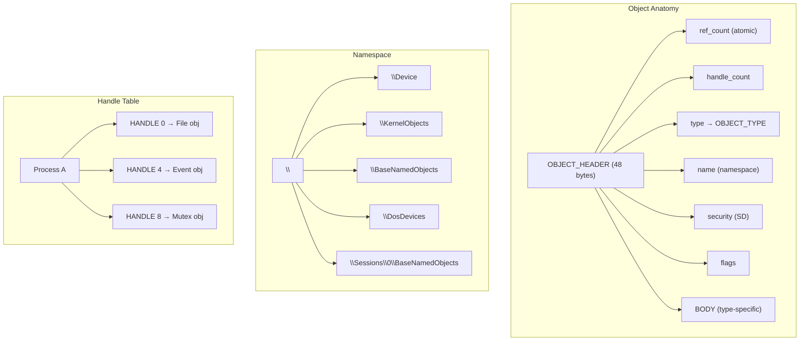
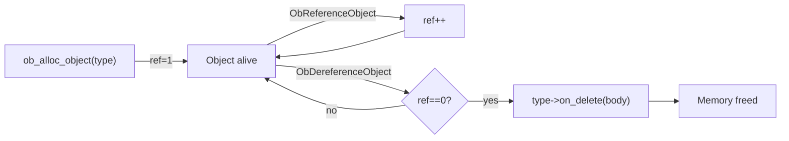

# Object Manager

> Unified kernel object substrate: typed headers, reference-counted lifetimes, per-process handle tables, hierarchical namespace, security descriptors, and Win32 HANDLE semantics for 11 built-in object types.

## Overview

The Object Manager (ObXxx layer) gives every kernel resource — files, processes, threads, events, mutexes, semaphores, timers, registry keys, sections, ports — a common infrastructure: typed header, atomic reference count, named namespace entry, security descriptor, and per-process handle table slot. This is the foundation for Win32 `HANDLE` semantics.

---

## Object Types

11 built-in types registered at boot by `ob_init()`:

| Type | Body Struct | on_delete | on_close | Usage |
|---|---|---|---|---|
| Directory | `OBJECT_DIRECTORY` | frees children | — | Namespace containers |
| SymbolicLink | `OBJECT_SYMLINK` | frees target | — | `\DosDevices\C:` → `\Device\Ahci0\Part2` |
| Type | `OBJECT_TYPE` | — | — | Meta-type for type registration |
| File | wraps `vfs_node` | `vfs_close` | decrement handle_count | VFS file/directory objects |
| Process | wraps `task` | cleanup task | — | Process lifetime |
| Thread | wraps `thread` | cleanup thread | — | Thread lifetime |
| Event | `kernel_event_t` | — | — | `NtCreateEvent` / `NtSetEvent` |
| Mutant | `mutex_t` | — | release if owned | `NtCreateMutant` |
| Semaphore | `semaphore_t` | — | — | `NtCreateSemaphore` |
| Timer | `ktimer_t` | cancel | — | `NtCreateTimer` |
| Token | `ACCESS_TOKEN` | — | — | Security tokens |

---

## Reference Counting

- `ob_alloc_object(type)` — allocates header+body, sets ref=1
- `ObReferenceObject(body)` — atomic increment
- `ObDereferenceObject(body)` — atomic decrement; frees on 0 (unless `OB_FLAG_PERMANENT`)
- `OB_HEADER_FROM_BODY(ptr)` — macro to get header from body pointer

---

## Handle Table

Per-process array mapping `HANDLE` integers (multiples of 4) to objects:

| Function | Purpose |
|---|---|
| `ObpAllocateHandle(table, object, access, attrs)` | Allocate handle, increment ref |
| `ObpLookupHandle(table, handle)` | Find entry by handle value |
| `ObpFreeHandle(table, handle)` | Release handle, decrement ref |
| `ob_handle_table_init(table)` | Initialize empty table |
| `ob_handle_table_inherit(parent, child)` | Copy `OBJ_INHERIT` handles to child |

Handle attributes: `OBJ_INHERIT` (survives CreateProcess), `OBJ_PROTECT_CLOSE` (NtClose fails).

---

## Namespace

Hierarchical directory tree rooted at `\`. Objects are inserted by name and found via path traversal.

| Function | Purpose |
|---|---|
| `ObLookupObjectByName(path, type, access, &result)` | Walk namespace, follow symlinks |
| `NtOpenDirectoryObject(ht, name, access, &handle)` | Open directory by path |
| `NtQueryDirectoryObject(ht, handle, buf, count, &ctx, &n)` | Enumerate directory entries |
| `NtDuplicateObject(src_ht, src_h, dst_ht, &dst_h, ...)` | Duplicate handle between processes |

Root directories created at boot: `\Device`, `\KernelObjects`, `\BaseNamedObjects`, `\DosDevices`, `\Sessions\0\BaseNamedObjects`.

---

## Security Integration

Every object can carry a `SECURITY_DESCRIPTOR` (owner SID, DACL, SACL). Access checks are performed at handle creation time via the Security Reference Monitor (`SeAccessCheck`). Security descriptors are hash-deduplicated to save memory.

---

## Key Files

| File | Purpose |
|---|---|
| `include/kernel/ob/ob.h` | `OBJECT_HEADER`, `ob_alloc_object`, `ObReferenceObject`, handle API |
| `include/kernel/ob/ob_type.h` | `OBJECT_TYPE` with lifecycle callbacks |
| `include/kernel/ob/ob_ns.h` | `ObLookupObjectByName`, namespace API |
| `include/kernel/ob/handle_table.h` | `HANDLE_TABLE`, `ObpAllocateHandle`, inherit |
| `src/kernel/ob/ob.c` | Core: alloc, ref/deref, init, 11 type registrations |
| `src/kernel/ob/ob_ns.c` | Namespace: directory tree, symlink traversal |
| `src/kernel/ob/handle_table.c` | Handle table: alloc, lookup, free, inherit |
| `src/kernel/test/test_ob.c` | 7 suites, 23 assertions |
| `src/kernel/test/test_security.c` | 5 suites, 13 assertions (SID, ACL, token) |

---

## Gotchas

> [!CAUTION]
> **`ref_count` is `atomic_t`, not `int`.** Use `atomic_read(&hdr->ref_count)` to read it. Direct comparison (`hdr->ref_count == 1`) causes a compile error.

> [!WARNING]
> **Handle values are multiples of 4.** `HANDLE 0` is valid (first slot). `INVALID_HANDLE_VALUE` is `-1`. Low 2 bits are reserved.

> [!NOTE]
> **`OB_FLAG_PERMANENT` objects survive refcount 0.** Root namespace directories and built-in type objects are permanent — they're never freed even when all handles are closed.

> [!NOTE]
> **ObBrowse.exe** is tracked separately in [16-tools-accessories/TODO-01](../../todo/16-tools-accessories/TODO-01-obbrowse-namespace-browser.md) — a user-mode GUI for browsing the namespace.

---

## OS Comparison

| Feature | Win11 | Linux | Impossible OS |
|---|---|---|---|
| Typed object header | `OBJECT_HEADER` | `kobject + kref` | `OBJECT_HEADER` (48 bytes) |
| Type descriptors | `OBJECT_TYPE` hooks | `kobj_type` | `OBJECT_TYPE` (6 callbacks) |
| Auto-delete on 0 ref | `ObDereferenceObject` | `kref_put` | `ObDereferenceObject` (atomic) |
| Per-process handles | `HANDLE_TABLE` | fd table | `HANDLE_TABLE` (multiples of 4) |
| Named namespace | `\BaseNamedObjects` | `/proc`, `/sys` | `\`, `\Device`, `\BaseNamedObjects` |
| File/Process/Thread objects | `FILE_OBJECT`, `EPROCESS` | `struct file`, `task_struct` | Ob-managed with type callbacks |
| Named sync objects | Named events/mutex | POSIX named semaphores | Named Event/Mutant/Semaphore |
| Section objects | `SECTION_OBJECT` | anonymous mmap | Ob-managed Section type |
| Security descriptors | DACL/SACL | inode perms/ACLs | Per-object SD (hash-deduplicated) |
| Duplicate/inherit | Full semantics | dup/O_CLOEXEC | `NtDuplicateObject` + `OBJ_INHERIT` |
| Public namespace API | Internal only | No equivalent | `NtOpenDirectoryObject` + `NtQueryDirectoryObject` |
| Unified type system | Partial ObXxx | Split fd/kobject | Single `OBJECT_HEADER` for all types |

---

## References

- Source: `src/kernel/ob/`, `include/kernel/ob/`
- Tests: `src/kernel/test/test_ob.c` (7 suites, 23 assertions)
- Security: `src/kernel/test/test_security.c` (5 suites, 13 assertions)
- ObBrowse tool: [16-tools-accessories/TODO-01](../../todo/16-tools-accessories/TODO-01-obbrowse-namespace-browser.md)
- Related: [Init Sequencing](init-sequencing.md) (Phase 2 OB init), [System Logging](system-logging.md)
