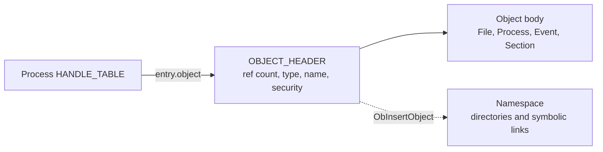

<!-- docs: covers=todo/02-kernel-core/TODO-05-object-manager.md sources=include/kernel/ob/ob.h,include/kernel/ob/ob_type.h,include/kernel/ob/handle_table.h,include/kernel/ob/ob_ns.h,include/kernel/ob/ob_callback.h,include/kernel/ob/ob_trace.h,src/kernel/ob/ob.c,src/kernel/ob/handle_table.c,src/kernel/ob/ob_ns.c,src/kernel/ob/ob_callback.c,src/kernel/ob/ob_trace.c,src/kernel/test/test_ob.c reviewed=2026-09-28 order=5 -->
# Object Manager

## What is it?

The Object Manager gives every kernel resource (a file, a process, a thread, an event, a mutex, a section, a directory entry) the same typed header, a reference count, an optional name in a shared namespace, and a slot in a per-process handle table. It is what makes a Win32 `HANDLE` meaningful: one uniform way to open, duplicate, close and leak-track a kernel resource.

Every object body sits directly after an `OBJECT_HEADER` in memory, and its behaviour (how it opens, closes, is deleted or is parsed in the namespace) comes from the `OBJECT_TYPE` it points at. Every section of the roadmap has shipped code; several still carry follow-up items, most of them rooted in one gap: looking up a handle and taking a reference on its object are still two separate steps.

## How does it work?

`ob_create_type()` registers an `OBJECT_TYPE` in a fixed 64-slot table (`OB_MAX_TYPES` in [`ob.h`](../../include/kernel/ob/ob.h)) under a spinlock, so concurrent registration never publishes a half-written row. At boot, `ob_init()` in [`ob.c`](../../src/kernel/ob/ob.c) registers 15 built-in types (File, InfoFile, Process, Thread, Directory, SymbolicLink, Event, Mutex, Semaphore, Section, Timer, Token, Job, Peb and Teb).

`ob_alloc_object(type)` makes one combined allocation of header plus body, so freeing an object is one call, and `OB_HEADER_FROM_BODY()` and `OB_BODY_FROM_HEADER()` convert between the two pointers. The header carries an atomic reference count, a handle count, the type pointer, an optional name and a security descriptor pointer. `ObReferenceObject()` is the fast increment; `ObReferenceObjectSafe()` increments only if the count is still nonzero, for lookup paths that can race a close; `ObDereferenceObject()` decrements and, at zero, calls the type's delete routine and frees the block.

Each process owns a `HANDLE_TABLE` ([`handle_table.h`](../../include/kernel/ob/handle_table.h)): a growable array of entries holding the object, the granted access and the attributes, starting at 64 slots. `ObpAllocateHandle()` claims a slot and takes a reference; `ObpFreeHandle()` clears it and runs the type's close routine when the last handle goes; `ObpLookupHandle()` resolves a handle, including the pseudo-handles for the current process and thread. A per-process limit is enforced before the slot search: 16384 by default (`HANDLE_TABLE_DEFAULT_LIMIT`, adjustable through the `handle.quota_default` tunable) with a hard ceiling of 1,048,576 (`HANDLE_TABLE_ABSOLUTE_MAX`).

Named objects live in a namespace rooted at `\`, built from directory objects and symbolic links ([`ob_ns.c`](../../src/kernel/ob/ob_ns.c)). `ObInsertObject()` publishes a name; `ObLookupObjectByName()` walks a path and follows symbolic links with a shared depth budget, so a cycle fails instead of exhausting the stack. `ob_ns_init()` builds `\Device`, `\KernelObjects`, `\DosDevices`, `\BaseNamedObjects` and `\Sessions\0\BaseNamedObjects`, plus the `C:` link.

Drivers can register pre- and post-operation filters on handle creation and duplication through `ObRegisterCallbacks()`: 16 slots sorted by altitude, called outside the registration lock ([`ob_callback.c`](../../src/kernel/ob/ob_callback.c)). Tagged references (`ObReferenceObjectWithTag()`) and optional handle tracing feed a per-object history that is dumped through klog when the object is finally freed ([`ob_trace.c`](../../src/kernel/ob/ob_trace.c)).



## What are its interfaces?

| Interface | Purpose |
| --- | --- |
| `OBJECT_HEADER`, `OBJECT_TYPE` | The header and type contract every object shares ([`ob.h`](../../include/kernel/ob/ob.h), [`ob_type.h`](../../include/kernel/ob/ob_type.h)) |
| `ob_create_type()`, `ob_alloc_object()` | Register a type; allocate header and body together |
| `ObReferenceObject()`, `ObReferenceObjectSafe()`, `ObReferenceObjectByPointer()`, `ObDereferenceObject()` | Object lifetime ([`ob.c`](../../src/kernel/ob/ob.c)) |
| `ObpAllocateHandle()`, `ObpFreeHandle()`, `ObpLookupHandle()`, `ob_handle_table_set_limit()` | Per-process handle table and quota ([`handle_table.c`](../../src/kernel/ob/handle_table.c)) |
| `ObInsertObject()`, `ObLookupObjectByName()` | Publish or find a named object ([`ob_ns.h`](../../include/kernel/ob/ob_ns.h)) |
| `NtClose()`, `NtDuplicateObject()`, `NtQueryObject()` | Close, duplicate and query handles |
| `NtOpenDirectoryObject()`, `NtQueryDirectoryObject()` | Browse the namespace |
| `ObSetSecurityDescriptor()`, `ObGetSecurityDescriptor()` | Attach or read an object's security descriptor |
| `ObRegisterCallbacks()`, `ObUnRegisterCallbacks()` | Handle operation filters ([`ob_callback.h`](../../include/kernel/ob/ob_callback.h)) |
| `ObReferenceObjectWithTag()`, `ObDereferenceObjectWithTag()` | Tagged references for leak diagnosis ([`ob_trace.h`](../../include/kernel/ob/ob_trace.h)) |

## How do I use it?

The Object Manager starts on every boot in Phase 2; there is nothing to enable.

```bash
bash scripts/test.sh SUITE=ob        # or: make test-ob
```

The suite in [`test_ob.c`](../../src/kernel/test/test_ob.c) covers types, reference counts, handles, the namespace, callbacks, quotas and tracing. Two settings change behaviour: the `handle.quota_default` tunable sets the default per-process handle limit, and `ob_handle_trace=1` in `boot.conf` turns on per-handle create, free and inherit tracing in klog. Reference tracing is opt-in per type through `ob_enable_type_tracing()`.

## What is not implemented yet?

- **Atomic lookup-then-reference.** A handle lookup and the reference that pins its object are separate steps, so a concurrent `NtClose` on another CPU can free the object between them. The `ObpReferenceObjectByHandle()` primitive and a per-table lock are designed but not built ([Per-Process Handle Table](../../todo/02-kernel-core/TODO-05-object-manager.md#3-per-process-handle-table)).
- **Full-path object names and real process handles.** `NtQueryObject` returns only the leaf name, and `NtOpenProcess`/`NtOpenThread` still turn a PID or TID into a handle directly, so access masks, inheritance and duplication do not apply to them ([NtClose / NtDuplicateObject / NtQueryObject](../../todo/02-kernel-core/TODO-05-object-manager.md#9-ntclose--ntduplicateobject--ntqueryobject)).
- **Directory teardown.** The Directory type has no delete routine, so freeing a non-empty directory drops its entries ([Object Namespace](../../todo/02-kernel-core/TODO-05-object-manager.md#4-object-namespace)).
- **Reopening named events, mutexes and semaphores by name** is not normalized the way timers are ([Synchronisation Object Types](../../todo/02-kernel-core/TODO-05-object-manager.md#6-synchronisation-object-types)).
- **Section views** can outlive their handle, and closing a handle does not clear the user mappings ([Section (Shared Memory) Object Type](../../todo/02-kernel-core/TODO-05-object-manager.md#7-section-shared-memory-object-type)).
- **Process creation is not atomic on failure**: a late failure leaks the partly built child ([Handle Inheritance Across CreateProcess](../../todo/02-kernel-core/TODO-05-object-manager.md#10-handle-inheritance-across-createprocess)).
- **DACL checks at handle open** belong to the [Security Reference Monitor](../../todo/02-kernel-core/TODO-15-security-reference-monitor.md): security descriptors are stored, but no built-in type enforces them yet.

## How does it compare with Windows 11 and Linux?

| Capability | Windows 11 | Linux | Impossible OS |
| --- | --- | --- | --- |
| Typed object header and type descriptor | `OBJECT_HEADER`, `OBJECT_TYPE` | `kobject`, `kref` | Same shape |
| Per-process handle table | Handle table | File descriptor table | Same shape |
| Named namespace | `\BaseNamedObjects` | `/proc`, `/sys` | `\`, `\Device`, `\BaseNamedObjects` |
| Duplicate, inherit, quota | Full semantics | `dup`, `O_CLOEXEC`, `RLIMIT_NOFILE` | Full semantics, 16384 default quota |
| Handle operation callbacks | `ObRegisterCallbacks` | LSM hooks | `ObRegisterCallbacks`-shaped API |
| Namespace browser | Undocumented | None | Public system calls |
| Leak detection | ETW with external tooling | None built in | Built into klog |

The namespace browser, one header for every kernel resource, and klog-integrated leak detection go beyond both. The handle lookup race above is specific to this implementation, not a design difference.

## See also

- [Object Manager roadmap](../../todo/02-kernel-core/TODO-05-object-manager.md)
- [Native API and SSDT](native-api-ssdt.md)
- [PEB, TEB and the User-Mode ABI](peb-teb-user-abi.md)
