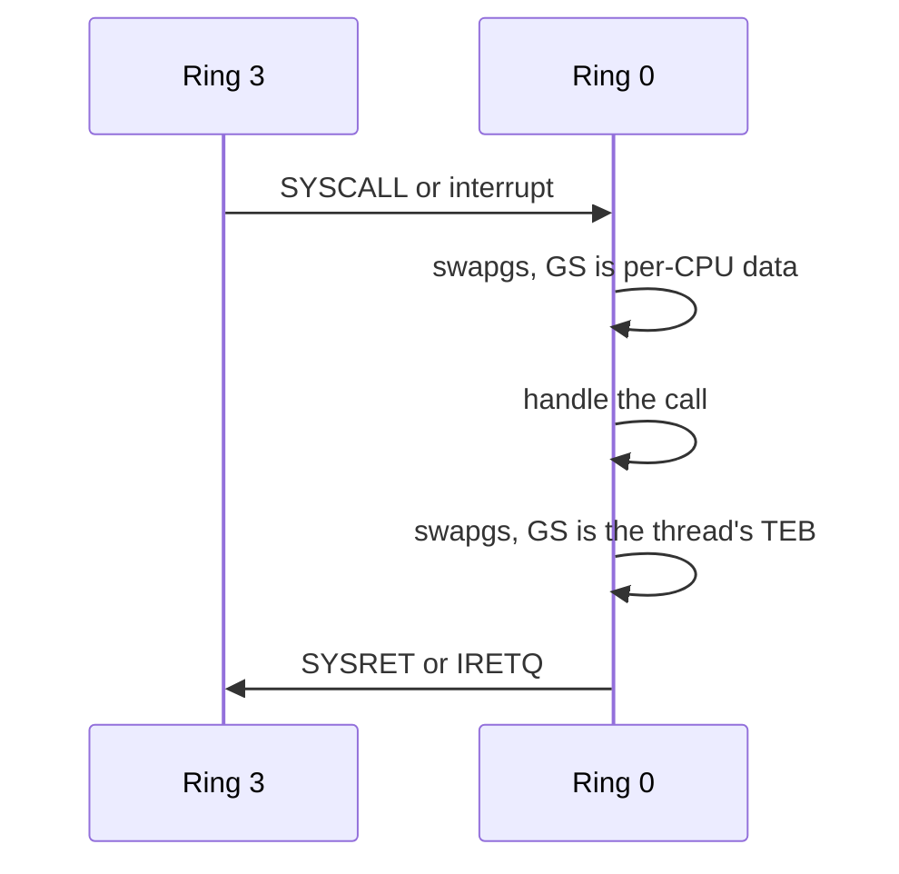

<!-- docs: covers=todo/02-kernel-core/TODO-11-peb-teb-user-abi.md sources=include/kernel/ob/teb.h,include/kernel/ob/peb.h,include/kernel/nt/kusd.h,src/kernel/sched/task.c,src/kernel/isr_stubs.asm,src/kernel/elf.c,src/kernel/test/test_peb_teb.c reviewed=2026-09-28 order=11 -->
# PEB, TEB and the User-Mode ABI

## What is it?

The Process Environment Block (PEB) and Thread Environment Block (TEB) are the per-process and per-thread structures that `ntdll.dll` and Win32 programs read directly, without a system call, to find their image base, command line, environment, last error code and thread-local storage. Impossible OS lays out both at the Windows x64 offsets so Windows startup code works unchanged: `NtCurrentTeb()` compiles to `mov rax, gs:[0x30]`. Alongside them, `KUSER_SHARED_DATA` is a read-only page of time and version data, and the ELF auxiliary vector gives Linux-ABI programs the entries their C runtime expects.

## How does it work?

Every transition between ring 3 and ring 0 swaps `GS_BASE` and `IA32_KERNEL_GS_BASE` with `swapgs`, so the kernel sees its per-CPU data through GS and each user thread sees its own TEB. The interrupt stub in [`isr_stubs.asm`](../../src/kernel/isr_stubs.asm) swaps only when the saved code segment is a ring-3 one, on entry and on exit, and the `SYSCALL` path pairs the same way. The scheduler loads the next thread's TEB address into `IA32_KERNEL_GS_BASE` whenever the running thread changes, not only the process.



When `task_exec()` in [`task.c`](../../src/kernel/sched/task.c) starts a program, it builds the PEB, the process parameters block and the environment block at fixed user addresses (PEB at `0x7FFDE000`), and `teb_alloc_for_task()` places the first thread's TEB at `0x7FFDB000`. A minimal loader data block lists the main executable in all three Windows module lists, so `ntdll` does not fault walking an empty list. The kernel writes the new GS base before publishing the TEB pointer with release ordering, and the scheduler reads them in the opposite order, so a CPU that sees the TEB always sees its GS base; that ordering fixed an intermittent boot halt.

Additional user threads come from `uthread_create()`, which builds a real ring-3 return frame with its own kernel stack, user stack and TEB, placed one page apart per thread ID below the first TEB.

Thread-local storage is a per-process bitmap: 64 slots live in the TEB's `TlsSlots` array and 1024 more pointer slots are allocated on demand into an 8 KiB, two-page expansion array the first time a program needs them.

`KUSER_SHARED_DATA` ([`kusd.h`](../../include/kernel/nt/kusd.h)) is one physical page mapped read-only at `0x7FFE0000`. `kusd_init()` fills the static fields once at boot, including `SafeBootMode`, `KdDebuggerEnabled` and `MitigationPolicies` from the kernel configuration snapshot, and the timer interrupt updates the time fields with a three-write protocol so a reader never sees a torn value.

For ELF programs, `task_exec()` builds a System V initial stack (argc, argv, envp and the auxiliary vector). The vector includes `AT_RANDOM` (16 bytes from the kernel CSPRNG, which seeds the stack protector), `AT_PHDR`, `AT_PHENT` and `AT_PHNUM` from `elf_extract_phdr_info()` in [`elf.c`](../../src/kernel/elf.c), which is the same parser the loader uses, plus the user and group IDs, `AT_SECURE` and `AT_HWCAP`.

## What are its interfaces?

| Interface | Purpose |
| --------- | ------- |
| `TEB`, `NT_TIB`, `CLIENT_ID` | Thread block at Windows x64 offsets, pinned by `_Static_assert` ([`teb.h`](../../include/kernel/ob/teb.h)) |
| `PEB`, `RTL_USER_PROCESS_PARAMETERS`, `PEB_LDR_DATA`, `LDR_DATA_TABLE_ENTRY` | Process block and its loader and parameter structures ([`peb.h`](../../include/kernel/ob/peb.h)) |
| `KUSER_SHARED_DATA`, `kusd_init()`, `kusd_update_time()` | Shared time and version page ([`kusd.h`](../../include/kernel/nt/kusd.h)) |
| `peb_alloc_for_task()`, `teb_alloc_for_task()` | Build the PEB and a thread's TEB ([`task.c`](../../src/kernel/sched/task.c)) |
| `kthread_create()`, `uthread_create()`, `thread_create()` | Kernel threads, real ring-3 threads, and a dispatcher between them |
| `tls_alloc()`, `tls_free()`, `tls_get_value()`, `tls_set_value()` | TLS slots, static and expansion |
| `elf_extract_phdr_info()` | Program header parser shared by the loader and the auxiliary vector ([`elf.c`](../../src/kernel/elf.c)) |

## How do I use it?

```bash
bash scripts/test.sh SUITE=abi     # PEB and TEB offsets, TLS, auxiliary vector, user threads
```

On boot, serial prints the PEB and TEB addresses for each user process (`PID N: PEB=... TEB=... (Win 10.0.22621, N CPUs)`) and the auxiliary vector built for each ELF program (`ELF auxv: AT_RANDOM=...`). User code can read `KUSER_SHARED_DATA` directly at `0x7FFE0000` without a system call. `cmd.exe` reaching its prompt in ring 3 exercises the PEB, TEB and TLS paths on every smoke test. The tests are in [`test_peb_teb.c`](../../src/kernel/test/test_peb_teb.c).

## What is not implemented yet?

- **PEB version fields** after offset `0x28` sit at the 32-bit offsets, not the x64 ones, so a real 64-bit `ntdll` would read padding ([PEB x64 Version-Field Offsets](../../todo/02-kernel-core/TODO-11-peb-teb-user-abi.md#17-peb-x64-version-field-offsets)).
- **The TEB is two pages** but only one is mapped per thread, and threads are placed one page apart ([TEB Multi-Page Mapping and User-VA Non-Overlap](../../todo/02-kernel-core/TODO-11-peb-teb-user-abi.md#16-teb-multi-page-mapping-and-user-va-non-overlap)).
- **exec and fork GS staging**: `task_fork()` gives the child the parent's TEB instead of its own ([exec/fork/switch GS-base Staging Correctness and Cost](../../todo/02-kernel-core/TODO-11-peb-teb-user-abi.md#19-execforkswitch-gs-base-staging-correctness-and-cost)).
- **PEB allocation robustness**: mapping results are not checked and long names are not bounded to the page ([PEB Allocation Robustness and Win32 ABI Handoff](../../todo/02-kernel-core/TODO-11-peb-teb-user-abi.md#20-peb-allocation-robustness-and-win32-abi-handoff)).
- **A Win64 startup frame** for PE programs does not exist; every format gets the ELF-style stack ([Format-Specific User Startup Frame](../../todo/02-kernel-core/TODO-11-peb-teb-user-abi.md#21-format-specific-user-startup-frame-elf--pe--eif--env-unification)).
- **The loader module entry** records the entry point as the image base ([PEB Ldr Module Identity](../../todo/02-kernel-core/TODO-11-peb-teb-user-abi.md#22-peb-ldr-module-identity-dllbase--sizeofimage--name)).
- **Per-thread TLS values**: the TLS helpers still read the first thread's TEB ([Per-thread TLS Value Storage](../../todo/02-kernel-core/TODO-11-peb-teb-user-abi.md#23-per-thread-tls-value-storage-static--expansion)).
- **PEB and TEB namespace objects** are disabled until a safe wrapper object exists ([PEB/TEB Ob-Namespace Exposure](../../todo/02-kernel-core/TODO-11-peb-teb-user-abi.md#24-pebteb-ob-namespace-exposure-safe-wrapper-objects--lifecycle)).
- **One shared build number** (the PEB reports 22621 while `KUSER_SHARED_DATA` reports the internal build) is open; the Safe Mode, debugger and mitigation fields are already published by `kusd_init()` ([KUSER_SHARED_DATA](../../todo/02-kernel-core/TODO-11-peb-teb-user-abi.md#11-kuser_shared_data----kernel-user-shared-page)).
- **Hardening** of TLS expansion, the auxiliary vector and `uthread_create()` is tracked in [sections 25 to 27](../../todo/02-kernel-core/TODO-11-peb-teb-user-abi.md#25-tls-expansion-mapping-safety-and-alloc-race).

## How does it compare with Windows 11 and Linux?

Windows keeps the PEB and TEB as private `ntdll` and loader internals; Linux has no equivalent structures and uses the raw ELF stack, the C library's thread block and a per-thread `errno`. Impossible OS matches Windows on the core contract: PEB, TEB, `swapgs`, static and expansion TLS, the shared time page and per-thread TEBs for real user threads. The remaining gaps are ABI-correctness and robustness items, chiefly the x64 PEB version offsets and the two-page TEB mapping.

## See also

- [PEB / TEB and User-Mode ABI roadmap](../../todo/02-kernel-core/TODO-11-peb-teb-user-abi.md)
- [Native API and SSDT](native-api-ssdt.md)
- [Time and FILETIME](time-filetime.md)
