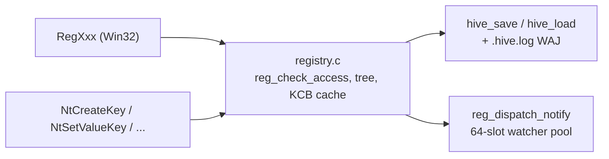

<!-- docs: covers=todo/02-kernel-core/TODO-14-registry-completion.md sources=src/kernel/registry.c,include/registry.h,src/kernel/nt/nt_registry.c,src/kernel/test/test_registry.c reviewed=2026-09-28 order=14 -->
# Registry

## What is it?

The Registry is Impossible OS's hierarchical, typed key/value configuration store, the kernel-resident equivalent of Windows' `HKEY_LOCAL_MACHINE` tree. It gives every subsystem, from boot device discovery to NLS locale policy, one place to persist settings as `reg_key_t` nodes carrying `reg_value_t` entries (`REG_SZ`, `REG_DWORD`, `REG_BINARY`, and the rest of the standard type set), backed by a crash-safe on-disk hive format with write-ahead journaling. The core engine (`src/kernel/registry.c`, 4293 lines) implements the full Win32 `RegXxx` surface, access-right enforcement, a change-notification engine, and 20 NT syscalls; what remains open is mostly user-mode exposure (advapi32, `regedit`), SMP locking, and a set of exclusive features (transactions, snapshots, schema validation) that go beyond what either Windows or Linux ships.

## How does it work?

Every key lives in a static pool (`reg_key_t` / `reg_value_t`), addressed by an FNV-1a hash and a parent/child linked structure; a 32-entry LRU cache (`reg_kcb_cache`, [`registry.c`](../../src/kernel/registry.c)) shortcuts repeated `(parent, name)` resolutions. All five root keys (`HKLM`, `HKCU`, `HKCR`, `HKU`, `HKCC`) exist, and the internal path walker (`reg_walk_path()`) follows `REG_LINK` keys transparently. Every public entry point (`RegOpenKeyEx`, `RegCreateKeyEx`, `RegSetValueEx`, and so on) funnels through `reg_check_access()`, which checks the caller's granted access mask against the key's `KEY_*` rights; the underlying `SeAccessCheck` DACL walk is not implemented yet (see below), so `reg_check_access()` currently enforces only the mask recorded on the open handle, not the security descriptor.

On disk, a hive is a flat file plus a `.hive.log` write-ahead journal: `hive_save()`/`hive_load()` serialize the tree, and `hive_best_source()` picks between the main hive and a valid journal on mount so a crash mid-write cannot corrupt live state. `RegCopyTree()` and `RegRenameKey()` provide recursive subtree copy and in-place rename (not copy-plus-delete). A change-notification engine (`reg_watcher_pool`, 64 static slots) lets kernel-internal callers register on `REG_NOTIFY_CHANGE_NAME`/`ATTRIBUTES`/`LAST_SET`/`SECURITY`; `reg_dispatch_notify()` walks a mutated key up its parent chain, firing subtree watchers once per ancestor, and every tombstone path (`RegDeleteKey`, `reg_delete_subtree`, `RegUnloadHive`) unregisters its watchers so a freed slot never stays linked. The Win32-facing `RegNotifyChangeKeyValue` (event-based, asynchronous) is not wired to this engine yet.

The NT syscall surface in `src/kernel/nt/nt_registry.c` wires 20 handlers to the SSDT: `NtCreateKey`, `NtOpenKey(Ex)`, `NtDeleteKey`, `NtSetValueKey`, `NtQueryValueKey`, `NtDeleteValueKey`, `NtEnumerateKey`, `NtEnumerateValueKey`, `NtQueryKey`, `NtFlushKey`, `NtNotifyChangeKey`, `NtRenameKey`, `NtSaveKey(Ex)`, `NtRestoreKey`, `NtLoadKey(Ex)`, `NtUnloadKey(Ex)`. `NtNotifyChangeKey` is a real syscall slot but its handler unconditionally returns `STATUS_NOT_IMPLEMENTED`; it is waiting on the same event-based wiring as the Win32 entry point. `HKEY` values returned to user mode are still raw pointers into a 128-entry handle pool rather than Object Manager handles, so `NtClose` cannot release them today.



## What are its interfaces?

| Interface | Purpose |
| --- | --- |
| `RegOpenKeyEx()`, `RegCreateKeyEx()`, `RegCloseKey()`, `RegDeleteKey()`, `RegDeleteTree()` | Core key lifecycle ([`registry.h`](../../include/registry.h)) |
| `RegSetValueEx()`, `RegQueryValueEx()`, `RegGetValue()`, `RegDeleteValue()`, `RegEnumValue()` | Value read/write |
| `RegEnumKeyEx()`, `RegQueryInfoKey()` | Enumeration and metadata (FILETIME `LastWriteTime`) |
| `RegCopyTree()`, `RegRenameKey()` | Recursive subtree copy and in-place rename |
| `RegFlushKey()` | Immediate single-hive save |
| `reg_notify_register()`, `RegUnregisterNotify()` | Kernel-internal change-notification callbacks |
| `reg_check_access()` | The per-operation `KEY_*` access-mask chokepoint |
| `NtCreateKey`, `NtOpenKey`, `NtSetValueKey`, `NtQueryValueKey`, `NtEnumerateKey`, `NtQueryKey`, `NtFlushKey` | NT syscalls wired to the SSDT ([`nt_registry.c`](../../src/kernel/nt/nt_registry.c)) |
| `NtSaveKey`, `NtRestoreKey`, `NtLoadKey`, `NtUnloadKey`, `NtRenameKey` | Hive-level NT syscalls |
| `NtNotifyChangeKey` | Wired SSDT slot, returns `STATUS_NOT_IMPLEMENTED` |

## How do I use it?

The registry starts on every boot; the engine mounts and populates defaults automatically, with no setting to disable it.

```bash
bash scripts/test.sh SUITE=abi        # or: make test-abi
```

Kernel code reads and writes through the `RegXxx` functions directly (`RegGetDword`, `RegSetString`, `RegReadKeyValue` are one-shot convenience wrappers); user-mode code goes through the NT syscalls once a process has a valid `HKEY`. `%VAR%` expansion for boot-path values uses `reg_lookup_env_var()`/`reg_expand_sz()`. The suite in [`test_registry.c`](../../src/kernel/test/test_registry.c) covers access rights, `RegCopyTree`/`RegRenameKey`, volatile keys, the KCB cache, and the notification engine.

## What is not implemented yet?

- `SeAccessCheck` (the DACL walk itself) is not built, so `reg_check_access()` enforces only the handle's granted mask, not the key's security descriptor; see the [Security Reference Monitor](security-reference-monitor.md) ([SeAccessCheck Engine](../../todo/02-kernel-core/TODO-15-security-reference-monitor.md#5-seaccesscheck-engine)).
- Registry-wide SMP locking does not exist: `registry.c` still assumes single-threaded access even though NT syscalls expose it to concurrent user-mode tasks ([Registry SMP Synchronization](../../todo/02-kernel-core/TODO-14-registry-completion.md#14-registry-smp-synchronization)).
- `NtNotifyChangeKey` and the Win32 `RegNotifyChangeKeyValue` event path are unimplemented stubs; only the kernel-internal callback engine works today ([Change Notifications](../../todo/02-kernel-core/TODO-14-registry-completion.md#3-change-notifications)).
- `HKEY` values are raw pointers into a 128-entry pool, not Object Manager handles, so a long-running process leaking `HKEY`s cannot be closed via `NtClose` ([Nt/Zw Registry Syscalls](../../todo/02-kernel-core/TODO-14-registry-completion.md#4-ntzw-registry-syscalls)).
- `RegSaveKey`/`RegRestoreKey` and their NT equivalents have their privilege gates wired but return `ERROR_NOT_SUPPORTED`/no hive I/O body ([Advanced Key Operations](../../todo/02-kernel-core/TODO-14-registry-completion.md#2-advanced-key-operations)).
- `advapi32.dll` A/W export shims, the merged `HKCR` view, `.reg` import/export, and the `regedit` shell tool do not exist ([advapi32.dll Win32 Compatibility](../../todo/02-kernel-core/TODO-14-registry-completion.md#5-advapi32dll-win32-compatibility)).
- Registry virtualization (`VirtualStore` redirect for low-IL writes) is not built ([Registry Virtualization & .reg Import/Export](../../todo/02-kernel-core/TODO-14-registry-completion.md#6-registry-virtualization--reg-importexport)).
- Transactions, the pattern-search API, snapshot/diff, schema validation, dual-log WAJ failover, incremental delta flush, and hive compaction are all deferred, exclusive-feature work ([Transactions, Search API & Snapshot/Diff](../../todo/02-kernel-core/TODO-14-registry-completion.md#9-transactions-search-api--snapshotdiff), [Advanced Hive Features](../../todo/02-kernel-core/TODO-14-registry-completion.md#8-advanced-hive-features)).
- Value name/data limits are still 255 chars / 512 bytes, short of the 16383-char / 1 MiB Windows 11 limits, pending a heap-backed migration of five fixed stack buffers ([Registry Value Size Expansion](../../todo/02-kernel-core/TODO-14-registry-completion.md#15-registry-value-size-expansion-16-kib-names-1-mib-data)).

## How does it compare with Windows 11 and Linux?

Windows 11's registry is the direct model: a hierarchical typed store, `.LOG1`/`.LOG2` crash-safe journaling, `RegNotifyChangeKeyValue`, and a full NT syscall surface with DACL enforcement. Linux has no in-kernel equivalent; GNOME's dconf is the closest analogue, a user-space binary database with no write-ahead journal and no typed access-rights model. Impossible OS already matches Windows on the core tree, hive persistence with WAJ, `RegCopyTree`/`RegRenameKey`, volatile keys, and a 32-entry hot-key cache Windows' `CmpCache` pushlock also provides. It is behind Windows 11 on DACL enforcement, the full NT syscall surface (`NtNotifyChangeKey` is a stub), advapi32 A/W exposure, and SMP-safe concurrent access, all tracked above. Sections not yet started (transactions, snapshot/diff, schema-validated keys, incremental delta flush) are designed to exceed what either OS offers once built.

## See also

- [Registry System Completion roadmap](../../todo/02-kernel-core/TODO-14-registry-completion.md)
- [Security Reference Monitor](security-reference-monitor.md)
- [Object Manager](object-manager.md)
- [Atom, NLS and Locale Subsystem](atom-nls-locale.md)
