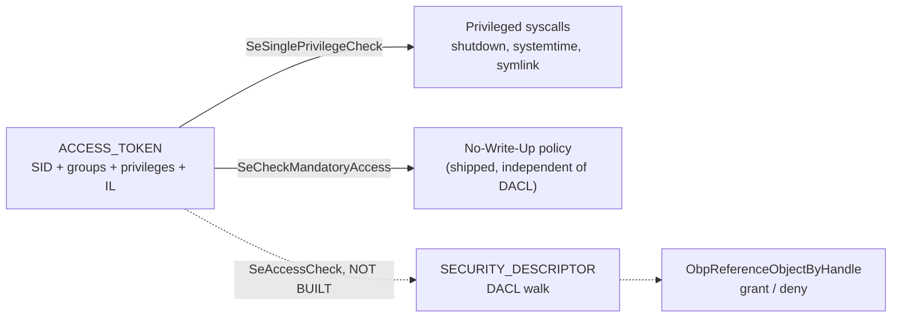

<!-- docs: covers=todo/02-kernel-core/TODO-15-security-reference-monitor.md sources=include/kernel/security/sid.h,include/kernel/security/luid.h,include/kernel/security/privileges.h,include/kernel/security/acl.h,include/kernel/security/token.h,include/kernel/security/mic.h,include/kernel/security/generic_mapping.h,include/kernel/security/default_sds.h,include/kernel/security/assign_security.h,src/kernel/security/sid.c,src/kernel/security/luid.c,src/kernel/security/privileges.c,src/kernel/security/acl.c,src/kernel/security/token.c,src/kernel/security/ps_token.c,src/kernel/security/mic.c,src/kernel/security/default_sds.c,src/kernel/security/assign_security.c,src/kernel/nt/nt_token.c,src/kernel/test/test_security.c reviewed=2026-09-28 order=15 -->
# Security Reference Monitor

## What is it?

The Security Reference Monitor (SRM) is the subsystem that will decide every access-control question in Impossible OS: who a process is (`ACCESS_TOKEN`), what a resource's permissions are (`SECURITY_DESCRIPTOR` and its ACLs), and whether a request is allowed. Today it ships the identity and policy PRIMITIVES, a working Mandatory Integrity Control layer, and per-privilege enforcement on a handful of privileged syscalls; the central `SeAccessCheck` DACL-walk engine that would connect a token to a security descriptor and actually grant or deny access is designed but not implemented. Every access decision elsewhere in the kernel (Registry, Object Manager, files) is either unenforced or gated by a narrower, local check until that engine lands.

## How does it work?

`src/kernel/security/sid.c` and `luid.c` define `SID` and `LUID`, 18 well-known SID constants (`SeLocalSystemSid`, `SeBuiltinAdministratorsSid`, and so on), and both trusted (`RtlLengthSid`) and untrusted-input-safe (`RtlLengthSidBounded`) variants of the core operations. `privileges.c` defines 25 privilege LUIDs (`SeCreateTokenPrivilege` through `SeCreateSymbolicLinkPrivilege`) and implements `SePrivilegeCheck()`/`SeSinglePrivilegeCheck()`, which scan a token's privilege list for a matching, enabled entry; a `KernelMode` caller always bypasses. `acl.c` implements the Win32 `SECURITY_DESCRIPTOR`/`ACL`/`ACE` ABI, both absolute (pointer-based) and self-relative (offset-based, for on-disk or wire storage) forms, plus bounded validators (`RtlValidAcl`, `RtlGetAceEx`) for parsing a security descriptor from untrusted input without overreading.

`token.c` and `ps_token.c` implement the `ACCESS_TOKEN` kernel object (registered as an Object Manager type) and its lifecycle: `SeCreateSystemToken()` builds the SYSTEM token assigned to PID 0 in boot Phase 3, `SeCreateUserToken()` builds either a Medium-IL, non-elevated token or, for an administrator, a High-IL token that is already elevated (no linked filtered token is created; that is the unbuilt UAC work), and every task-creation edge (`task_fork`, `task_create`, `task_create_user`) deep-copies the creator's token onto the new task before it becomes visible. `mic.c` implements Mandatory Integrity Control: `SeCheckMandatoryAccess()` compares a token's integrity level against an object's `SYSTEM_MANDATORY_LABEL_ACE` and enforces the No-Write-Up policy (and optionally No-Read-Up / No-Execute-Up) independently of any DACL. `assign_security.c` implements `SeAssignSecurity`, which propagates inheritable ACEs from a parent container to a newly created object, though no live caller (Object Manager, VFS) wires it in yet.

What is missing is the connective tissue: `SeAccessCheck()`, the function that would walk a security descriptor's DACL against a captured `SECURITY_SUBJECT_CONTEXT` (with owner bypass, deny-before-allow ACE ordering, a MIC pre-check, and a second DACL pass for restricted tokens) has no implementation. Until it exists, `ObpReferenceObjectByHandle` cannot enforce object ACLs, the Registry's `reg_check_access()` only checks a handle's already-granted mask rather than the key's security descriptor, and UAC's filtered tokens (`NtFilterToken`) are deliberately unshipped because exposing a restricted token without the engine that would honor its restriction would be false security.



## What are its interfaces?

| Interface | Purpose |
| --- | --- |
| `RtlEqualSid()`, `RtlLengthSid()`, `RtlConvertSidToString()` | SID primitives ([`sid.h`](../../include/kernel/security/sid.h)) |
| `SePrivilegeCheck()`, `SeSinglePrivilegeCheck()` | Token privilege enforcement ([`privileges.h`](../../include/kernel/security/privileges.h)) |
| `RtlCreateAcl()`, `RtlAddAccessAllowedAce()`, `RtlAbsoluteToSelfRelativeSD()`, `RtlValidAcl()` | Security descriptor and ACL construction/validation ([`acl.h`](../../include/kernel/security/acl.h)) |
| `SeCreateDefaultSD()` | Default DACL for a new object by type ([`default_sds.h`](../../include/kernel/security/default_sds.h)) |
| `SeCreateSystemToken()`, `SeCreateUserToken()`, `PsReferencePrimaryToken()` | Token creation and lifetime ([`token.h`](../../include/kernel/security/token.h)) |
| `ImpersonateSelf()`, `RevertToSelf()` | Self-only thread impersonation |
| `SeGetTokenIntegrityLevel()`, `SeGetObjectIntegrityLevel()`, `SeCheckMandatoryAccess()` | Mandatory Integrity Control ([`mic.h`](../../include/kernel/security/mic.h)) |
| `NtOpenProcessToken`, `NtQueryInformationToken`, `NtDuplicateToken`, `NtAdjustPrivilegesToken` | Token syscalls (`nt_token.c`) |
| `SeAssignSecurity()` | Inheritable-ACE propagation to new objects ([`assign_security.h`](../../include/kernel/security/assign_security.h)) |

## How do I use it?

Token and privilege enforcement are always on for the syscalls that already gate on them; there is no setting to enable the SRM as a whole.

```bash
bash scripts/test.sh SUITE=security    # or: make test-security
```

A kernel path that must require a privilege calls `SeSinglePrivilegeCheck(&SeXxxPrivilege, UserMode)` before proceeding, the pattern already used by shutdown, `NtSetSystemTime`, symbolic-link creation, and `NtQuerySystemInformation(SystemPerformanceInformation)`. A path that must respect integrity levels calls `SeCheckMandatoryAccess()` directly; nothing today calls a combined `SeAccessCheck`, because it does not exist. The tests live in [`test_security.c`](../../src/kernel/test/test_security.c).

## What is not implemented yet?

- `SeAccessCheck()`, the DACL-walk engine itself, is designed (an 8-step algorithm: kernel bypass, owner bypass, empty/absent DACL, MIC pre-check, ACE walk, restricted-token second pass) but has no code ([SeAccessCheck Engine](../../todo/02-kernel-core/TODO-15-security-reference-monitor.md#5-seaccesscheck-engine)).
- `ObpReferenceObjectByHandle` does not call any access-check function, so Object Manager handles are not gated by a security descriptor today ([SeAccessCheck Engine](../../todo/02-kernel-core/TODO-15-security-reference-monitor.md#5-seaccesscheck-engine)).
- `NtFilterToken`, restricted tokens, and the UAC linked-token elevation protocol are deliberately unbuilt: shipping them without `SeAccessCheck` honoring the restriction would be false sandboxing ([UAC Token Split & NtFilterToken](../../todo/02-kernel-core/TODO-15-security-reference-monitor.md#9-uac-token-split--ntfiltertoken)).
- Win32 wrappers (`OpenProcessToken`, `GetTokenInformation`, `ConvertSidToStringSidW`, SDDL parsing) are not exposed to user mode; they need a per-thread kernel Win32 last-error facility first ([Win32 Security API Wrappers](../../todo/02-kernel-core/TODO-15-security-reference-monitor.md#10-win32-security-api-wrappers)).
- The live token inspector (`whoami.exe` and tray popout) and the access-denial explainer cascade on the two gaps above and are not built ([Live Token Inspector](../../todo/02-kernel-core/TODO-15-security-reference-monitor.md#11-live-token-inspector), [Access Denial Explainer](../../todo/02-kernel-core/TODO-15-security-reference-monitor.md#15-access-denial-explainer)).
- AppContainer/LowBox tokens cascade on `SeAccessCheck` and UAC ([AppContainer / LowBox Tokens](../../todo/02-kernel-core/TODO-15-security-reference-monitor.md#14-appcontainer--lowbox-tokens)).
- `ACCESS_TOKEN` has no per-token lock yet, so the token query, adjust and set syscalls are not safe against two threads of one process touching the same token concurrently ([ACCESS_TOKEN Object](../../todo/02-kernel-core/TODO-15-security-reference-monitor.md#4-access_token-object)).
- SD inheritance (`SeAssignSecurity`) has no live caller: neither the Object Manager nor the VFS wires it into object creation yet ([SD Inheritance / SeAssignSecurity](../../todo/02-kernel-core/TODO-15-security-reference-monitor.md#13-security-descriptor-inheritance-seassignsecurity)).
- SHA-1 service-SID derivation and constant-time SID comparison wait on `cng_sha1()` and `cng_consttime_compare()` from the [CNG crypto primitives](../../todo/09-desktop-shell/TODO-07-cng-crypto.md#1-crypto-primitives-opus) ([Security Primitive Hardening](../../todo/02-kernel-core/TODO-15-security-reference-monitor.md#16-security-primitive-hardening)).

## How does it compare with Windows 11 and Linux?

Windows 11's token-and-DACL model is the reference this subsystem follows exactly: `ACCESS_TOKEN` objects, `SECURITY_DESCRIPTOR`/ACL/ACE structures, Mandatory Integrity Control, and privilege-gated syscalls. Linux has no token or DACL concept at all; it relies on UID/GID plus optional capability bits, with SELinux or AppArmor bolted on for anything resembling mandatory access control. Impossible OS's identity layer (SID, LUID, ACCESS_TOKEN, privilege list) and its Mandatory Integrity Control (No-Write-Up policy) already match Windows 11's design, and per-privilege enforcement covers the highest-value syscalls (shutdown, system time, symlink creation, backup/restore privilege gates). It is well behind Windows 11 on the piece that actually connects identity to permission: `SeAccessCheck` does not exist, so no object in the kernel enforces its DACL today, and every feature that depends on it (UAC, restricted tokens, AppContainer, Win32 security wrappers) is correctly held back rather than shipped as a facade.

## See also

- [Security Reference Monitor roadmap](../../todo/02-kernel-core/TODO-15-security-reference-monitor.md)
- [Registry](registry.md)
- [Object Manager](object-manager.md)
- [PEB, TEB and the User-Mode ABI](peb-teb-user-abi.md)
