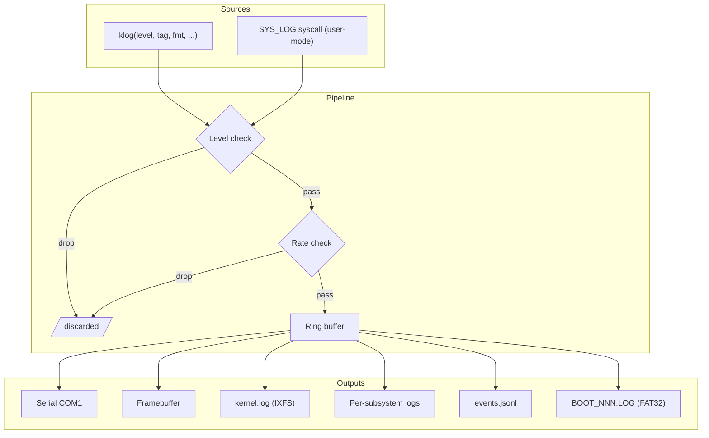
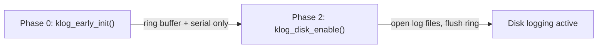

# System Logging (klog)

> Unified kernel logging with per-subsystem splitting, rotation, rate limiting, structured JSON events, and serial/disk/framebuffer output.

## Overview

Impossible OS uses a single kernel logging system (`klog`) that routes all log entries through a 1000-entry ring buffer to serial, framebuffer, and disk. Log entries carry a level (`DEBUG`–`FATAL`), subsystem tag (`"net"`, `"fs"`, `"mm"`, etc.), timestamp, and formatted message. The system supports per-subsystem log file splitting, verbosity control, automatic rotation, rate limiting, and structured JSON Lines events.



---

## Log Levels

| Value | Name | Prefix | Output | Behaviour |
|---|---|---|---|---|
| 0 | `LOG_DEBUG` | `[INFO]` | Serial only | Suppressed from framebuffer by default |
| 1 | `LOG_INFO` | `[ OK ]` | Serial + framebuffer (green) | Normal operation |
| 2 | `LOG_WARN` | `[WARN]` | Serial + framebuffer (yellow) | Degraded but continuing |
| 3 | `LOG_ERROR` | `[FAIL]` | Serial + framebuffer (red) | Subsystem failure |
| 4 | `LOG_FATAL` | `[CRIT]` | Serial + framebuffer (red) | Kernel halt after log |

---

## Per-Subsystem Log Splitting

18 tag-to-file mappings route entries to dedicated log files in `C:\Impossible\System\Logs\`:

| Log File | Tags Routed |
|---|---|
| `network.log` | `net` |
| `boot.log` | `boot`, `smp`, `UEFI` |
| `fs.log` | `fs`, `vfs`, `ixfs`, `fat32` |
| `mm.log` | `mm` |
| `drivers.log` | `drv`, `ahci`, `pci`, `lapic`, `ioapic`, `acpi`, `blk` |
| `security.log` | `sec`, `TPM` |
| `kernel.log` | Everything else (unmatched tags) |

Colon suffixes are supported: `"net:rx"` matches the `"net"` rule.

---

## Verbosity Control

Per-subsystem minimum log level, configurable at runtime and from Registry.

```c
klog_set_level("mm", LOG_WARN);       /* silence mm DEBUG/INFO */
klog_set_level(NULL, LOG_ERROR);       /* global: ERROR+ only */
klog_load_levels_from_registry();      /* read HKLM\SYSTEM\Logs\Levels\<tag> */
```

Up to 32 subsystem overrides active simultaneously. Entries below the threshold are dropped before entering the ring buffer (zero overhead).

---

## Log Rotation

Prevents disk exhaustion on long-running systems.

| Setting | Registry Key | Default |
|---|---|---|
| Max file size | `HKLM\SYSTEM\Logs\MaxSize` | 4 MB |
| Max rotated files | `HKLM\SYSTEM\Logs\MaxRotated` | 3 (max 9) |

Rotation shifts `kernel.log` → `kernel.log.1` → `kernel.log.2` → `kernel.log.3` (oldest deleted). Applied to all per-subsystem files and `events.jsonl`. Size checked at each `klog_disk_flush()` — O(1) via tracked `kernel_log_size`.

---

## Rate Limiting

Prevents a misbehaving subsystem from flooding the log.

| Parameter | Value |
|---|---|
| Window | 100 ticks (1 second at 100 Hz) |
| Default threshold | 100 messages per window |
| Max tracked subsystems | 32 |
| Override | `HKLM\SYSTEM\Logs\RateLimit\<tag>` (REG_DWORD) |

When exceeded: entries are dropped and one summary emitted: `[WARN] [tag] rate limit active (>100 msgs/sec)`. Drop count available via `klog_get_dropped(tag)`.

---

## Structured JSON Events

`C:\Impossible\System\Logs\events.jsonl` — one JSON object per line:

```json
{"ts":8440,"lvl":"INFO","sub":"TEST","msg":"=== 59 tests passed, 0 failed ===","dropped":0}
{"ts":9270,"lvl":"WARN","sub":"boot","msg":"DIAG: xHCI=0 ports=00","dropped":0}
```

- Append-only, batched into 16 KB buffer for single `vfs_write()`
- `dropped` field from rate limiter (§5)
- Subject to log rotation (§4)
- Readable by any text editor, `jq`, or the Event Viewer tool

---

## Boot-Phase Init



| Phase | Function | What's available |
|---|---|---|
| 0 | `klog_early_init()` | Ring buffer + serial output only. No VFS. |
| 2 | `klog_disk_enable()` | Opens log files, flushes ring to disk. Requires VFS. |

---

## Key Files

| File | Lines | Purpose |
|---|---|---|
| `src/kernel/klog.c` | 541 | Ring buffer, level/rate filtering, serial/framebuffer output |
| `src/kernel/klog_disk.c` | 912 | Disk flush, per-subsystem dispatch, rotation, JSON Lines |
| `include/kernel/klog.h` | 82 | Public API: klog(), ring access, level control, rate query |
| `src/kernel/test/test_klog.c` | — | 6 suites, 9 assertions: ring, level, global, rate, wrap |
| `resources/boot/boot.conf` | — | `serial_debug=1` enables serial output |

---

## Gotchas

> [!CAUTION]
> **`klog_set_level` drops entries entirely.** Messages below the threshold never enter the ring buffer. If you set `"mm"` to `LOG_WARN`, you cannot retroactively retrieve mm DEBUG entries — they were never stored.

> [!WARNING]
> **Rate limiter is tick-dependent.** The 100-tick window relies on `system_get_ticks()`. At boot time on fast WHPX systems, 150 messages may complete within a single tick, bypassing the rate limiter entirely. This is by design — rate limiting protects steady-state, not bursts.

> [!NOTE]
> **`dispatch_filename()` is static.** The tag-to-filename mapping cannot be tested from unit tests. Dispatch correctness is verified by filesystem inspection after boot.

> [!NOTE]
> **JSON events use inline formatting, not cJSON.** The `events.jsonl` writer uses `vformat_buf()` to build JSON strings directly — no heap allocation, no DOM tree. cJSON (TODO-20 §6) is available for consumers but not used by the producer.

---

## OS Comparison

| Feature | Win11 | Linux | Impossible OS |
|---|---|---|---|
| Unified kernel log | Event Log (XML) | journald (binary) | klog ring buffer (text) |
| Log levels | 5 levels | 8 POSIX levels | 5 levels (DEBUG–FATAL) |
| Per-subsystem splitting | Event channels | syslog facilities | 18-tag dispatch → 7 log files |
| Verbosity control | ETW filters | per-facility level | `klog_set_level()` + Registry |
| Log rotation | Size-limited | logrotate daemon | Built-in, O(1) size check |
| Rate limiting | ETW built-in | rsyslog only | Per-subsystem, 100 msg/s window |
| Structured events | XML verbose | Binary journal | JSON Lines (`events.jsonl`) |
| Serial timestamps | Not standard | Not standard | Every entry has `[SS.MMM]` prefix |
| User-mode API | ReportEvent/ETW | syslog() | `SYS_LOG` syscall #17 |
| Boot session logs | Not built-in | Not built-in | `BOOT_NNN.LOG` on FAT32 |

---

## References

- Source: `src/kernel/klog.c`, `src/kernel/klog_disk.c`
- Header: `include/kernel/klog.h`
- Tests: `src/kernel/test/test_klog.c`
- Event Viewer: [16-tools-accessories/TODO-02](../../todo/16-tools-accessories/TODO-02-event-viewer.md)
- Syslog Forwarding: [07-networking/TODO-11](../../todo/07-networking/TODO-11-syslog-forwarding.md)
- Related: [Init Sequencing](init-sequencing.md) (Phase 0/2 klog gates)
