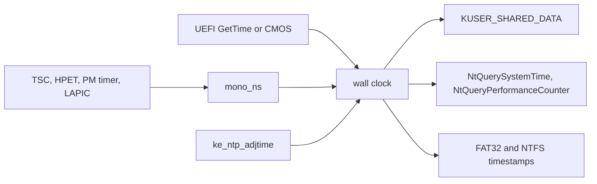

<!-- docs: covers=todo/02-kernel-core/TODO-08-time-filetime-management.md sources=include/kernel/nt/filetime.h,src/kernel/nt/filetime.c,include/kernel/time/mono_clock.h,src/kernel/time/mono_clock.c,include/kernel/time/wall_clock.h,src/kernel/time/wall_clock.c,include/kernel/time/timezone.h,src/kernel/time/timezone.c,include/kernel/time/timer_resolution.h,src/kernel/time/timer_resolution.c,include/kernel/time/ntp_adj.h,src/kernel/time/kusd_time.c,include/kernel/nt/kusd.h,src/kernel/drivers/hpet.c,src/kernel/drivers/rtc.c,src/kernel/test/test_time.c reviewed=2026-09-28 order=8 -->
# Time and FILETIME

## What is it?

The time subsystem gives the kernel one family of clocks: a `FILETIME` wall clock (100-nanosecond ticks since 1601-01-01 UTC, the Windows convention), a monotonic nanosecond counter for uptime and scheduling, interrupt time with and without suspend bias, and performance-counter system calls for user mode. Without it, file timestamps, log lines and scheduler deadlines would be zero or invented.

It also owns the `KUSER_SHARED_DATA` time fields that let user code read the clock without a system call, per-process timer resolution, time zone bias, and the timestamps FAT32 and NTFS write. Most of the roadmap has shipped; per-CPU TSC synchronization and suspend-time bias tracking are parked on prerequisites outside this subsystem.

## How does it work?

The monotonic counter comes first. `mono_clock_init()` in [`mono_clock.c`](../../src/kernel/time/mono_clock.c) picks the best source in order: invariant TSC, then the HPET, then the ACPI PM timer, then the LAPIC or PIT tick count, and logs the choice (for example `Monotonic clock: TSC (N MHz, invariant)`). A candidate with an implausible frequency is rejected at boot. A watchdog compares the active source against an independent one about every half second and demotes a drifting TSC, logging `clocksource: demoting ...`. A floor guarantees `mono_ns()` never steps backward across a demotion.

The wall clock in [`wall_clock.c`](../../src/kernel/time/wall_clock.c) is a `FILETIME` anchor plus the monotonic reading at that instant, protected by a seqlock. `wall_clock_init()` seeds it from UEFI `GetTime()` with a plausibility check and falls back to the CMOS clock only through `rtc_try_read()`, which fails closed instead of returning a zeroed date. `KeQuerySystemTime()` adds the monotonic delta to the anchor; `KeQuerySystemTimeCoarse()` returns a value cached once per tick, for hot paths such as klog.

On every timer tick, [`kusd_time.c`](../../src/kernel/time/kusd_time.c) updates the `KUSER_SHARED_DATA` page mapped read-only at `0x7FFE0000`: interrupt time, system time, time zone bias and tick count, at the offsets defined in [`kusd.h`](../../include/kernel/nt/kusd.h). Each 64-bit time is written with the three-step `KSYSTEM_TIME` protocol, so a reader never sees a torn value. `KeQueryInterruptTime()` includes a suspend bias that a future resume path will add to; `KeQueryUnbiasedInterruptTime()` excludes it.

Timer resolution ([`timer_resolution.c`](../../src/kernel/time/timer_resolution.c)) keeps one request per process in a 16-slot table, and the shortest request wins, between 0.5 ms and the 15.625 ms default. A change reprograms the LAPIC timer and logs `Timer resolution: N us`.

NTP support is two layers. `ke_ntp_adjtime()` ([`ntp_adj.h`](../../include/kernel/time/ntp_adj.h)) is the entry point a future network time client will call: an offset over one second steps the wall clock, a smaller one is slewed, and a frequency correction is applied continuously. A per-tick applier consumes the slew behind a floor, so a negative correction slows the clock instead of stepping it backward. The monotonic clock, performance counter and interrupt time are never adjusted.



## What are its interfaces?

| Interface | Purpose |
| --- | --- |
| `filetime_from_unix_seconds()`, `filetime_to_dos_datetime()`, `filetime_from_efi_time()`, `filetime_to_string()` | `FILETIME` conversion and formatting ([`filetime.h`](../../include/kernel/nt/filetime.h)) |
| `mono_ns()`, `mono_ns_coarse()`, `mono_clock_source_name()` | Monotonic clock ([`mono_clock.h`](../../include/kernel/time/mono_clock.h)) |
| `KeQuerySystemTime()`, `KeSetSystemTime()`, `KeQuerySystemTimePrecise()`, `KeQuerySystemTimeCoarse()` | Wall clock ([`wall_clock.h`](../../include/kernel/time/wall_clock.h)) |
| `KeQueryInterruptTime()`, `KeQueryUnbiasedInterruptTime()`, `ke_suspend_bias_update()` | Interrupt time with and without suspend bias |
| `KeQueryTickCount()`, `KeDelayExecutionThread()` | Tick count and thread delay |
| `NtQuerySystemTime`, `NtSetSystemTime`, `NtQueryPerformanceCounter`, `NtQueryTimerResolution`, `NtSetTimerResolution` | System calls for user mode |
| `KeSetTimerResolution()`, `KeQueryTimerResolution()` | Timer resolution arbitration ([`timer_resolution.h`](../../include/kernel/time/timer_resolution.h)) |
| `timezone_set()`, `filetime_to_local()`, `filetime_from_local()` | Time zone bias and daylight saving ([`timezone.h`](../../include/kernel/time/timezone.h)) |
| `ke_ntp_adjtime()`, `ke_ntp_get_status()` | Hooks for a network time client ([`ntp_adj.h`](../../include/kernel/time/ntp_adj.h)) |
| `hpet_ns()`, `rtc_try_read()` | HPET counter and fail-closed CMOS read ([`hpet.c`](../../src/kernel/drivers/hpet.c), [`rtc.c`](../../src/kernel/drivers/rtc.c)) |

## How do I use it?

The time service starts on every boot; there is no setting.

```bash
bash scripts/test.sh SUITE=sched    # clocks, interrupt time, timer resolution, NTP, time zone
bash scripts/test.sh SUITE=abi      # FILETIME conversion and the time system calls
```

Serial shows the chosen monotonic source and the time zone default (`Timezone: UTC ...`). From user mode, `NtQueryPerformanceCounter` reports a fixed 10 MHz frequency, and the tick count and system time can be read straight from `KUSER_SHARED_DATA` without a system call. The tests are in [`test_time.c`](../../src/kernel/test/test_time.c).

## What is not implemented yet?

- Per-CPU TSC synchronization at AP startup is parked: it needs a synchronization point the AP bringup handoff does not have ([Invariant TSC Detection and Per-CPU Offset Calibration](../../todo/02-kernel-core/TODO-08-time-filetime-management.md#3-invariant-tsc-detection-and-per-cpu-offset-calibration)).
- Suspend and hibernate bias tracking waits on the S3 and S4 resume path; only `ke_suspend_bias_update()` exists ([Suspend/Hibernate Time Bias Tracking](../../todo/02-kernel-core/TODO-08-time-filetime-management.md#14-suspendhibernate-time-bias-tracking)).
- The Windows 11 24H2 performance-counter bypass fields stay zero until a user-mode reader uses them ([KUSER_SHARED_DATA Time Field Updates](../../todo/02-kernel-core/TODO-08-time-filetime-management.md#12-kuser_shared_data-time-field-updates)).
- A watchdog leg that checks the PM timer itself needs a fourth independent reference clock ([Clocksource Quality Watchdog](../../todo/02-kernel-core/TODO-08-time-filetime-management.md#18-clocksource-quality-watchdog)).
- The time zone always starts at UTC; Registry-backed persistence is not built ([Timezone Bias and DST Management](../../todo/02-kernel-core/TODO-08-time-filetime-management.md#11-timezone-bias-and-dst-management)).
- The NTP protocol client itself does not exist; only the kernel hooks do ([NTP Clock Adjustment Hooks](../../todo/02-kernel-core/TODO-08-time-filetime-management.md#17-ntp-clock-adjustment-hooks)).

## How does it compare with Windows 11 and Linux?

Impossible OS matches both on the `FILETIME` wall clock, an invariant-TSC monotonic clock with HPET and PM timer fallback, a drift watchdog with demotion, NTP slew and frequency discipline, biased and unbiased interrupt time, per-process timer resolution, the shared time page updated from the timer interrupt, and FAT32 and NTFS timestamps. Leap seconds are not counted, as in Win32 and POSIX.

Two gaps remain: per-CPU TSC synchronization (Windows syncs at CPU start, Linux runs `check_tsc_sync`) and suspend-time bias (Windows `InterruptTimeBias`, Linux `CLOCK_BOOTTIME`). Two extras go beyond both: a fixed 10 MHz performance-counter frequency, so applications never need to query it, and named coarse time functions for hot paths.

## See also

- [Time and FILETIME Management roadmap](../../todo/02-kernel-core/TODO-08-time-filetime-management.md)
- [Interrupt Architecture and Timers](../boot/interrupt-timer-architecture.md)
- [PEB, TEB and the User-Mode ABI](peb-teb-user-abi.md)
