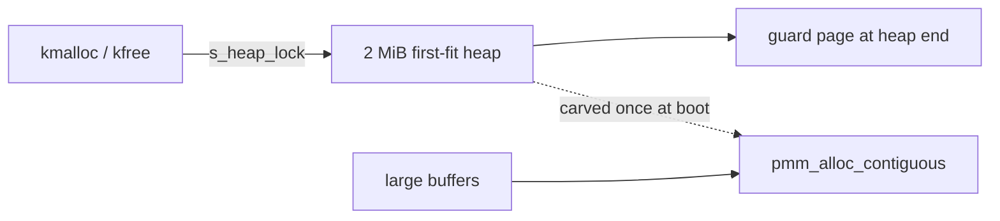

<!-- docs: covers=todo/03-memory-concurrency/TODO-03-advanced-allocator.md sources=include/kernel/mm/heap.h,src/kernel/mm/heap.c,include/kernel/mm/pmm.h,src/kernel/mm/pmm.c,src/kernel/test/test_heap.c reviewed=2026-09-28 order=3 -->
# Kernel Heap and Allocators

## What is it?

The kernel allocates small objects with `kmalloc()` from a single fixed 2 MiB heap and allocates anything larger straight from the physical frame allocator with `pmm_alloc_contiguous()`. The heap is SMP-safe and hardened with per-block cookies and redzones, but it does not grow, and the SLAB caches, `vmalloc`, pool types and memory-pressure notifications this roadmap plans do not exist yet.

## How does it work?

[`heap.c`](../../src/kernel/mm/heap.c) is a first-fit free-list allocator over `HEAP_INITIAL_PAGES` (512 pages, 2 MiB), carved at boot with `pmm_alloc_contiguous()` plus one extra page that becomes a guard page labelled `GUARD: kernel heap overflow`. That is the normal path; boot continues in two degraded states, each logged: with no contiguous 2 MiB run the heap is built frame by frame and may be smaller (`Heap: no contiguous ... falling back to partial heap`), and when the guard frame is not adjacent or cannot be installed the heap runs without an overflow guard (`guard install failed`). Every public call takes one global lock, `s_heap_lock`, with `spin_lock_irqsave()`, so the heap is safe from any CPU and from interrupt context.

Each block starts with a 48-byte `struct block_header` (size pinned by a `_Static_assert`) holding the size, the next pointer, a cookie, the requested size, an optional tag, the free flag and a front redzone. The cookie is `HEAP_COOKIE_SECRET` (`0xDEADBEEFC0FFEE01`) XORed with the header address; the front redzone is `0xFEFE...FE` and an 8-byte back redzone of `0xBDBD...BD` follows the user data. A mismatch on free or realloc marks the heap poisoned and raises `BUGCHECK_IOS_HEAP_CORRUPTION` once the lock is released. New allocations are zeroed (`HEAP_INIT_ON_ALLOC` is 1); zero-on-free exists as a build knob, `HEAP_ZERO_ON_FREE`, and is off. A single request is capped at `KMALLOC_MAX` (256 MiB), and anything above 4 KiB belongs in `pmm_alloc_contiguous()` by project rule.

`kmalloc_tagged()` and `kfree_tagged()` record a 32-bit tag and bugcheck when a block is freed under a different tag; outside the tests nothing uses them yet.



## What are its interfaces?

| Interface | Purpose |
| --- | --- |
| `kmalloc()`, `kmalloc_zeroed()`, `kfree()`, `krealloc()` | General kernel allocation ([`heap.h`](../../include/kernel/mm/heap.h)) |
| `kmalloc_tagged()`, `kfree_tagged()` | Tagged allocation with a tag check on free |
| `heap_get_total()`, `heap_get_used()`, `heap_get_free()`, `heap_owns()` | Heap statistics and ownership test |
| `pmm_alloc_frame()`, `pmm_alloc_contiguous()`, `pmm_free_contiguous()` | Physical frames for anything over 4 KiB ([`pmm.h`](../../include/kernel/mm/pmm.h)) |
| `kmalloc_fail_*` | Test-only fault injection for allocation failure paths |

## How do I use it?

Use `kmalloc()` for objects of 4 KiB or less and `pmm_alloc_contiguous()` for anything larger; free each with its own counterpart. The heap's behaviour (alignment, zeroing, tags, redzone exact fit, overlap, realloc and fault injection) is covered in [`test_heap.c`](../../src/kernel/test/test_heap.c):

```bash
bash scripts/test.sh SUITE=mm
```

## What is not implemented yet?

- **Heap growth.** The heap is fixed at 2 MiB with no segments and no `HeapMaxMiB` Registry key, and the frame allocator has no lock of its own ([Growable Kernel Heap + SMP Spinlock](../../todo/03-memory-concurrency/TODO-03-advanced-allocator.md#1-growable-kernel-heap--smp-spinlock)).
- **Memory-pressure notifications** ([Memory Pressure Notifications](../../todo/03-memory-concurrency/TODO-03-advanced-allocator.md#2-memory-pressure-notifications)).
- **`vmalloc`** for virtually contiguous buffers ([vmalloc](../../todo/03-memory-concurrency/TODO-03-advanced-allocator.md#3-vmalloc----virtual-contiguous-allocator)).
- **SLAB caches with a per-CPU fast path, and a shrinker** ([SLAB Allocator](../../todo/03-memory-concurrency/TODO-03-advanced-allocator.md#4-slab-allocator--lock-free-per-cpu-fast-path), [SLAB Shrinker](../../todo/03-memory-concurrency/TODO-03-advanced-allocator.md#5-slab-shrinker)).
- **Per-tag accounting.** The tag API exists but no `PTAG_*` constants or per-tag totals ([Tagged Allocation API](../../todo/03-memory-concurrency/TODO-03-advanced-allocator.md#6-tagged-allocation-api)).
- **NonPagedPool and PagedPool** ([NonPagedPool / PagedPool](../../todo/03-memory-concurrency/TODO-03-advanced-allocator.md#7-nonpagedpool--pagedpool)).
- **Hardening beyond cookies and redzones:** out-of-band metadata, type-isolated pools, per-page keys, KFENCE-style sampled guard pages, delayed reuse and zero-on-free by default ([Out-of-Band Metadata](../../todo/03-memory-concurrency/TODO-03-advanced-allocator.md#8-out-of-band-metadata) to [Zero-on-Free](../../todo/03-memory-concurrency/TODO-03-advanced-allocator.md#13-zero-on-free)).
- **Bulk allocation and `/sys/slab`, `/sys/pooltags` statistics** ([Bulk Alloc/Free API](../../todo/03-memory-concurrency/TODO-03-advanced-allocator.md#14-bulk-allocfree-api), [`/sys/slab` + `/sys/pooltags`](../../todo/03-memory-concurrency/TODO-03-advanced-allocator.md#15-sysslab--syspooltags--shell-commands)).

## How does it compare with Windows 11 and Linux?

Windows 11 (segment heap, lookaside lists, tagged pools, NonPagedPool and PagedPool) has every parity row in this roadmap. Linux (SLUB with per-CPU caches, `vmalloc`, shrinkers, `/proc/slabinfo`) has most of them, but only partial equivalents of two: allocation tags exist only through `kmemleak`, and paged versus non-paged memory is expressed by GFP flags rather than explicit pool types. Impossible OS has a locked, hardened fixed heap and none of the roadmap's rows yet. The planned additions go further than either on the hardening side: out-of-band metadata, type-isolated pools, per-page encoding keys, always-on quarantine and zero-on-free by default.

## See also

- [Advanced Kernel Allocator roadmap](../../todo/03-memory-concurrency/TODO-03-advanced-allocator.md)
- [Kernel Security Hardening](../kernel/kernel-security-hardening.md)
- [Virtual Memory Protection](vmm-memory-protection.md)
- [Concurrency and Memory Diagnostics](concurrency-diagnostics.md)
