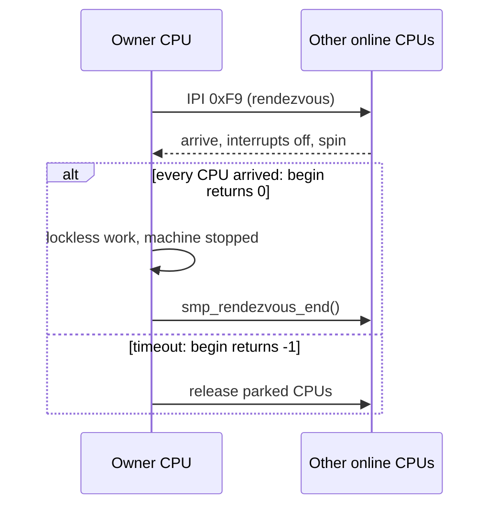

<!-- docs: covers=todo/03-memory-concurrency/TODO-07-smp-phase2.md sources=include/kernel/barrier.h,include/kernel/smp.h,include/kernel/vectors.h,include/kernel/rcu.h,src/kernel/smp/smp.c,src/kernel/rcu.c,src/kernel/cpu_security.c,src/kernel/test/test_smp_rendezvous.c,src/kernel/test/test_smp_lifecycle.c reviewed=2026-09-28 order=7 -->
# SMP Phase 2

## What is it?

The second stage of multi-processor support: cross-CPU TLB shootdown, per-CPU run queues and load balancing, adaptive mutexes, a per-CPU RCU, CPU hotplug and a compiler-safe memory access vocabulary. Phase 1 is in place (all CPUs boot, join the online set and can be stopped together), but ordinary threads still run only on the boot CPU: the other CPUs idle in `ap_entry()` and never call the scheduler, but none of this roadmap's sections are complete; memory barriers and a CPU feature intersection exist in forms the roadmap does not yet record.

## How does it work?

**CPU bring-up and the online set.** Each CPU has a `struct per_cpu_data` ([`smp.h`](../../include/kernel/smp.h)) with its current task, online flag and preemption counter, for up to `MAX_CPUS` (16). APs join through a compare-and-swap handshake, and the online mask bit is the publication point: `smp_publish_cpu_online()` sets it last and `smp_retract_cpu_online()` clears it first. `smp_cpu_count()` is the live online population and `smp_cpu_present_count()` the discovery count; neither bounds a CPU index, because slots can be sparse. After the APs are up, `cpu_features_finalize_global()` in [`cpu_security.c`](../../src/kernel/cpu_security.c) reduces the per-CPU feature bits to what every online CPU supports.

**Stopping every CPU.** `smp_rendezvous_begin(timeout_ms)` is called on the boot CPU only. It sends `VECTOR_IPI_RENDEZVOUS` (`0xF9`) and returns 0 once every other online CPU is spinning with interrupts off, with the caller's interrupts off too; on timeout it releases whichever CPUs did park and returns -1, so the caller must check the result. Inside the stopped window the caller may not take locks, allocate, log or run callbacks, because a parked CPU may be holding a lock ([`smp.h`](../../include/kernel/smp.h)). `smp_rendezvous_end()` releases them. It was built for system sleep transitions, which need every other CPU parked; outside its tests nothing calls it yet.

**Barriers.** [`barrier.h`](../../include/kernel/barrier.h) provides `barrier()` (compiler only), `mb()`, `rmb()` and `wmb()` (`mfence`, `lfence`, `sfence`), and `smp_mb()`, `smp_rmb()` and `smp_wmb()`, which are full barriers under `CONFIG_SMP` and compiler barriers otherwise.

**RCU.** [`rcu.h`](../../include/kernel/rcu.h) implements a simple RCU: `rcu_read_lock()` disables the scheduler, and `synchronize_rcu()` is a full barrier, one `yield()` and another barrier. It tracks no readers, so it is correct only under the single-CPU assumption its header states; it gives no guarantee against a reader running on another CPU, including an interrupt handler on an AP. There is no per-CPU counter and no `call_rcu()`.

**IPI vectors.** [`vectors.h`](../../include/kernel/vectors.h) reserves `0xFB` (control register re-verify), `0xFC` (async init work), `0xFD` (reschedule) and `0xFE` (TLB shootdown). Nothing handles `0xFE` yet, so page permission changes rely on running before other CPUs use the mapping.



## What are its interfaces?

| Interface | Purpose |
| --- | --- |
| `smp_cpu_count()`, `smp_cpu_present_count()`, `smp_online_mask()`, `smp_cpu_is_online()` | Live and present CPU sets ([`smp.h`](../../include/kernel/smp.h)) |
| `smp_rendezvous_begin()`, `smp_rendezvous_end()` | Stop-the-world across all online CPUs |
| `barrier()`, `mb()`, `smp_mb()`, `smp_rmb()`, `smp_wmb()` | Compiler and CPU memory barriers ([`barrier.h`](../../include/kernel/barrier.h)) |
| `rcu_read_lock()`, `rcu_read_unlock()`, `synchronize_rcu()`, `rcu_assign_pointer()` | Scheduler-disabling RCU ([`rcu.h`](../../include/kernel/rcu.h)) |
| `VECTOR_IPI_*` | Reserved inter-processor interrupt vectors ([`vectors.h`](../../include/kernel/vectors.h)) |

## How do I use it?

Iterate CPUs over `MAX_CPUS` and filter with `smp_cpu_is_online()`, never `0..smp_cpu_count()`. Take one `smp_online_mask()` snapshot when several values must agree. The rendezvous and CPU lifecycle are covered by [`test_smp_rendezvous.c`](../../src/kernel/test/test_smp_rendezvous.c) and [`test_smp_lifecycle.c`](../../src/kernel/test/test_smp_lifecycle.c), and the smoke matrix boots at 1 and 2 CPUs:

```bash
bash scripts/test.sh SUITE=x86
bash scripts/test.sh SUITE=boot
bash scripts/test-smoke-matrix.sh
```

## What is not implemented yet?

- **An atomics audit** of every shared counter and flag against the barrier set above ([SMP-Safe Atomics Audit](../../todo/03-memory-concurrency/TODO-07-smp-phase2.md#1-smp-safe-atomics-audit--smp_mb-barriers-opus)).
- **TLB shootdown.** Vector `0xFE` is reserved with no handler and no sender ([TLB Shootdown IPI](../../todo/03-memory-concurrency/TODO-07-smp-phase2.md#2-tlb-shootdown-ipi-opus)).
- **Per-CPU run queues and work stealing.** The scheduler is one global round-robin that only the boot CPU runs ([Per-CPU Run Queues](../../todo/03-memory-concurrency/TODO-07-smp-phase2.md#3-per-cpu-run-queues-opus), [Work-Stealing Load Balancer](../../todo/03-memory-concurrency/TODO-07-smp-phase2.md#4-work-stealing-load-balancer-opus)).
- **Adaptive mutex spinning** ([Adaptive Mutex Spin-on-Owner](../../todo/03-memory-concurrency/TODO-07-smp-phase2.md#5-adaptive-mutex-spin-on-owner-opus)).
- **Per-CPU RCU with `call_rcu()`** ([Per-CPU RCU Upgrade](../../todo/03-memory-concurrency/TODO-07-smp-phase2.md#6-per-cpu-rcu-upgrade-opus)).
- **CPU hotplug.** Only a test-only park helper exists ([CPU Hotplug Stub](../../todo/03-memory-concurrency/TODO-07-smp-phase2.md#7-cpu-hotplug-stub-sonnet)).
- **`READ_ONCE` and `WRITE_ONCE`** ([`READ_ONCE` / `WRITE_ONCE` Macros](../../todo/03-memory-concurrency/TODO-07-smp-phase2.md#8-read_once--write_once-macros-sonnet)).
- **The roadmap's feature intersection design.** A global reduction ships; the per-CPU CPUID record and offlining of a CPU that lacks a required feature are open ([CPU Feature Intersection at AP Bringup](../../todo/03-memory-concurrency/TODO-07-smp-phase2.md#9-cpu-feature-intersection-at-ap-bringup-opus)).

## How does it compare with Windows 11 and Linux?

Windows 11 and Linux both have TLB shootdown, per-CPU run queues with load balancing, adaptive mutex spinning, CPU hotplug and `READ_ONCE`-style accessors, and Linux has Tree RCU where Windows has no public RCU. Impossible OS boots every CPU, keeps an honest online set and can stop the machine safely, but runs ordinary threads on the boot CPU only and cannot yet invalidate another CPU's TLB. The roadmap's addition beyond Windows is a per-CPU RCU with deferred callbacks.

## See also

- [SMP Phase 2 roadmap](../../todo/03-memory-concurrency/TODO-07-smp-phase2.md)
- [CPU Boot Sequencing](../boot/cpu-boot-sequencing.md)
- [Scheduler](scheduler.md)
- [Synchronisation Primitives](advanced-sync.md)
- [Power Management](../kernel/power-management.md)
