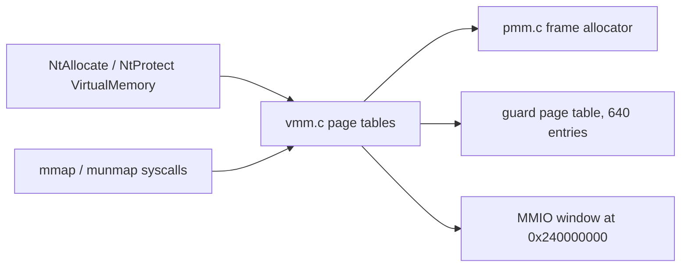

<!-- docs: covers=todo/03-memory-concurrency/TODO-01-vmm-memory-protection.md sources=include/kernel/mm/vmm.h,src/kernel/mm/vmm.c,include/kernel/mm/heap.h,include/kernel/mm/pmm.h,src/kernel/nt/nt_memory.c,include/kernel/nt/nt_memory.h,src/kernel/test/test_vmm.c reviewed=2026-09-28 order=1 -->
# Virtual Memory Protection

## What is it?

The virtual memory manager (VMM) owns the x86-64 page tables: it maps and unmaps kernel pages, changes page permissions, maps device registers, installs guard pages and builds per-process user address spaces. The kernel-side primitives exist and are tested; the Win32 memory API on top of them (`NtAllocateVirtualMemory`, `NtProtectVirtualMemory`, `NtQueryVirtualMemory`) is registered but simplified, and reserve/commit, demand paging and commit charge are not built yet.

## How does it work?

All mapping goes through [`vmm.c`](../../src/kernel/mm/vmm.c). The permission paths in use today are narrow. During Phase 1, `vmm_apply_nx_policy()` (called from [`boot_hw.c`](../../src/kernel/main/boot_hw.c)) walks the kernel's own range and marks data pages no-execute, splitting 2 MiB pages where it must, and [`wx.c`](../../src/kernel/security/wx.c) makes `.text` and `.rodata` read-only with `vmm_set_ro()`; `vmm_set_nx()` also protects UEFI runtime data. `NtProtectVirtualMemory` changes a user range by remapping each page with `vmm_map_page()` and the new flags. `vmm_protect()` and `vmm_protect_range()` also exist (raw PTE flags, 4 KiB kernel pages only, a 2 MiB page refused until `vmm_split_huge_page()` breaks it), but nothing calls them yet, and they send no TLB shootdown, so any future caller must run before other CPUs use the mapping.

Guard pages are unmapped 4 KiB pages recorded in a fixed table of `VMM_MAX_GUARD_PAGES` (640) entries, each with a label ([`vmm.h`](../../include/kernel/mm/vmm.h)). `vmm_install_guard_page()` splits the covering huge page if needed and clears the PTE; when a fault lands on one, the page-fault handler prints the label (for example `GUARD: kernel heap overflow`) instead of a generic page fault. Kernel task stacks created by `task_create()`, AP stacks, IST stacks and, on the normal boot path, the heap end carry one; forked tasks and kernel threads still run on unguarded `kmalloc()` stacks (see [Concurrency and Memory Diagnostics](concurrency-diagnostics.md)).

Device registers are mapped with `vmm_map_mmio_uc()` (uncached) or `vmm_map_mmio_wc()` (write-combining) into a bump-allocated window that starts at `MMIO_VA_BASE` (`0x240000000`, 9 GiB), because MMIO through write-back pages misbehaves on real hardware.

User address spaces are built per process: `vmm_create_user_pml4()` creates a top-level table, `vmm_map_user_page()` maps a freshly zeroed private frame with the User bit at every level, and `vmm_share_user_page()`, `vmm_remap_user_page()`, `vmm_unmap_user_page()` and `vmm_destroy_user_pml4()` manage the rest. Ownership bits in the PTE (`VMM_FLAG_PT_OWNED`, bit 9, and `VMM_FLAG_PAGE_OWNED`, bit 10) tell teardown which frames to free.



## What are its interfaces?

| Interface | Purpose |
| --- | --- |
| `vmm_set_nx()`, `vmm_set_ro()`, `vmm_apply_nx_policy()` | Kernel page permissions in use ([`vmm.h`](../../include/kernel/mm/vmm.h)) |
| `vmm_protect()`, `vmm_protect_range()`, `vmm_query_flags()` | Raw-flag permission change and readback, used only by tests so far |
| `vmm_install_guard_page()`, `vmm_uninstall_guard_page()`, `vmm_guard_page_label()` | Labelled guard pages |
| `vmm_map_mmio_uc()`, `vmm_map_mmio_wc()`, `vmm_unmap_mmio()` | Device register mappings |
| `vmm_create_user_pml4()`, `vmm_map_user_page()`, `vmm_unmap_user_page()`, `vmm_destroy_user_pml4()` | Per-process user address spaces |
| `NtAllocateVirtualMemory` to `NtWriteVirtualMemory` | Nine NT memory services registered in [`nt_memory.c`](../../src/kernel/nt/nt_memory.c), constants in [`nt_memory.h`](../../include/kernel/nt/nt_memory.h) |
| `SYS_MMAP` (37), `SYS_MUNMAP` (38) | POSIX-style mappings ([`mmap.h`](../../include/kernel/mm/mmap.h)) |

The heap and frame allocator that the VMM sits on are declared in [`heap.h`](../../include/kernel/mm/heap.h) and [`pmm.h`](../../include/kernel/mm/pmm.h).

## How do I use it?

Kernel code maps a device with `vmm_map_mmio_uc(phys, size)` and never through the direct map; it guards a new stack by allocating one extra page and calling `vmm_install_guard_page()` on the bottom one. The behaviour is covered by the memory-management suite, including W^X on `.text` and `.rodata`, guard page install and saturation, huge page splitting and the user-page round trip in [`test_vmm.c`](../../src/kernel/test/test_vmm.c):

```bash
bash scripts/test.sh SUITE=mm
```

## What is not implemented yet?

- **Win32 protection semantics.** `NtProtectVirtualMemory` always reports the old protection as `PAGE_READWRITE`, there is no `mprotect` syscall, and a guard page on a user thread stack does not raise `EXCEPTION_STACK_OVERFLOW` ([`mprotect` / `NtProtectVirtualMemory`](../../todo/03-memory-concurrency/TODO-01-vmm-memory-protection.md#1-mprotect--ntprotectvirtualmemory)).
- **W^X refusal.** `PAGE_EXECUTE_READWRITE` is accepted and mapped writable and executable ([W^X Enforcement](../../todo/03-memory-concurrency/TODO-01-vmm-memory-protection.md#2-wx-enforcement)).
- **Reserve and commit.** Allocation commits immediately with no reserved-region tracking ([Demand Paging](../../todo/03-memory-concurrency/TODO-01-vmm-memory-protection.md#3-demand-paging----mem_reserve--mem_commit)).
- **Region queries.** `NtQueryVirtualMemory` answers for one page, always `MEM_COMMIT` and `PAGE_READWRITE` ([`NtQueryVirtualMemory`](../../todo/03-memory-concurrency/TODO-01-vmm-memory-protection.md#4-ntqueryvirtualmemory)).
- **Memory statistics and leak detection.** There is no `meminfo` or `memleak` command ([PMM Statistics](../../todo/03-memory-concurrency/TODO-01-vmm-memory-protection.md#8-pmm-statistics), [Kernel Memory Leak Detector](../../todo/03-memory-concurrency/TODO-01-vmm-memory-protection.md#10-kernel-memory-leak-detector)).
- **Page locking.** `NtLockVirtualMemory` and `NtUnlockVirtualMemory` return success without doing anything ([NtLockVirtualMemory / mlock](../../todo/03-memory-concurrency/TODO-01-vmm-memory-protection.md#14-ntlockvirtualmemory--mlock----pin-pages-in-ram)).
- **Growing stacks, commit charge and per-process counters** ([Auto-Growing User Stacks](../../todo/03-memory-concurrency/TODO-01-vmm-memory-protection.md#13-auto-growing-user-stacks), [Commit Charge](../../todo/03-memory-concurrency/TODO-01-vmm-memory-protection.md#15-commit-charge-tracking--enforcement), [Process Memory Counters](../../todo/03-memory-concurrency/TODO-01-vmm-memory-protection.md#16-process-memory-counters-getprocessmemoryinfo)).
- **User page mapping follow-ups.** The mapping functions ship; four hardening items remain open, including out-of-memory atomicity on exec remap ([Per-Process User Page Mapping](../../todo/03-memory-concurrency/TODO-01-vmm-memory-protection.md#12-per-process-user-page-mapping-vmm_map_user_page)).

## How does it compare with Windows 11 and Linux?

Both Windows 11 and Linux have page protection, reserve and commit (Linux through overcommit), region queries, memory statistics, leak detection, growing stacks, page locking and per-process memory counters. They differ where the roadmap plans to differ: Windows allows writable-and-executable pages under DEP, Linux commits by overcommit rather than a hard limit, and neither fails the build on an oversized `kmalloc`-style allocation. Impossible OS has the page-table primitives, guard pages, a boot-time W^X policy for the kernel image and UC/WC device mappings, but only per-process user page mapping is complete on the roadmap's own table. The three planned differences are a hard refusal of writable-and-executable user pages, a build-time allocation lint, and deterministic commit charge instead of overcommit.

## See also

- [VMM Memory Protection and Diagnostics roadmap](../../todo/03-memory-concurrency/TODO-01-vmm-memory-protection.md)
- [Kernel Security Hardening](../kernel/kernel-security-hardening.md)
- [Kernel Address Space](../infrastructure/kernel-address-space.md)
- [Kernel Heap and Allocators](advanced-allocator.md)
- [Advanced Virtual Memory](advanced-virtual-memory.md)
