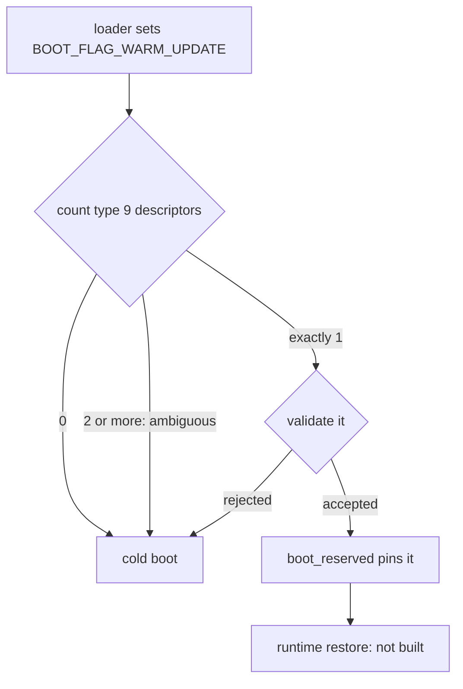

<!-- docs: covers=todo/03-memory-concurrency/TODO-11-warm-kernel-update-runtime.md sources=include/kernel/boot_info.h,src/kernel/main/boot_warm_update.c,src/kernel/main/boot_hw.c,src/kernel/main/boot_payload.c,src/kernel/mm/boot_reserved.c,src/kernel/mm/pmm.c,src/kernel/test/test_boot_warm_update.c,src/kernel/test/test_boot_reserved.c reviewed=2026-09-28 order=11 -->
# Warm Kernel Update

## What is it?

A warm kernel update replaces the running kernel with a new image without a full reboot, carrying selected state (page tables, open files, device queues) across the switch and falling back to a normal cold boot if anything is wrong. The handoff contract that describes preserved memory exists and is validated at boot; the runtime that would stage, quiesce, jump and reattach is not built, so no warm update can happen today.

## How does it work?

The contract lives in the boot handoff ABI, [`boot_info.h`](../../include/kernel/boot_info.h). A loader that performs a warm update sets `BOOT_FLAG_WARM_UPDATE` and describes the preserved region with a memory map entry of type `BOOT_MMAP_WARM_UPDATE` (15) and a boot payload of type `BOOT_PAYLOAD_WARM_UPDATE_STATE` (9). Continuation flags say which state the region carries: page tables, a quiesced scheduler, VFS writeback, the file descriptor table, object handles and hardware queues (`BOOT_WARM_UPDATE_CONT_*`, bits 8 to 13, collected in `BOOT_WARM_UPDATE_CONT_MASK_KNOWN`).

At boot the kernel decides whether to trust the region. `boot_warm_update_selection_get()` in [`boot_warm_update.c`](../../src/kernel/main/boot_warm_update.c) seals one decision for the rest of boot. It counts the warm-update payload descriptors first: none means a cold boot, and two or more are refused as ambiguous before any is validated, even if only one of them is well formed. A single descriptor is then validated, rejecting a wrong type, unknown continuation bits, misalignment, an empty range, missing flags, a bad length or a range that wraps, each with its own `BOOT_WARM_UPDATE_ERR_*` code. The same rules are exposed standalone as `boot_warm_update_consume()`, which the tests call.

Phase 0 ([`boot_hw.c`](../../src/kernel/main/boot_hw.c)) logs that decision. When the frame allocator starts, [`boot_reserved.c`](../../src/kernel/mm/boot_reserved.c) reads the same sealed selection and reserves the region so it is never handed out, even when the descriptor and payload disagree, and records that it did with `boot_warm_update_selection_mark_pinned()`. [`pmm.c`](../../src/kernel/mm/pmm.c) refuses to let a type 15 extent raise the tracked memory ceiling. A descriptor that cannot be trusted produces a cold fallback: the memory is protected, but nothing is restored from it.



## What are its interfaces?

| Interface | Purpose |
| --- | --- |
| `BOOT_FLAG_WARM_UPDATE`, `BOOT_MMAP_WARM_UPDATE`, `BOOT_PAYLOAD_WARM_UPDATE_STATE` | Handoff flag, memory map type and payload type ([`boot_info.h`](../../include/kernel/boot_info.h)) |
| `BOOT_WARM_UPDATE_CONT_*` | Continuation flags for the preserved state |
| `boot_warm_update_selection_get()` | The sealed boot decision |
| `boot_warm_update_consume()`, `boot_warm_update_cont_name()` | Standalone descriptor validation and flag names |

There is no system call, Registry key or command for requesting an update yet.

## How do I use it?

Nothing can trigger a warm update today. A normal boot logs nothing about it; a boot whose loader set the flag or published a descriptor logs `boot_warm_update:` with the selected region or the reason none was accepted. The validator and the sealed selection are tested in [`test_boot_warm_update.c`](../../src/kernel/test/test_boot_warm_update.c) (fourteen cases) and the reservation path in [`test_boot_reserved.c`](../../src/kernel/test/test_boot_reserved.c):

```bash
bash scripts/test.sh SUITE=boot
```

## What is not implemented yet?

- **Staging the outgoing kernel** and preserving its pages ([Outgoing-Kernel Staging Area](../../todo/03-memory-concurrency/TODO-11-warm-kernel-update-runtime.md#1-outgoing-kernel-staging-area--folio-preservation)).
- **Subsystem quiesce callbacks** ([Per-Subsystem Quiesce Callback Registry](../../todo/03-memory-concurrency/TODO-11-warm-kernel-update-runtime.md#2-per-subsystem-quiesce-callback-registry)).
- **Serialising open files and draining the scheduler** ([VFS Writeback + FD Table Serialize](../../todo/03-memory-concurrency/TODO-11-warm-kernel-update-runtime.md#3-vfs-writeback--fd-table-serialize), [Scheduler Drain + Thread Freeze](../../todo/03-memory-concurrency/TODO-11-warm-kernel-update-runtime.md#4-scheduler-drain--thread-freeze)).
- **The jump into the new image and the restore on the other side** ([Kexec-Equivalent Jump](../../todo/03-memory-concurrency/TODO-11-warm-kernel-update-runtime.md#5-kexec-equivalent-jump-into-new-kernel-image), [Incoming-Kernel Reattach Path](../../todo/03-memory-concurrency/TODO-11-warm-kernel-update-runtime.md#6-incoming-kernel-reattach-path-splice-memory-restore)).
- **The `nt_live_update` system call** ([Live-Update Syscall](../../todo/03-memory-concurrency/TODO-11-warm-kernel-update-runtime.md#7-live-update-syscall--nt_live_update-ssdt-entry)).

## How does it compare with Windows 11 and Linux?

Windows 11 Hotpatch applies closed, limited patches to a running kernel without preserving user processes across a kernel replacement. Linux 6.16 added Kexec HandOver (KHO), which preserves memory across a kexec, and the Live Update Orchestrator (LUO) built on it arrived in a later release to carry subsystem state for virtual machine hosts. Impossible OS has the validated handoff contract that such a runtime needs, and every row of the roadmap's comparison table (live replacement, process preservation, subsystem continuation) is still planned.

## See also

- [Warm-Kernel-Update Runtime roadmap](../../todo/03-memory-concurrency/TODO-11-warm-kernel-update-runtime.md)
- [Boot Protocol ABI Overview](../boot/boot-protocol-abi-overview.md)
- [boot_info Fields](../boot/boot-info-fields.md)
- [Alternate Boot Protocols](../boot/alternate-boot-protocols.md)
