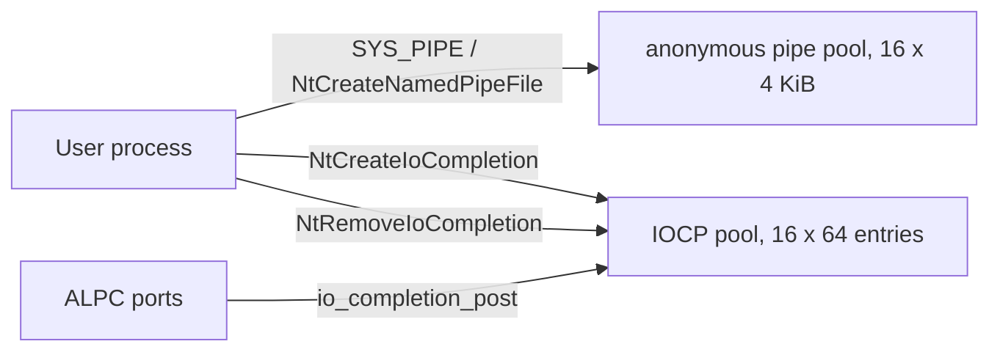

<!-- docs: covers=todo/03-memory-concurrency/TODO-09-win32-ipc-extensions.md sources=include/kernel/ipc/pipe.h,src/kernel/ipc/pipe.c,include/kernel/nt/nt_file.h,src/kernel/nt/nt_file.c,src/kernel/nt/nt_lpc.c,src/kernel/nt/nt_syscall.c,include/kernel/ipc/alpc_port.h,src/kernel/test/test_ipc.c,src/kernel/test/test_alpc.c reviewed=2026-09-28 order=9 -->
# Win32 IPC Extensions

## What is it?

The Windows inter-process communication surface beyond ALPC: named pipes, mailslots, I/O completion ports, named synchronisation objects, legacy LPC and an asynchronous submission ring. Anonymous pipes, a fixed-size completion port pool and the named event, mutant and semaphore objects exist today; named pipe servers, mailslots, LPC and the submission ring do not.

## How does it work?

**Anonymous pipes.** [`pipe.c`](../../src/kernel/ipc/pipe.c) keeps a pool of `PIPE_MAX` (16) pipes, each with a `PIPE_BUF_SIZE` (4096 byte) ring buffer, created by `pipe_create()` and reached from user mode through `SYS_PIPE`. `NtCreateNamedPipeFile` is registered, but it creates an anonymous pipe through the same path: there is no `\Device\NamedPipe\` namespace and no server endpoint.

**I/O completion ports.** [`nt_file.c`](../../src/kernel/nt/nt_file.c) keeps 16 ports in a static pool; each `IO_COMPLETION_PORT` is a ring of `IOCP_MAX_ENTRIES` (64) completion entries guarded by a spinlock ([`nt_file.h`](../../include/kernel/nt/nt_file.h)). `NtCreateIoCompletion`, `NtSetIoCompletion` and `NtRemoveIoCompletion` are registered, and ALPC posts message completions to a port with `io_completion_post()`. Ports are not Object Manager objects and cannot yet be associated with file handles.

**Named sync objects.** Events, mutants and semaphores are Object Manager objects with names, created through `NtCreateEvent`, `NtCreateMutant` and `NtCreateSemaphore` (see [Synchronisation Primitives](advanced-sync.md)).

**ALPC** ships as its own subsystem, documented in [ALPC and Message Ports](../kernel/alpc-message-ports.md); this roadmap owns only its extensions.

**Stubs.** `NtCreateMailslotFile` returns `STATUS_INVALID_DEVICE_REQUEST`, and all fifteen LPC services in [`nt_lpc.c`](../../src/kernel/nt/nt_lpc.c) return `STATUS_NOT_IMPLEMENTED`.



## What are its interfaces?

| Interface | Purpose |
| --- | --- |
| `pipe_create()`, `pipe_close()`, `SYS_PIPE` | Anonymous pipes ([`pipe.h`](../../include/kernel/ipc/pipe.h)) |
| `NtCreateNamedPipeFile` | Registered; creates an anonymous pipe ([`nt_syscall.c`](../../src/kernel/nt/nt_syscall.c)) |
| `NtCreateIoCompletion`, `NtSetIoCompletion`, `NtRemoveIoCompletion`, `io_completion_post()` | Completion ports ([`nt_file.c`](../../src/kernel/nt/nt_file.c)) |
| `AlpcAssociateCompletionPort()` | Route ALPC messages to a completion port ([`alpc_port.h`](../../include/kernel/ipc/alpc_port.h)) |
| `NtCreateMailslotFile`, LPC services | Registered stubs |

## How do I use it?

A Win32 program can create an anonymous pipe pair and a completion port today; `CreateNamedPipe` servers and mailslots fail. Pipes are tested in [`test_ipc.c`](../../src/kernel/test/test_ipc.c) and completion ports through ALPC in [`test_alpc.c`](../../src/kernel/test/test_alpc.c):

```bash
bash scripts/test.sh SUITE=ipc
bash scripts/test.sh SUITE=abi
```

## What is not implemented yet?

- **Named pipe servers, instances and overlapped I/O** ([Named Pipes (NPFS)](../../todo/03-memory-concurrency/TODO-09-win32-ipc-extensions.md#1-named-pipes-npfs----server-endpoint-opus), [Named Pipe Instances + Overlapped I/O](../../todo/03-memory-concurrency/TODO-09-win32-ipc-extensions.md#2-named-pipe-instances--overlapped-io-opus)).
- **Mailslots** ([Mailslots (MSFS)](../../todo/03-memory-concurrency/TODO-09-win32-ipc-extensions.md#3-mailslots-msfs-sonnet)).
- **Object-backed completion ports** with file-handle association, a worker pool and a completion hook for device interrupts ([I/O Completion Ports](../../todo/03-memory-concurrency/TODO-09-win32-ipc-extensions.md#4-io-completion-ports-iocp-opus), [IOCP Worker Thread Pool](../../todo/03-memory-concurrency/TODO-09-win32-ipc-extensions.md#5-iocp-worker-thread-pool--dma-completion-hook-opus)).
- **Waitable named sync objects** through the shared wait interface ([Win32 Ob-Backed Named Sync Objects](../../todo/03-memory-concurrency/TODO-09-win32-ipc-extensions.md#6-win32-ob-backed-named-sync-objects-sonnet)).
- **LPC and the ALPC extensions** ([LPC Basic](../../todo/03-memory-concurrency/TODO-09-win32-ipc-extensions.md#7-lpc-basic----local-procedure-call-opus), [ALPC Extensions](../../todo/03-memory-concurrency/TODO-09-win32-ipc-extensions.md#8-alpc-extensions-opus)).
- **`ImpossibleRing`**, the asynchronous submission ring ([`ImpossibleRing`](../../todo/03-memory-concurrency/TODO-09-win32-ipc-extensions.md#9-impossiblering----async-submission-rings-opus)).
- **The remaining IPC system calls** ([IPC Syscalls Wired to SSDT](../../todo/03-memory-concurrency/TODO-09-win32-ipc-extensions.md#10-ipc-syscalls-wired-to-ssdt)).
- **Anonymous pipe hardening.** Slot claims are not atomic across CPUs, and `pipe_create()` returns the same `-1` for a full pool and an allocation failure ([Anonymous-Pipe Hardening](../../todo/03-memory-concurrency/TODO-09-win32-ipc-extensions.md#11-anonymous-pipe-hardening----smp-safe-slot-state-real-error-codes-honest-capacity)).

## How does it compare with Windows 11 and Linux?

Windows 11 has named pipes, mailslots, completion ports, named sync objects, LPC and ALPC; Linux has byte-stream FIFOs, no mailslots, and `epoll` and `io_uring` in place of completion ports. Impossible OS has ALPC, anonymous pipes, a small completion port pool and named sync objects, with every row of the roadmap's table still open. The planned addition beyond both is `ImpossibleRing`, a submission ring in the style of `io_uring` that works for every handle type.

## See also

- [Win32 IPC Extensions and Async I/O roadmap](../../todo/03-memory-concurrency/TODO-09-win32-ipc-extensions.md)
- [ALPC and Message Ports](../kernel/alpc-message-ports.md)
- [Synchronisation Primitives](advanced-sync.md)
- [Native API and the SSDT](../kernel/native-api-ssdt.md)
