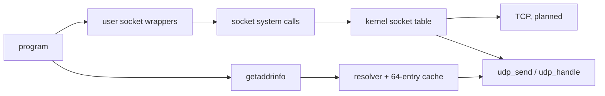

<!-- docs: covers=todo/07-networking/TODO-02-dns-sockets.md sources=src/kernel/net/udp.c,src/kernel/net/dhcp.c,include/kernel/net/net.h,include/kernel/sched/syscall.h,src/kernel/sched/syscall.c,user/cmd.c reviewed=2026-09-29 order=2 -->
# DNS Resolver and Sockets

## What is it?

This roadmap gives programs two things every networked application needs: turning a host name such as `impossibleos.co` into an address, and a socket API (`socket`, `connect`, `send`, `recv`, `bind`, `listen`, `accept`, `select`) to talk over TCP and UDP. Impossible OS has neither today. The only network calls a program can make are two diagnostic system calls, one that sends a ping and one that reads the interface settings, and the shell accepts only dotted IPv4 addresses. All eight sections are unstarted, and the socket half cannot start until TCP exists in [TCP and Network Infrastructure](tcp-network-infrastructure.md).

## How does it work?

**What exists.** DHCP already learns a DNS server: `dhcp.c` stores the first address from option 6 in `net_cfg.dns` ([`net.h`](../../include/kernel/net/net.h)), and `ifconfig` prints it. Nothing sends a query to it. UDP can send (`udp_send()` in [`udp.c`](../../src/kernel/net/udp.c)), but its receive side is a fixed switch that delivers only DHCP's port 68, so there is no way yet for a DNS reply to reach a resolver.

Programs reach the network through two legacy `INT 0x80` system calls in [`syscall.h`](../../include/kernel/sched/syscall.h): `SYS_PING` (15) sends one ICMP echo request, and `SYS_NETINFO` (16) copies `net_cfg` into a caller buffer. The shell's `ping` and `ifconfig` in [`user/cmd.c`](../../user/cmd.c) are their only users.

**Planned design.** The resolver comes first because it needs only UDP:

1. A query builder that encodes a name into DNS wire format with a random 16-bit ID.
2. A response parser that follows compression pointers and extracts A records and the TTL.
3. A 64-entry cache with least-recently-used eviction, honouring each record's TTL, plus an `nslookup` command.
4. An AAAA query stub that returns "not supported" until [IPv6](ipv6.md) lands.

The socket layer then wraps TCP and UDP behind integer descriptors:

5. `SOCK_STREAM` and `SOCK_DGRAM` sockets with `socket`, `connect`, `send`, `recv` and `close`.
6. Server sockets: `bind`, `listen` with a backlog, and `accept`.
7. `setsockopt` and `getsockopt` for `SO_REUSEADDR`, `SO_RCVTIMEO` and `SO_SNDBUF`, new system calls, and thin user-mode wrappers including `getaddrinfo`.
8. `select()` over up to 64 sockets, with a timeout.

The roadmap also relies on a `udp_register_handler(port, callback)` so the resolver and later UDP users can receive on their own ports. That function does not exist yet and has to be added before the parser can be tested end to end.

## What are its interfaces?

| Interface | Status |
| --- | --- |
| `SYS_PING` (15), `SYS_NETINFO` (16) | Shipped legacy calls ([`syscall.c`](../../src/kernel/sched/syscall.c)) |
| `net_cfg.dns` | Shipped: DNS server from the DHCP lease |
| `dns_resolve()`, `dns_resolve6()` | Planned kernel resolver |
| `socket()`, `connect()`, `send()`, `recv()`, `bind()`, `listen()`, `accept()`, `select()`, `getaddrinfo()` | Planned user-mode wrappers |

The roadmap's section 7 was written when system call numbers 39 to 46 were free. They are now taken by file-handle, object-directory and test calls (39 to 48 are all in use), so the socket calls will get the next free numbers when that section is implemented. Whether sockets should instead be exposed through the native NT system service table, as Windows does with its AFD driver, is still to be decided, together with the repository-wide rule for new system call numbers in the [Native API roadmap](../../todo/02-kernel-core/TODO-12-native-api-ssdt.md#33-legacy-sys_-number-allocation-across-roadmaps).

## How do I use it?

It cannot be used yet. To see the DNS server a program would query, run `ifconfig` after the DHCP lease arrives and read the `DNS:` line; under QEMU user networking this is QEMU's built-in resolver.

## What is not implemented yet?

- **Resolver**: [DNS Query Builder](../../todo/07-networking/TODO-02-dns-sockets.md#1-dns-query-builder-sonnet), [DNS Response Parser](../../todo/07-networking/TODO-02-dns-sockets.md#2-dns-response-parser-sonnet), [DNS Cache](../../todo/07-networking/TODO-02-dns-sockets.md#3-dns-cache-sonnet) and [AAAA Query Stub](../../todo/07-networking/TODO-02-dns-sockets.md#4-aaaa-query-stub-sonnet).
- **Sockets**: [Kernel Socket Layer](../../todo/07-networking/TODO-02-dns-sockets.md#5-kernel-socket-layer-opus), [Server Sockets](../../todo/07-networking/TODO-02-dns-sockets.md#6-server-sockets-sonnet), [Socket Options + Syscalls](../../todo/07-networking/TODO-02-dns-sockets.md#7-socket-options--syscalls-sonnet) and [`select()`](../../todo/07-networking/TODO-02-dns-sockets.md#8-select-opus).
- **Pointer checking**: `SYS_NETINFO` writes to the caller's buffer without checking that it is a user address. That defect belongs to the legacy system call audit in [Kernel Security Hardening](../kernel/kernel-security-hardening.md).
- **Win32 surface**: `ws2_32.dll` and Winsock belong to [Time Sync, Network Status and Winsock](ntp-status-winsock.md).

## How does it compare with Windows 11 and Linux?

Windows 11 resolves names through `dnsapi.dll` and the DNS Client service, and exposes sockets through Winsock over the `afd.sys` kernel driver. Linux resolves names in user space (glibc, `systemd-resolved`) and implements BSD sockets in `net/socket.c` with `select`, `poll` and `epoll`. Impossible OS plans a small in-kernel resolver with its own cache, which makes the cache shared by every program without a separate service, and a BSD-style socket core that the Winsock DLL maps onto.

## See also

- [DNS and sockets roadmap](../../todo/07-networking/TODO-02-dns-sockets.md)
- [TCP and Network Infrastructure](tcp-network-infrastructure.md)
- [HTTP, HTTPS and TLS](http-tls.md)
- [Time Sync, Network Status and Winsock](ntp-status-winsock.md)
- [Networking](index.md)
