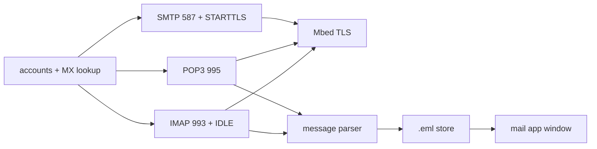

<!-- docs: covers=todo/07-networking/TODO-09-email-client.md sources=include/kernel/kcodec.h,src/kernel/kcodec.c,include/registry.h,src/libs/PROVENANCE.md reviewed=2026-09-29 order=9 -->
# Email Protocols

## What is it?

This roadmap is the protocol half of the Impossible OS mail client: a message and MIME parser, SMTP for sending, POP3 and IMAP for receiving, an account manager with server autodiscovery, contacts and search. The mail window, compose window and new-mail notifications are built by the [Email Client app roadmap](../../todo/11-apps/TODO-04-email-client.md), which calls into this code. Nothing here exists yet, and every protocol needs TCP and TLS first. Seven sections are unstarted; the three GUI sections are marked in progress only because their visible parts moved to the app roadmap, leaving small hooks here.

## How does it work?

**What exists.** One building block is ready: `base64_decode()` in [`kcodec.h`](../../include/kernel/kcodec.h) (implemented in [`kcodec.c`](../../src/kernel/kcodec.c)) has a MIME mode that skips line breaks and spaces, which is exactly what email attachments need, and `hex_decode()` sits beside it. The Registry API in [`registry.h`](../../include/registry.h) is ready for account settings. There is no quoted-printable decoder yet, and no mail, SMTP, POP3 or IMAP code.

Mail cannot be sent or fetched until [HTTP, HTTPS and TLS](http-tls.md) delivers a working TLS connection (Mbed TLS is vendored, per [`PROVENANCE.md`](../../src/libs/PROVENANCE.md), but not yet built) and [DNS Resolver and Sockets](dns-sockets.md) delivers name lookup, including a new MX query for autodiscovery.

**Planned design.** The parser comes first because every protocol produces messages for it:

1. **Message parser.** Header parsing with continuation lines, MIME multipart bodies (plain and HTML alternatives, attachments), base64 and quoted-printable decoding, and saving attachments. It defines `mail_message_t`.
2. **SMTP.** Port 587 with STARTTLS, `EHLO`, `AUTH LOGIN`, `MAIL FROM`, `RCPT TO` and `DATA`, sending UTF-8 MIME messages.
3. **POP3.** Port 995 over TLS with `STAT`, `LIST`, `RETR` and `DELE`, storing messages as `.eml` files.
4. **IMAP.** Port 993 over TLS with the usual folder and message commands and `IDLE` for push.
5. **Accounts.** Up to eight accounts under `HKCU\Software\Impossible\Mail\Accounts`, and a setup wizard that finds the server from the address's domain.
6. **Notifications.** A five-minute poll and an unread counter; the toast and taskbar badge are drawn by the app.
7. **Mail window** and 8. **Compose window**, both drawn by the app.
9. **Contacts** in a JSON file, filled from addresses you receive mail from, with autocomplete.
10. **Search** across local messages, and server-side `SEARCH` on IMAP.

Messages are stored under `C:\Users\Default\AppData\Mail\<account>\<folder>\`.

## What are its interfaces?

All planned: `mail_message_t` and the parser, `smtp_send()`, `pop3_sync()` and `imap_sync()`, the account functions, a `dns_resolve_mx()` query, and the `mail_unread_count` counter the app reads for its badge.

## How do I use it?

It cannot be used yet.

## What is not implemented yet?

- **Parsing and protocols**: [Message Parser](../../todo/07-networking/TODO-09-email-client.md#1-message-parser-sonnet), [SMTP Client](../../todo/07-networking/TODO-09-email-client.md#2-smtp-client-sonnet), [POP3 Client](../../todo/07-networking/TODO-09-email-client.md#3-pop3-client-sonnet) and [IMAP Client](../../todo/07-networking/TODO-09-email-client.md#4-imap-client-opus).
- **Accounts and user features**: [Email Account Manager](../../todo/07-networking/TODO-09-email-client.md#5-email-account-manager-sonnet), [Notifications](../../todo/07-networking/TODO-09-email-client.md#6-notifications-sonnet), [Email GUI](../../todo/07-networking/TODO-09-email-client.md#7-email-gui-opus), [Compose Window](../../todo/07-networking/TODO-09-email-client.md#8-compose-window-sonnet), [Contacts Integration](../../todo/07-networking/TODO-09-email-client.md#9-contacts-integration-sonnet) and [Search](../../todo/07-networking/TODO-09-email-client.md#10-search-sonnet).
- **Password storage**: account passwords go in the encrypted credential store owned by the app roadmap's Account Management section, never in a plain Registry value. That store needs the kernel's AES-256-GCM and key store first.
- **Not planned**: OAuth sign-in (which Gmail and Microsoft 365 now require for most accounts), Exchange and JMAP, and S/MIME or PGP encryption.

## How does it compare with Windows 11 and Linux?

Windows 11 ships the Outlook app, with mail and calendar tied to Microsoft accounts and OAuth. Linux desktops use Thunderbird or Evolution, with terminal clients such as mutt and search tools such as notmuch. This roadmap targets the standard protocols (SMTP, POP3, IMAP with IDLE) with password sign-in, which covers self-hosted and many ISP mail servers but not the large providers that require OAuth.

## See also

- [Email protocol roadmap](../../todo/07-networking/TODO-09-email-client.md)
- [Email Client app roadmap](../../todo/11-apps/TODO-04-email-client.md)
- [HTTP, HTTPS and TLS](http-tls.md)
- [Registry](../kernel/registry.md)
- [Networking](index.md)
