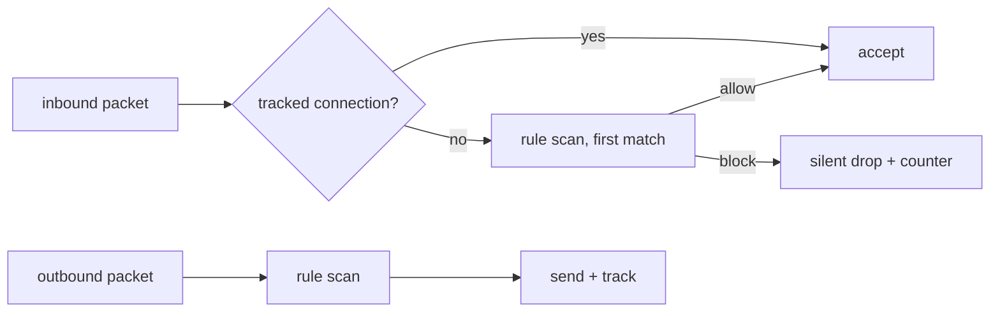

<!-- docs: covers=todo/07-networking/TODO-05-firewall.md sources=src/kernel/net/ip.c,src/kernel/net/udp.c,src/kernel/net/dhcp.c,include/kernel/net/net.h,include/registry.h reviewed=2026-09-29 order=5 -->
# Network Firewall

## What is it?

The firewall decides which network packets the system accepts and which it sends. This roadmap builds a stateful packet filter: an ordered table of up to 64 rules where the first match wins, hooks in the IPv4 and IPv6 send and receive paths, automatic acceptance of replies to connections the machine opened, a default policy of allow outbound and block inbound, a `fw` command, rules saved in the Registry, a Control Panel applet and per-rule hit counters. Impossible OS has no firewall today, so every packet the stack understands is processed. All nine sections are unstarted.

## How does it work?

**Today.** Nothing filters traffic. What the stack accepts is limited only by what it implements: `ipv4_handle()` in [`ip.c`](../../src/kernel/net/ip.c) passes ICMP and UDP up and drops TCP because TCP does not exist, and `udp_handle()` in [`udp.c`](../../src/kernel/net/udp.c) delivers only port 68 to the DHCP client. That narrow surface is the whole of today's exposure, and it has gaps a firewall would not close on its own: `ipv4_handle()` accepts packets addressed to any IP and does not verify the header checksum, and the DHCP client in [`dhcp.c`](../../src/kernel/net/dhcp.c) uses a fixed transaction ID, so any host on the local network can answer it.

**Planned design.**

1. **The engine.** A `fw_rule` holds direction, protocol, source and destination address with prefix length, port ranges and an allow or block action. `fw_check()` walks the table in order and returns the first match, or the default policy.
2. **IPv4 hooks.** `fw_check()` runs on every packet in `ipv4_handle()` and `ipv4_send()`. Blocked inbound packets are dropped silently rather than rejected, so a scan sees nothing. `ipv4_send()` returns nothing today, so the outbound hook also needs a way to report the block to its caller.
3. **Connection tracking.** Before the rule scan, inbound packets are checked against the connection table from [TCP and Network Infrastructure](tcp-network-infrastructure.md); a reply to an outbound connection is allowed without a rule.
4. **Default rules.** Inbound is blocked and outbound allowed, with explicit exceptions for ICMP, DHCP, DHCPv6, DNS and NTP replies.
5. **IPv6.** The same engine with IPv6 address fields, hooked into the [IPv6](ipv6.md) send and receive paths.
6. **Command line.** `fw list`, `add`, `remove`, `flush`, `enable`, `disable` and `status`.
7. **Persistence.** Rules saved under `HKEY_LOCAL_MACHINE\SYSTEM\Network\Firewall\Rules` and loaded at boot, using the Registry API in [`registry.h`](../../include/registry.h).
8. **Control Panel.** A `firewall.cpl` applet with an on and off switch, rule editing and a 100-entry log of blocked packets.
9. **Counters.** An atomic hit count on every rule, readable from `/sys/firewall` and shown by `fw list`.

## What are its interfaces?

All planned:

| Interface | Purpose |
| --- | --- |
| `fw_check()` | Decide allow or block for one packet |
| `fw_add_rule()`, `fw_remove_rule()`, `fw_set_default_policy()` | Rule table management |
| `fw` command | Operator control and rule listing |
| `HKEY_LOCAL_MACHINE\SYSTEM\Network\Firewall\Rules` | Saved rules |
| `/sys/firewall` | Per-rule hit counters |
| `firewall.cpl` | Graphical settings |

## How do I use it?

It cannot be used yet.

## What is not implemented yet?

- **Engine and hooks**: [Packet Filter Engine](../../todo/07-networking/TODO-05-firewall.md#1-packet-filter-engine-opus), [IP Layer Hooks](../../todo/07-networking/TODO-05-firewall.md#2-ip-layer-hooks-sonnet) and [Stateful Connection Tracking Integration](../../todo/07-networking/TODO-05-firewall.md#3-stateful-connection-tracking-integration-opus).
- **Policy**: [Default Ruleset](../../todo/07-networking/TODO-05-firewall.md#4-default-ruleset-sonnet) and [IPv6 Firewall](../../todo/07-networking/TODO-05-firewall.md#5-ipv6-firewall-sonnet).
- **Management**: [Firewall CLI](../../todo/07-networking/TODO-05-firewall.md#6-firewall-cli-sonnet), [Registry Persistence](../../todo/07-networking/TODO-05-firewall.md#7-registry-persistence-sonnet), [`firewall.cpl` Control Panel Applet](../../todo/07-networking/TODO-05-firewall.md#8-firewallcpl-control-panel-applet-sonnet) and [Per-Rule Hit Counters](../../todo/07-networking/TODO-05-firewall.md#9-per-rule-hit-counters-sonnet).
- **Not planned**: per-application rules, network profiles (domain, private and public) and NAT.

## How does it compare with Windows 11 and Linux?

Windows 11 has Windows Defender Firewall on top of the Windows Filtering Platform, with per-application rules, network profiles and `netsh advfirewall`. Linux has nftables (and the older iptables) on the netfilter hooks, with `nf_conntrack` for state and front ends such as `firewalld` and `ufw`. The planned design is closer to a simple nftables table than to Windows' profile model; its distinctive feature is atomic per-rule hit counters readable as a plain file.

## See also

- [Firewall roadmap](../../todo/07-networking/TODO-05-firewall.md)
- [TCP and Network Infrastructure](tcp-network-infrastructure.md)
- [IPv6 Dual Stack](ipv6.md)
- [Registry](../kernel/registry.md)
- [Networking](index.md)
