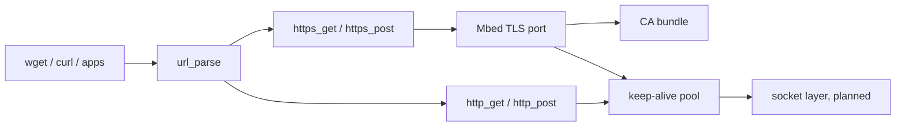

<!-- docs: covers=todo/07-networking/TODO-03-http-tls.md sources=src/libs/PROVENANCE.md,Makefile,src/libs/mbedtls/include/mbedtls/mbedtls_config.h,include/kernel/csprng.h,include/kernel/crypto/sha256.h reviewed=2026-09-29 order=3 -->
# HTTP, HTTPS and TLS

## What is it?

This roadmap builds the web client layer: a URL parser, HTTP GET and POST, `wget` and `curl` commands, TLS through Mbed TLS, a store of trusted root certificates, HTTPS, and a pool of reusable connections. It is the foundation for the web browser, the email client, update downloads and anything else that talks to a server on the internet. Impossible OS has none of it running today. The Mbed TLS source is already in the tree but is not compiled, and HTTP needs the TCP connections and sockets that earlier roadmaps have not built yet. All eight sections are unstarted.

## How does it work?

**What exists.** Three pieces are in place:

- **Mbed TLS 3.6.2**, vendored unmodified in `src/libs/mbedtls/` and recorded in [`PROVENANCE.md`](../../src/libs/PROVENANCE.md) and the credits file. It is dual-licensed Apache-2.0 or GPL-2.0-or-later, both compatible with this project's GPL-3.0-only licence. The [`Makefile`](../../Makefile) excludes it from the kernel build, and its [`mbedtls_config.h`](../../src/libs/mbedtls/include/mbedtls/mbedtls_config.h) is still the stock upstream configuration, which enables the hosted networking and timing modules a freestanding kernel cannot use. The freestanding port is owned by [Kernel Libraries](../kernel/kernel-libraries.md) and is not finished.
- **A kernel random number generator**: `csprng_fill()` in [`csprng.h`](../../include/kernel/csprng.h), which the TLS port is meant to use for its entropy instead of inventing its own.
- **SHA-256** and other hashes in [`sha256.h`](../../include/kernel/crypto/sha256.h) and its neighbours.

There is no URL parser, no HTTP code, no certificate store and no `wget` or `curl`.

**Planned design.** The plain-HTTP half comes first:

1. `url_parse()` splits a URL into scheme, host, port (80 or 443 by default), path and query without allocating.
2. `http_get()` sends an HTTP/1.1 request over a TCP socket, parses the status line and headers, and follows up to five redirects.
3. `http_post()` adds request bodies and decodes chunked transfer encoding.
4. `wget <url> [-o file]` and `curl <url>` commands with a progress display.

Then the secure half:

5. The Mbed TLS kernel port: memory through `kmalloc`, randomness through the kernel generator, and a transport that sends over the kernel socket layer.
6. A certificate store loaded from `C:\Impossible\System\Certs\ca-bundle.crt`, planned as the Mozilla root bundle of about 130 authorities. That bundle is MPL-2.0 data, so adding it needs its own provenance and credits entries.
7. `https_get()` and `https_post()` with TLS 1.2 and 1.3 and full certificate chain and host name checks.
8. A keep-alive pool of up to eight connections per host, reused across requests and closed after 30 idle seconds.

## What are its interfaces?

All of these are planned; none exist yet.

| Interface | Purpose |
| --- | --- |
| `url_parse(str, &url)` | Split a URL into its parts |
| `http_get(url, buf, max)`, `http_post(url, ct, body, blen, buf, max)` | Plain HTTP requests |
| `https_get()`, `https_post()` | The same over TLS |
| `wget`, `curl` | Command-line downloads |
| `C:\Impossible\System\Certs\ca-bundle.crt` | Trusted root certificates |

These are kernel functions first. User programs will reach HTTP through the socket system calls from [DNS Resolver and Sockets](dns-sockets.md), not through new system calls.

## How do I use it?

It cannot be used yet. The closest check today is confirming the library is vendored: the Mbed TLS row in `src/libs/PROVENANCE.md` names the exact upstream version and vendoring commit.

## What is not implemented yet?

- **Prerequisites**: TCP ([TCP and Network Infrastructure](tcp-network-infrastructure.md)) and name resolution and sockets ([DNS Resolver and Sockets](dns-sockets.md)).
- **Plain HTTP**: [URL Parser](../../todo/07-networking/TODO-03-http-tls.md#1-url-parser-sonnet), [HTTP GET](../../todo/07-networking/TODO-03-http-tls.md#2-http-get-sonnet), [HTTP POST + Chunked Transfer Encoding](../../todo/07-networking/TODO-03-http-tls.md#3-http-post--chunked-transfer-encoding-sonnet) and [`wget` / `curl` Shell Commands](../../todo/07-networking/TODO-03-http-tls.md#4-wget--curl-shell-commands-sonnet).
- **TLS**: [Mbed TLS Kernel Port](../../todo/07-networking/TODO-03-http-tls.md#5-mbed-tls-kernel-port-opus), [CA Certificate Store](../../todo/07-networking/TODO-03-http-tls.md#6-ca-certificate-store-sonnet), [HTTPS GET / POST](../../todo/07-networking/TODO-03-http-tls.md#7-https-get--post-opus) and [HTTP/1.1 Keep-Alive Connection Pool](../../todo/07-networking/TODO-03-http-tls.md#8-http11-keep-alive-connection-pool-opus).
- **HTTP/2 and HTTP/3** are not planned.

## How does it compare with Windows 11 and Linux?

Windows 11 ships WinHTTP and WinINet, TLS in `schannel.dll`, the Windows Certificate Store and, since Windows 10, `curl.exe`. Linux distributions use libcurl and wget over OpenSSL or GnuTLS, with root certificates under `/etc/ssl/certs` and optional in-kernel TLS offload. Impossible OS plans a kernel-resident HTTP and TLS client on a mature vendored TLS library, so the browser, mail client and updater share one audited TLS path rather than each bringing its own.

## See also

- [HTTP and TLS roadmap](../../todo/07-networking/TODO-03-http-tls.md)
- [Kernel Libraries](../kernel/kernel-libraries.md)
- [DNS Resolver and Sockets](dns-sockets.md)
- [Web Browser](web-browser.md)
- [Networking](index.md)
