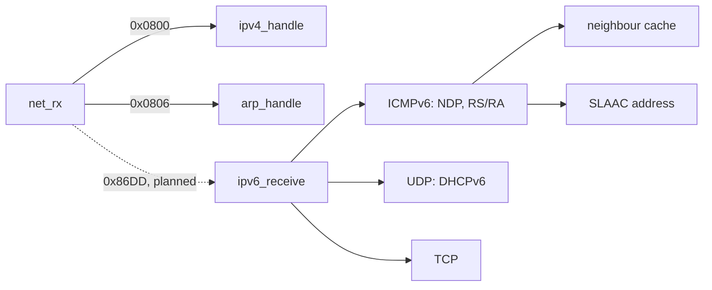

<!-- docs: covers=todo/07-networking/TODO-04-ipv6-dual-stack.md sources=src/kernel/net/ethernet.c,src/kernel/net/ip.c,src/kernel/net/udp.c,include/kernel/net/net.h,user/cmd.c reviewed=2026-09-29 order=4 -->
# IPv6 Dual Stack

## What is it?

IPv6 is the newer Internet Protocol. Many mobile and corporate networks now hand out IPv6 addresses first, and some offer nothing else, so an operating system without it cannot reach those networks. This roadmap adds IPv6 beside the existing IPv4 stack: the IPv6 header and send and receive, Neighbor Discovery, automatic address configuration, a DHCPv6 client, AAAA name lookups, IPv6 sockets and `ifconfig` output. Impossible OS has no IPv6 code today; an IPv6 frame arriving at the network card is dropped. All ten sections are unstarted.

## How does it work?

**Today.** `net_rx()` in [`ethernet.c`](../../src/kernel/net/ethernet.c) switches on the EtherType of each received frame and handles only ARP (`0x0806`) and IPv4 (`0x0800`) ([`net.h`](../../include/kernel/net/net.h)). IPv6 frames (`0x86DD`) fall through to the default case and are discarded. There is no IPv6 constant, header structure or address field anywhere in the kernel, and the single interface configuration `net_cfg` holds IPv4 addresses only.

**Planned design.** IPv6 is added as a parallel path rather than a rewrite of IPv4:

1. The IPv6 header structure, the `0x86DD` case in `net_rx()`, and a hop limit of 64.
2. `ipv6_send()` and `ipv6_receive()` in a new `ip6.c`, with next-header dispatch to ICMPv6, UDP and TCP.
3. ICMPv6 Neighbor Discovery in a new `icmp6.c`: neighbour solicitation and advertisement (message types 135 and 136) take the place of ARP, and router solicitation and advertisement (133 and 134) find the local router.
4. A link-local `fe80::` address built from the card's MAC address (EUI-64), with a one-second duplicate address check.
5. A 128-entry neighbour cache with the standard INCOMPLETE, REACHABLE, STALE, PROBE and FAILED states and a 30-second reachability time.
6. SLAAC: a global address built from the router's advertised prefix, plus DNS servers from the RDNSS option.
7. A DHCPv6 client on UDP ports 546 and 547 for networks that assign addresses centrally.
8. Turning on the AAAA query that [DNS Resolver and Sockets](dns-sockets.md) leaves as a stub, with a dual lookup that prefers IPv6.
9. `AF_INET6` sockets, IPv4-mapped addresses and `IPV6_V6ONLY`.
10. `ifconfig` showing link-local and global addresses, and an `ndp` command for the neighbour cache.

Two prerequisites from the base stack matter here. The roadmap stores IPv6 addresses in the planned `struct net_interface` from [TCP and Network Infrastructure](tcp-network-infrastructure.md), which does not exist yet. And DHCPv6 needs a way to receive on its own UDP port, but `udp_handle()` in [`udp.c`](../../src/kernel/net/udp.c) delivers only DHCP's port 68 today.

## What are its interfaces?

None yet. The planned kernel functions are `ipv6_send()`, `ipv6_receive()`, the neighbour cache lookup, `dhcp6_*` and `dns_resolve_dual()`. For programs, the planned surface is `AF_INET6` (value 10) sockets with `struct sockaddr_in6` and the `IPV6_V6ONLY` option through the socket API.

## How do I use it?

It cannot be used yet. `ifconfig` in [`user/cmd.c`](../../user/cmd.c) shows only IPv4 fields. QEMU's user networking can offer IPv6 to a guest, which is the planned first test environment once the receive path exists.

## What is not implemented yet?

Everything in the roadmap:

- **Packets**: [IPv6 Header + Ethertype Routing](../../todo/07-networking/TODO-04-ipv6-dual-stack.md#1-ipv6-header--ethertype-routing-sonnet) and [IPv6 Send / Receive](../../todo/07-networking/TODO-04-ipv6-dual-stack.md#2-ipv6-send--receive-sonnet).
- **Neighbours and addresses**: [ICMPv6 Neighbor Discovery](../../todo/07-networking/TODO-04-ipv6-dual-stack.md#3-icmpv6----neighbor-discovery-ns--na--rs--ra-opus), [Link-Local EUI-64 Autoconfiguration](../../todo/07-networking/TODO-04-ipv6-dual-stack.md#4-link-local-eui-64-autoconfiguration-sonnet), [NDP Neighbor Cache](../../todo/07-networking/TODO-04-ipv6-dual-stack.md#5-ndp-neighbor-cache-opus), [SLAAC](../../todo/07-networking/TODO-04-ipv6-dual-stack.md#6-slaac----stateless-address-autoconfiguration-sonnet) and [DHCPv6 Client](../../todo/07-networking/TODO-04-ipv6-dual-stack.md#7-dhcpv6-client-sonnet).
- **Applications**: [DNS AAAA Activation](../../todo/07-networking/TODO-04-ipv6-dual-stack.md#8-dns-aaaa-activation-sonnet), [Dual-Stack Socket API](../../todo/07-networking/TODO-04-ipv6-dual-stack.md#9-dual-stack-socket-api-opus) and [`ifconfig` IPv6 Display](../../todo/07-networking/TODO-04-ipv6-dual-stack.md#10-ifconfig-ipv6-display-sonnet).
- **Not planned here**: privacy (temporary) addresses, multicast listener discovery beyond what Neighbor Discovery needs, and IPv6 firewall rules, which belong to the [Network Firewall](firewall.md).

## How does it compare with Windows 11 and Linux?

Both have had dual-stack IPv6 on by default for over a decade. Windows 11 implements it in `tcpip.sys` and shows it in `ipconfig /all` and `netsh`; Linux implements it in `net/ipv6/` and shows it in `ip -6 addr` and `ip neigh`. Linux leaves DHCPv6 to a user-space client, while this roadmap puts a small DHCPv6 client in the kernel beside SLAAC so an address is configured before any service starts.

## See also

- [IPv6 roadmap](../../todo/07-networking/TODO-04-ipv6-dual-stack.md)
- [TCP and Network Infrastructure](tcp-network-infrastructure.md)
- [DNS Resolver and Sockets](dns-sockets.md)
- [Network Firewall](firewall.md)
- [Networking](index.md)
