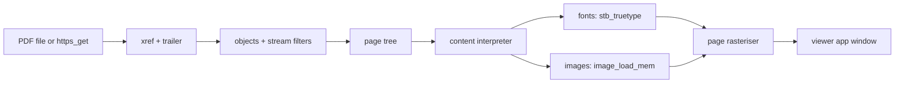

<!-- docs: covers=todo/07-networking/TODO-10-pdf-viewer.md sources=include/stb_image.h,include/stb_truetype.h,src/kernel/image.c,include/kernel/image.h,include/font_mgr.h reviewed=2026-09-29 order=10 -->
# PDF Viewer Engine

## What is it?

This roadmap plans a PDF reader written for Impossible OS with no third-party PDF library: a file structure parser, the object model with stream decompression, the page tree, a content stream interpreter, embedded fonts, images, a page rasteriser, opening PDFs straight from the web, and a stub for fillable forms. The viewer window itself (toolbar, zoom, page navigation, search box) is built by the [PDF Viewer app roadmap](../../todo/11-apps/TODO-05-pdf-viewer.md). No PDF code exists yet. Nine sections are unstarted; the viewer app section is marked in progress only because its window moved to the app roadmap.

## How does it work?

**What it will build on.** Most of the decoding a PDF needs is already in the kernel through the stb single-file libraries:

- **Deflate.** PDF's most common stream filter, FlateDecode, is zlib data. [`stb_image.h`](../../include/stb_image.h) contains a zlib decoder, `stbi_zlib_decode_buffer()`, compiled into [`image.c`](../../src/kernel/image.c) with external linkage.
- **Images.** `image_load_mem()` in [`image.h`](../../include/kernel/image.h) decodes JPEG (PDF's DCTDecode) and PNG into 32-bit pixels.
- **Fonts.** [`stb_truetype.h`](../../include/stb_truetype.h) parses and rasterises TrueType outlines, and the font manager in [`font_mgr.h`](../../include/font_mgr.h) already draws and measures text with it. It is safe only for the system's own fonts: its header warns against untrusted font files because it does not range-check offsets inside the file.

Missing pieces are the PDF-specific decoders (LZW, ASCII85, ASCIIHex), Type 1 and CFF fonts, and everything about the PDF format itself.

**Planned design.** A strict chain, each step verified before the next starts:

1. **Structure.** Find `startxref`, read the cross-reference table and trailer, follow incremental updates through `Prev`, and handle compressed cross-reference and object streams from PDF 1.5.
2. **Objects.** Resolve indirect objects, model dictionaries, arrays, strings, names and numbers, and decode Flate, LZW, ASCII85 and ASCIIHex streams.
3. **Pages.** Walk the page tree, inheriting resources and media boxes.
4. **Content.** Interpret the drawing operators: paths, fills and strokes, colour, the transformation matrix, and text positioning and showing.
5. **Fonts.** Type 1 fonts, ToUnicode maps for text extraction, and system fonts as the fallback. Embedded TrueType fonts come from untrusted files, so they need a bounds-checked parsing path before they can reach stb_truetype; that is filed as an item in the font section.
6. **Images.** Image objects in Flate and JPEG form, placed through the transformation matrix.
7. **Rasteriser.** Composite paths, text and images into a page bitmap at the chosen zoom.
8. **Viewer.** The app's window displays the pages this engine renders.
9. **From the web.** Open a PDF linked from the [Web Browser](web-browser.md) by downloading it over HTTPS.
10. **Forms.** Detect AcroForm fields, draw them as widgets over the page, and export their values as FDF or XFDF.

## What are its interfaces?

None yet. The planned engine exposes a document handle, `pdf_get_object()` for object lookup, `pdf_get_page(doc, n)` for a page, and `pdf_render_page(doc, n, dpi)`, which returns the page bitmap the viewer app displays.

## How do I use it?

It cannot be used yet.

## What is not implemented yet?

- **Parsing**: [PDF Structure Parser](../../todo/07-networking/TODO-10-pdf-viewer.md#1-pdf-structure-parser-opus), [Object Model](../../todo/07-networking/TODO-10-pdf-viewer.md#2-object-model-opus) and [Page Tree](../../todo/07-networking/TODO-10-pdf-viewer.md#3-page-tree-sonnet).
- **Rendering**: [Content Stream Interpreter](../../todo/07-networking/TODO-10-pdf-viewer.md#4-content-stream-interpreter-opus), [Font Handling](../../todo/07-networking/TODO-10-pdf-viewer.md#5-font-handling-opus), [Image Rendering](../../todo/07-networking/TODO-10-pdf-viewer.md#6-image-rendering-sonnet) and [Page Renderer](../../todo/07-networking/TODO-10-pdf-viewer.md#7-page-renderer-opus).
- **Integration**: [PDF Viewer App](../../todo/07-networking/TODO-10-pdf-viewer.md#8-pdf-viewer-app-sonnet), [PDF from HTTP](../../todo/07-networking/TODO-10-pdf-viewer.md#9-pdf-from-http-sonnet) and [PDF Forms Stub](../../todo/07-networking/TODO-10-pdf-viewer.md#10-pdf-forms-stub-sonnet).
- **Two plans for one engine**: the app roadmap also plans its own structure parser, stream decompression (through the vendored but unbuilt miniz library rather than stb's zlib decoder) and content renderer. Only one of them should be built; settling which is filed as an item in both roadmaps' structure parser sections.
- **Image decoder safety**: `image_load_mem()` has a buffer-growth over-read on PNG data split into small chunks, filed under [Thumbnail, Preview, and Multi-Size Asset Cache](../../todo/08-graphics-ui/TODO-01-graphics-asset-foundation.md#5-thumbnail-preview-and-multi-size-asset-cache); PDF images are untrusted input, so it blocks this roadmap's image section.
- **Not planned here**: opening password-protected (encrypted) PDFs and annotations.

## How does it compare with Windows 11 and Linux?

Windows 11 opens PDFs in Microsoft Edge, whose viewer is built on the Chromium PDF engine (PDFium). Linux desktops use Evince or Okular on the Poppler library, or Firefox's pdf.js. All of these handle encryption, annotations and forms. This roadmap aims for a compact reader for ordinary documents that reuses the kernel's existing image and font decoders instead of adding a second copy.

## See also

- [PDF engine roadmap](../../todo/07-networking/TODO-10-pdf-viewer.md)
- [PDF Viewer app roadmap](../../todo/11-apps/TODO-05-pdf-viewer.md)
- [Web Browser](web-browser.md)
- [Kernel Libraries](../kernel/kernel-libraries.md)
- [Networking](index.md)
