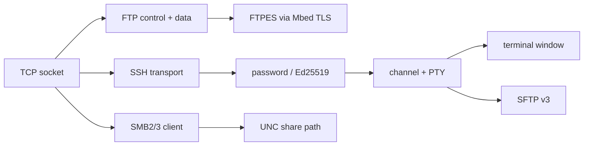

<!-- docs: covers=todo/07-networking/TODO-08-ssh-ftp-clients.md sources=src/libs/monocypher/monocypher.h,src/libs/monocypher/monocypher-ed25519.h,src/libs/PROVENANCE.md,include/desktop/terminal.h reviewed=2026-09-29 order=8 -->
# SSH, FTP and SMB Clients

## What is it?

This roadmap covers the protocols for working on and moving files between other machines: FTP and its TLS forms FTPS and FTPES, SSH with `ssh`, `scp` and `ssh-keygen`, an SSH agent, SFTP, and browsing and mounting Windows (SMB) file shares. It owns the protocol code; the graphical FTP client and the `ssh.exe` program with its configuration file are owned by the apps roadmaps. None of the ten sections has started, and all of them need TCP connections, which do not exist yet.

## How does it work?

**What exists.** The cryptography SSH needs is already in the kernel. Monocypher 4.0.2 (BSD-2-Clause or CC0-1.0, recorded in [`PROVENANCE.md`](../../src/libs/PROVENANCE.md)), is vendored and compiled, and the kernel's random number generator already uses it. It provides X25519 key exchange (`crypto_x25519()` in [`monocypher.h`](../../src/libs/monocypher/monocypher.h)), the ChaCha20 and Poly1305 building blocks, and SHA-512 Ed25519 signatures (`crypto_ed25519_sign()` and `crypto_ed25519_check()` in [`monocypher-ed25519.h`](../../src/libs/monocypher/monocypher-ed25519.h)). SSH's `ssh-ed25519` keys are this SHA-512 form, not Monocypher's default `crypto_eddsa_*` functions, which use BLAKE2b and would not interoperate. The terminal window's API in [`terminal.h`](../../include/desktop/terminal.h) (`terminal_open()`, `terminal_puts()`, `terminal_trygetchar()`) is what an interactive SSH session will relay through.

There is no FTP, SSH or SMB code and no `ssh`, `scp` or `ftp` command.

**Planned design.**

- **FTP** (sections 1 to 3). A control connection on port 21 with `USER`, `PASS`, passive mode, `LIST`, `RETR` and `STOR`; an interactive `ftp host` prompt and `wget ftp://`; then explicit TLS (`AUTH TLS`, `PBSZ 0`, `PROT P`) through Mbed TLS for FTPES. Implicit FTPS on port 990 is not supported.
- **SSH transport** (section 4). Version exchange as `SSH-2.0-ImpossibleOS`, binary packet framing, and one fixed modern algorithm set: `curve25519-sha256` key exchange, the `chacha20-poly1305@openssh.com` cipher and `ssh-ed25519` host keys, checked against a `known_hosts` file.
- **Authentication** (section 5). Password and Ed25519 public-key login, with `ssh-keygen -t ed25519`.
- **Sessions** (sections 6 and 7). Channels with a pseudo-terminal, relayed through the terminal window, and the `ssh user@host`, `scp` and `ssh-keygen` commands.
- **Agent and SFTP** (sections 8 and 9). An in-process key agent with `ssh-add`, and SFTP version 3 with an `sftp` prompt and `sftp://` locations in the file manager.
- **Network browsing and SMB** (section 10). Finding machines with WS-Discovery and mDNS (with NetBIOS names as a fallback), and an SMB 2 and 3 client that mounts `\\server\share` paths through the VFS. Signing is required and SMB1 is never offered. Whether to adopt the `libsmb2` library or write the client must be decided and recorded first.

## What are its interfaces?

All planned. Commands: `ftp`, `ssh`, `scp`, `ssh-keygen`, `ssh-add` and `sftp`. Files: `known_hosts` and `id_ed25519` under the user's `AppData\SSH` folder. Locations: `ftp://`, `sftp://` and `\\server\share` in the file manager.

## How do I use it?

It cannot be used yet.

## What is not implemented yet?

- **FTP**: [FTP Protocol](../../todo/07-networking/TODO-08-ssh-ftp-clients.md#1-ftp-protocol-sonnet), [FTP Shell + GUI Integration](../../todo/07-networking/TODO-08-ssh-ftp-clients.md#2-ftp-shell--gui-integration-sonnet) and [FTPS / FTPES](../../todo/07-networking/TODO-08-ssh-ftp-clients.md#3-ftps--ftpes-sonnet).
- **SSH**: [SSH2 Transport Layer](../../todo/07-networking/TODO-08-ssh-ftp-clients.md#4-ssh2-transport-layer-opus), [SSH Authentication](../../todo/07-networking/TODO-08-ssh-ftp-clients.md#5-ssh-authentication-opus), [SSH Channel + PTY](../../todo/07-networking/TODO-08-ssh-ftp-clients.md#6-ssh-channel--pty-sonnet), [SSH Shell Integration](../../todo/07-networking/TODO-08-ssh-ftp-clients.md#7-ssh-shell-integration-sonnet), [SSH Agent Stub](../../todo/07-networking/TODO-08-ssh-ftp-clients.md#8-ssh-agent-stub-sonnet) and [SFTP Subsystem](../../todo/07-networking/TODO-08-ssh-ftp-clients.md#9-sftp-subsystem-opus).
- **Windows shares**: [Network Browsing and SMB Client](../../todo/07-networking/TODO-08-ssh-ftp-clients.md#10-network-browsing-and-smb-client).
- **Not planned**: RSA and ECDSA keys, other SSH ciphers, and an SSH server.

## How does it compare with Windows 11 and Linux?

Windows 11 includes the OpenSSH client (`ssh`, `scp`, `sftp`, `ssh-agent`) and a built-in SMB client with network discovery; its built-in `ftp.exe` has no TLS support. Linux distributions use OpenSSH, `lftp` or `curl` for FTP, and Samba or the kernel's CIFS client for shares. Impossible OS plans a smaller SSH that supports only one modern algorithm set, which covers current OpenSSH servers and keeps the security-critical code small, on crypto the kernel already ships.

## See also

- [SSH and FTP roadmap](../../todo/07-networking/TODO-08-ssh-ftp-clients.md)
- [SSH client app roadmap](../../todo/11-apps/TODO-03-ssh-client.md)
- [FTP, wget and Wi-Fi app roadmap](../../todo/11-apps/TODO-02-ftp-wget-wifi.md)
- [Kernel Libraries](../kernel/kernel-libraries.md)
- [Networking](index.md)
