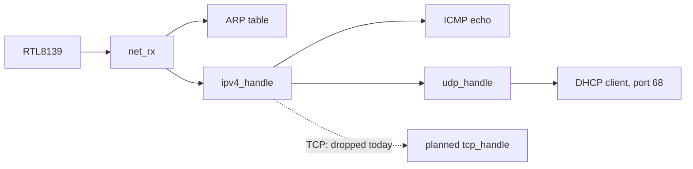

<!-- docs: covers=todo/07-networking/TODO-01-tcp-network-infrastructure.md sources=src/kernel/net/ethernet.c,src/kernel/net/arp.c,src/kernel/net/ip.c,src/kernel/net/icmp.c,src/kernel/net/udp.c,src/kernel/net/dhcp.c,include/kernel/net/net.h reviewed=2026-09-29 order=1 -->
# TCP and Network Infrastructure

## What is it?

This is the base of the Impossible OS network stack: the Ethernet, ARP, IPv4, ICMP, UDP and DHCP code that runs today, and the TCP, interface manager, loopback and connection tracking that the roadmap adds on top. Today a booted system gets an address from a DHCP server and answers ping, but it cannot open a TCP connection, so no program can talk to a web server, a mail server or a remote shell yet. Every later networking roadmap (DNS and sockets, HTTP and TLS, the firewall, the browser and the other clients) waits on the TCP work here. None of its seven sections has started.

## How does it work?

**The stack that exists.** Six small files in [`src/kernel/net/`](../../src/kernel/net/) form a minimal IPv4 host with one network card and one global configuration:

- **Ethernet** ([`ethernet.c`](../../src/kernel/net/ethernet.c)). `net_init()` copies the card's MAC address into `net_cfg`, `eth_send()` pads a frame to the 60-byte minimum and hands it to the RTL8139 driver, and `net_rx()` passes ARP and IPv4 frames up and drops every other EtherType.
- **ARP** ([`arp.c`](../../src/kernel/net/arp.c)). A 32-entry table filled from every ARP packet seen, with round-robin replacement and no expiry. It answers requests for the machine's own address once DHCP has configured one.
- **IPv4** ([`ip.c`](../../src/kernel/net/ip.c)). `ipv4_send()` builds a 20-byte header with TTL 64, sends broadcasts directly, routes off-subnet traffic to the gateway and resolves the next hop with ARP. On an ARP miss it sends a request and drops the packet, so the first packet to a new host is lost. There is no fragmentation: anything larger than the 1500-byte MTU is dropped. `ipv4_handle()` passes ICMP and UDP up; the `IP_PROTO_TCP` case exists and silently drops.
- **ICMP** ([`icmp.c`](../../src/kernel/net/icmp.c)). Answers echo requests and records echo replies, printing `[ICMP] Echo reply from a.b.c.d seq=N` to the log.
- **UDP** ([`udp.c`](../../src/kernel/net/udp.c)). `udp_handle()` delivers only port 68 (the DHCP client) and drops everything else. `udp_send()` sends with a zero checksum, which IPv4 allows, and nothing checks the checksum on receive.
- **DHCP** ([`dhcp.c`](../../src/kernel/net/dhcp.c)). A one-shot DISCOVER, OFFER, REQUEST, ACK exchange that fills in the address, subnet mask, gateway and first DNS server. It never retries, never renews its lease and ignores a NAK.

All of it shares one `struct net_config net_cfg` ([`net.h`](../../include/kernel/net/net.h)) with no locking. The boot path brings the card up, then the stack, then sends the DHCP DISCOVER; the card itself is described in [Network Drivers](../hardware/network-drivers.md).

**What the roadmap adds.** The planned order is interface manager first, then loopback, then TCP, then connection tracking:

1. A `struct net_interface` and `netif_*` API that replaces the single `net_cfg`, with a `netif_get_default()` shim for existing callers.
2. A loopback interface for `127.0.0.1/8` that never leaves the kernel.
3. TCP: the header and pseudo-header checksum, the RFC 793 state machine, a `tcp_connect()`, `tcp_send()`, `tcp_recv()` and `tcp_close()` API, then retransmission, Nagle's algorithm and slow-start congestion control.
4. Stateful connection tracking keyed on the address and port 4-tuple, which the [firewall](firewall.md) uses to let reply traffic back in.

A decision comes before any TCP code: the roadmap records that lwIP is BSD-3-Clause, and so compatible with this project's GPL-3.0-only licence, and requires a written vendor-or-build verdict first.

## What are its interfaces?

| Interface | Purpose |
| --- | --- |
| `net_init()`, `eth_send()`, `net_rx()` | Ethernet entry points ([`net.h`](../../include/kernel/net/net.h)) |
| `arp_resolve()`, `arp_request()` | Next-hop address lookup |
| `ipv4_send()`, `ipv4_handle()`, `ipv4_checksum()` | IPv4 send and receive |
| `icmp_send_echo()` | Send an echo request (used by `ping`) |
| `udp_send()`, `udp_handle()` | UDP send and the port-68-only receive path |
| `dhcp_discover()` | Start address configuration |
| `net_cfg` | The one interface's MAC, IP, subnet, gateway and DNS server |

None of the planned `tcp_*`, `netif_*` or connection-tracking functions exist yet.

## How do I use it?

Boot under QEMU with the repository launchers, which attach an RTL8139 card on QEMU user networking (`-netdev user`). The serial log shows `DHCP: IP a.b.c.d, GW a.b.c.d, DNS a.b.c.d` when the lease arrives. At the command prompt:

- `ifconfig` (or `ipconfig`) prints the MAC, IP, subnet, gateway and DNS server of `eth0`, or `(not configured, DHCP pending)`.
- `ping <ip>` sends four echo requests. It prints `Sent echo request seq=N` for each and does not wait for or report replies; a reply shows up only as the kernel log line above.

The addresses are dotted IPv4 numbers; there is no name lookup.

## What is not implemented yet?

- **Interfaces**: [Network Interface Manager](../../todo/07-networking/TODO-01-tcp-network-infrastructure.md#5-network-interface-manager-sonnet) and [Loopback Interface](../../todo/07-networking/TODO-01-tcp-network-infrastructure.md#6-loopback-interface-sonnet).
- **TCP**: [TCP Header + Checksum](../../todo/07-networking/TODO-01-tcp-network-infrastructure.md#1-tcp-header--checksum-sonnet), [TCP Connection State Machine](../../todo/07-networking/TODO-01-tcp-network-infrastructure.md#2-tcp-connection-state-machine-opus), [TCP API](../../todo/07-networking/TODO-01-tcp-network-infrastructure.md#3-tcp-api-sonnet) and [TCP Robustness](../../todo/07-networking/TODO-01-tcp-network-infrastructure.md#4-tcp-robustness-opus).
- **Firewall backing**: [Stateful Connection Tracking](../../todo/07-networking/TODO-01-tcp-network-infrastructure.md#7-stateful-connection-tracking-opus).
- **Receive-path hardening**: `ipv4_handle()` does not check the header length field or the header checksum, and `udp_handle()` trusts the UDP length field, so a malformed packet can make the stack read past the frame. The fix is filed under TCP Header + Checksum, which rewrites that path.

No unit test covers the network stack today.

## How does it compare with Windows 11 and Linux?

Windows 11 implements all of this in `tcpip.sys` behind NDIS, and Linux in `net/ipv4/` with `net_device`, the loopback driver and `nf_conntrack`. Both have had a hardened TCP for decades. Impossible OS today matches only their smallest piece: one card, IPv4, ping and a DHCP lease. The roadmap aims for the same layering, with connection tracking shared between TCP and the firewall.

## See also

- [TCP and network infrastructure roadmap](../../todo/07-networking/TODO-01-tcp-network-infrastructure.md)
- [Network Drivers](../hardware/network-drivers.md)
- [DNS Resolver and Sockets](dns-sockets.md)
- [Network Firewall](firewall.md)
- [Networking](index.md)
