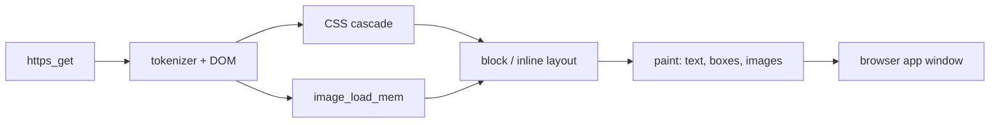

<!-- docs: covers=todo/07-networking/TODO-07-web-browser.md sources=include/kernel/image.h,src/kernel/image.c,include/font_mgr.h,include/desktop/wm.h,include/desktop/controls.h reviewed=2026-09-29 order=7 -->
# Web Browser

## What is it?

This roadmap is the engine half of the Impossible OS web browser: the page loader, HTML parser and DOM tree, layout, images, CSS, a JavaScript placeholder, tabs as data, bookmarks, downloads, and security features such as the TLS padlock, mixed-content blocking and a cookie jar. The window, toolbar and tab strip the user sees belong to a separate apps roadmap, [Web Browser app](../../todo/11-apps/TODO-01-web-browser.md). No browser code exists yet, and nothing can be fetched until the HTTP and TLS stack exists. All ten sections are unstarted.

## How does it work?

**What it will build on.** The browser reuses parts of the system that already work:

- **Images.** `image_load_mem()` in [`image.h`](../../include/kernel/image.h) decodes JPEG, PNG, BMP and GIF from memory through the stb_image library compiled into [`image.c`](../../src/kernel/image.c), and returns 32-bit pixels ready to draw.
- **Text.** The font manager in [`font_mgr.h`](../../include/font_mgr.h) renders and measures TrueType text (`ttf_draw_string()`, `ttf_measure_width()`) in the UI and monospace fonts.
- **Windows and controls.** `wm_create_window()` in [`wm.h`](../../include/desktop/wm.h) and the buttons, text boxes and scroll bars in [`controls.h`](../../include/desktop/controls.h).

What it cannot do without is `http_get()` and `https_get()` from [HTTP, HTTPS and TLS](http-tls.md), which in turn need TCP, DNS and sockets. None of those exist yet.

**Planned design.** A deliberately incremental engine, all written for this project with no third-party browser code:

1. A text-only browser that fetches a page, strips tags, and shows scrollable text with a numbered link list and back and forward. This proves the network stack end to end.
2. An HTML tokenizer and DOM tree covering about 20 essential tags.
3. Tabs as a data model (up to 16), which the app's tab strip drives.
4. A block and inline layout engine with word wrap, scrolling and clipping.
5. Images from ``, fetched over HTTP and decoded with `image_load_mem()`, with alt text as a fallback.
6. A CSS tokenizer and cascade with selector specificity and the box model.
7. A JavaScript stub: scripts are detected and shown as disabled, with a hook for a real engine later (QuickJS, which is MIT-licensed, is noted as the likely choice).
8. Bookmarks in a JSON file, with add, edit and HTML import and export.
9. A download manager with progress, pause, cancel and resume through HTTP range requests, saving to the Downloads folder.
10. Security and privacy: a padlock for TLS pages, blocking of insecure content on secure pages, a cookie jar and `ETag` caching.

## What are its interfaces?

None yet. The engine will expose tab functions such as `tab_new()`, `tab_close()` and `browser_active_tab()` for the app's chrome to call, and use `http_get()`, `https_get()` and a planned `http_get_range()` for downloads. Bookmarks and cookies will be stored as a `bookmarks.json` file and in the Registry.

## How do I use it?

It cannot be used yet.

## What is not implemented yet?

Everything in the roadmap:

- **Loading and parsing**: [Text-Only Browser](../../todo/07-networking/TODO-07-web-browser.md#1-text-only-browser-sonnet), [HTML Parser + DOM Tree](../../todo/07-networking/TODO-07-web-browser.md#2-html-parser--dom-tree-opus) and [Tab Management](../../todo/07-networking/TODO-07-web-browser.md#3-tab-management-sonnet).
- **Rendering**: [Block / Inline Layout Engine](../../todo/07-networking/TODO-07-web-browser.md#4-block--inline-layout-engine-opus), [Image Loading in Browser](../../todo/07-networking/TODO-07-web-browser.md#5-image-loading-in-browser-sonnet), [CSS Parser + Style Engine](../../todo/07-networking/TODO-07-web-browser.md#6-css-parser--style-engine-opus) and [JavaScript Stub](../../todo/07-networking/TODO-07-web-browser.md#7-javascript-stub-sonnet).
- **Everyday features**: [Bookmarks Manager](../../todo/07-networking/TODO-07-web-browser.md#8-bookmarks-manager-sonnet), [Download Manager](../../todo/07-networking/TODO-07-web-browser.md#9-download-manager-sonnet) and [Privacy + Security](../../todo/07-networking/TODO-07-web-browser.md#10-privacy--security-opus).
- **Image decoder safety**: the decoder's buffer-growth shim reads past the old buffer when a PNG split into small compressed chunks outgrows its first 4 KiB allocation. That must be fixed before the browser decodes untrusted images; it is filed under [Thumbnail, Preview, and Multi-Size Asset Cache](../../todo/08-graphics-ui/TODO-01-graphics-asset-foundation.md#5-thumbnail-preview-and-multi-size-asset-cache).
- **Not planned here**: JavaScript execution, HTTP/2 and HTTP/3, and web standards beyond the essentials above. The app roadmap asks for an existing open-source engine to be evaluated before the HTML parser is written; any candidate must pass this project's licence check first, and GPL-2.0-only code cannot be used.

## How does it compare with Windows 11 and Linux?

Windows 11 ships Microsoft Edge on the Chromium engine (Blink and V8). Linux distributions ship Firefox (Gecko and SpiderMonkey) or Chromium, with text browsers such as lynx and w3m available. Those engines are millions of lines of code. This roadmap aims for a small engine that renders ordinary documents and text-heavy sites, not full web compatibility, and reuses the system's own image decoder, fonts and TLS stack.

## See also

- [Web browser engine roadmap](../../todo/07-networking/TODO-07-web-browser.md)
- [Web browser app roadmap](../../todo/11-apps/TODO-01-web-browser.md)
- [HTTP, HTTPS and TLS](http-tls.md)
- [Controls design spec](../design/controls.md)
- [Networking](index.md)
