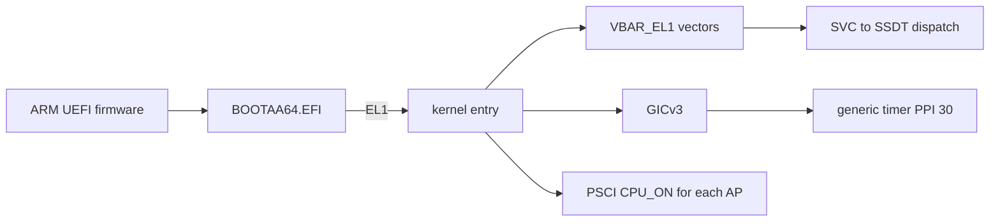

<!-- docs: covers=todo/16-architecture-ports/TODO-02-aarch64-kernel-port.md sources=Makefile,src/boot/uefi/bootx64.c,scripts/machines/run-qemu.ps1 reviewed=2026-09-30 order=2 -->
# AArch64 Kernel Port

## What is it?

The AArch64 port is the plan to build and boot the same kernel source on 64-bit ARM, starting with the QEMU `virt` machine. It covers a `BOOTAA64.EFI` loader, exception vectors, the GICv3 interrupt controller, the ARM generic timer, ARM page tables, PSCI processor bringup, `SVC` system calls, NEON and SVE state, and ARM's hardware security features. No part of it has started, and it cannot start until the [architecture abstraction layer](arch-abstraction-layer.md) exists.

## How does it work?

**Today.** Impossible OS runs on x86-64 only. The loader [`src/boot/uefi/bootx64.c`](../../src/boot/uefi/bootx64.c) builds as `BOOTX64.EFI`, the kernel compiles with `--target=x86_64-elf` in the [`Makefile`](../../Makefile), and the QEMU launcher [`scripts/machines/run-qemu.ps1`](../../scripts/machines/run-qemu.ps1) starts an x86-64 machine. The kernel's image format, ELF, is already architecture-neutral, so the port does not need a new kernel format.

**Planned.** Each x86-64 mechanism gets an ARM counterpart behind the HAL:

| x86-64 today | AArch64 plan | Roadmap section |
| --- | --- | --- |
| `BOOTX64.EFI` | `BOOTAA64.EFI`, PE/COFF machine type `0xAA64`, same boot.conf and `ExitBootServices` flow | 1 |
| IDT and `isr_stubs.asm` | `VBAR_EL1` vector table, 16 entries, C handler | 2 |
| LAPIC and IOAPIC | GICv3 distributor, redistributors and `ICC_*` registers; IPIs as SGIs | 3 |
| LAPIC timer with calibration | Generic timer, frequency from `CNTFRQ_EL0`, no calibration | 4 |
| Four-level PML4 tables | `TTBR0_EL1` for user, `TTBR1_EL1` for kernel, 4 KiB granule, 16-bit ASIDs | 5 |
| INIT/SIPI with a real-mode trampoline | `PSCI_CPU_ON` through `HVC` or `SMC`, one call per CPU | 6 |
| `SYSCALL`/`SYSRET` | `SVC #0`, arguments in `x0` to `x5`, dispatched to the same SSDT | 7 |
| XSAVE state | NEON `v0` to `v31` plus FPCR and FPSR, SVE optional, lazy via `CPACR_EL1.FPEN` | 8 |
| SMAP, CET | PAN, BTI, PAC and MTE | 9 |

## What are its interfaces?

None exist yet. The planned ones are the ARM implementations of the HAL functions from the [abstraction layer](arch-abstraction-layer.md) (for example `arch_read_timestamp()` reading `CNTVCT_EL0`, and `arch_mmu_map_page()` writing an ARM descriptor), the C exception entry `aarch64_exception_handler(struct exception_frame *)`, and an `ARCH=aarch64` build. Section 7 still has an open decision: whether the system-call number travels in `x8`, as on Linux, or `x16`, as on Apple platforms.

## How do I use it?

There is nothing to run. Section 10 plans `scripts/machines/run-aarch64.ps1`, beside the x86-64 launcher, starting QEMU with `-machine virt -cpu cortex-a72 -m 2G`, and an `ARCH=aarch64 bash scripts/build.sh` that must end in `=== BUILD OK ===`.

## What is not implemented yet?

Nothing in this roadmap is implemented, and section 1 depends on all five sections of the abstraction layer.

- [UEFI AA64 Bootloader](../../todo/16-architecture-ports/TODO-02-aarch64-kernel-port.md#1-uefi-aa64-bootloader)
- [Exception Vectors + EL1 Entry](../../todo/16-architecture-ports/TODO-02-aarch64-kernel-port.md#2-exception-vectors--el1-entry)
- [GICv3 Interrupt Controller](../../todo/16-architecture-ports/TODO-02-aarch64-kernel-port.md#3-gicv3-interrupt-controller)
- [ARM Generic Timer](../../todo/16-architecture-ports/TODO-02-aarch64-kernel-port.md#4-arm-generic-timer)
- [TTBR Page Tables](../../todo/16-architecture-ports/TODO-02-aarch64-kernel-port.md#5-ttbr-page-tables)
- [PSCI SMP Bringup](../../todo/16-architecture-ports/TODO-02-aarch64-kernel-port.md#6-psci-smp-bringup)
- [SVC Syscall Entry](../../todo/16-architecture-ports/TODO-02-aarch64-kernel-port.md#7-svc-syscall-entry)
- [NEON/SVE Context Switch](../../todo/16-architecture-ports/TODO-02-aarch64-kernel-port.md#8-neonsve-context-switch)
- [ARM Security Features](../../todo/16-architecture-ports/TODO-02-aarch64-kernel-port.md#9-arm-security-features)
- [QEMU AArch64 Test Suite](../../todo/16-architecture-ports/TODO-02-aarch64-kernel-port.md#10-qemu-aarch64-test-suite)

The roadmap assumes an ARM system describes itself the way this kernel's x86 path expects, through ACPI. The QEMU `virt` machine can also hand over a Devicetree, and the roadmap does not yet say which one the port reads. The broader two-architecture study, including RISC-V, is [ARM64 and RISC-V Architecture Port](../research/multi-arch-port.md).

## How does it compare with Windows 11 and Linux?

Windows on ARM and Linux's `arch/arm64/` both ship GICv3 and PSCI support today; Impossible OS plans both (sections 3 and 6). The planned differences are in section 9 and 10: MTE on in production rather than as Linux's opt-in hardware KASAN (Windows does not use MTE), PAC in the kernel as Linux has done since 5.7 (Windows uses it in user mode only), and one test suite that runs unchanged on both architectures, where Windows and Linux keep per-architecture test infrastructure.

## See also

- [AArch64 kernel port roadmap](../../todo/16-architecture-ports/TODO-02-aarch64-kernel-port.md)
- [Architecture Abstraction Layer](arch-abstraction-layer.md)
- [ARM64 and RISC-V Architecture Port](../research/multi-arch-port.md)
- [Interrupt and Timer Architecture](../boot/interrupt-timer-architecture.md), the x86-64 side the GICv3 and generic-timer code replaces
