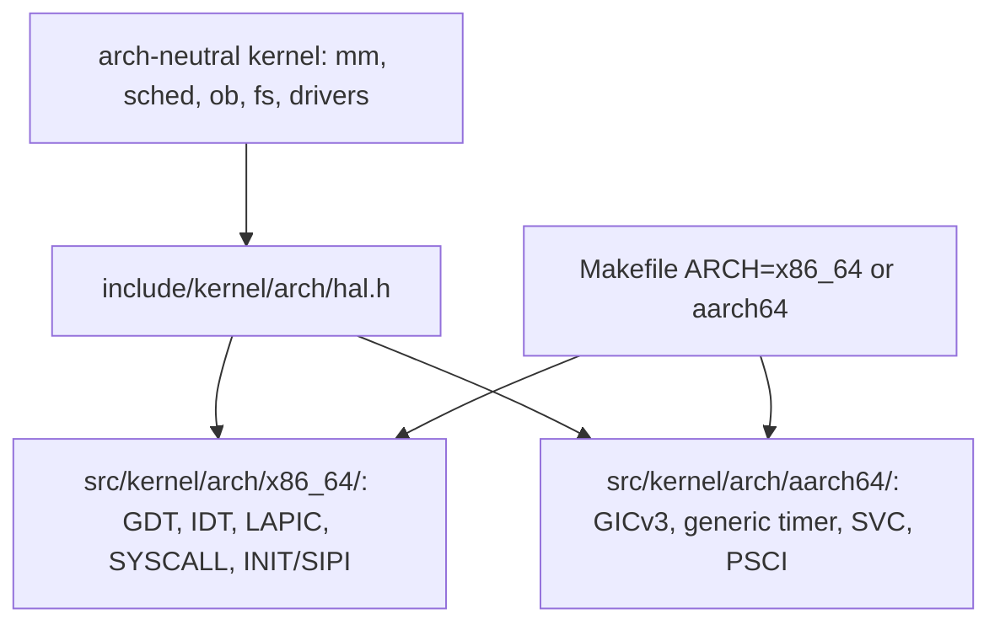

<!-- docs: covers=todo/16-architecture-ports/TODO-01-arch-abstraction-layer.md sources=Makefile,src/kernel/gdt.c,src/kernel/idt.c,src/kernel/isr_stubs.asm,src/kernel/smp/smp.c,src/kernel/sched/switch_context.asm,src/kernel/sched/syscall_entry.asm,include/kernel/barrier.h,include/kernel/sched/spinlock.h reviewed=2026-09-30 order=1 -->
# Architecture Abstraction Layer

## What is it?

The architecture abstraction layer is the planned split of the kernel into architecture-neutral code and one directory per CPU architecture, behind a small hardware abstraction layer (HAL) header. It is the prerequisite for every other port: an AArch64 kernel cannot be written until the x86-64 specifics have somewhere to live. None of it exists yet. Today the kernel is built for x86-64 only, and its architecture-specific code sits in the same directories as everything else.

## How does it work?

**Today.** The kernel is a single x86-64 build. The [`Makefile`](../../Makefile) compiles every kernel file with `--target=x86_64-elf`, links `kernel.exe` with `ld.lld-19`, and builds one loader, `BOOTX64.EFI`. There is no `ARCH=` variable, no `src/kernel/arch/` tree and no `include/kernel/arch/` header directory. The x86-64 code is spread across the tree:

- Descriptor tables and traps: [`src/kernel/gdt.c`](../../src/kernel/gdt.c), [`src/kernel/idt.c`](../../src/kernel/idt.c) and the vector stubs in [`src/kernel/isr_stubs.asm`](../../src/kernel/isr_stubs.asm).
- Processor bringup: [`src/kernel/smp/smp.c`](../../src/kernel/smp/smp.c) with the INIT/SIPI real-mode trampoline in `src/kernel/smp/ap_trampoline.asm`.
- Interrupt controllers and timers: `src/kernel/drivers/lapic.c`, `ioapic.c` and `pit.c`.
- System calls and context switch: [`src/kernel/sched/syscall_entry.asm`](../../src/kernel/sched/syscall_entry.asm) (SYSCALL/SYSRET) and [`src/kernel/sched/switch_context.asm`](../../src/kernel/sched/switch_context.asm).
- Inline assembly in shared headers: memory barriers in [`include/kernel/barrier.h`](../../include/kernel/barrier.h), the spin-wait `pause` in [`include/kernel/sched/spinlock.h`](../../include/kernel/sched/spinlock.h), plus `cpuid.h`, `msr.h` and `cpu_security.h`.

Inline assembly is not confined to those files. A grep of `src/kernel/` and `include/kernel/` for `__asm__` or `asm volatile` matched 104 files on 2026-09-30, and the kernel carries nine `.asm` sources, among them `gdt_asm.asm`, `kpti_trampoline.asm`, `retpoline.asm`, `except_seh.asm` and `rtl/unwind_asm.asm`.

**Planned.** [Section 1](../../todo/16-architecture-ports/TODO-01-arch-abstraction-layer.md#1-define-hal-interface) defines `include/kernel/arch/hal.h` with fourteen `arch_*` prototypes, each one a thin wrapper on x86-64 over code that already exists. Sections 2 to 4 move the x86-64 files into `src/kernel/arch/x86_64/`, add `ARCH ?= x86_64` to the Makefile and fix the include paths. Section 5 proves the refactor changed nothing by booting on all four platforms.



## What are its interfaces?

| Interface | Status |
| --- | --- |
| `include/kernel/arch/hal.h` (`arch_interrupts_disable`, `arch_halt`, `arch_tlb_flush_page`, `arch_read_timestamp`, `arch_context_switch`, `arch_mmu_map_page` and the rest) | Planned, section 1 |
| `src/kernel/arch/x86_64/` and `include/kernel/arch/x86_64/` | Planned, section 2 |
| `ARCH=` Makefile variable | Planned, section 3 |
| The x86-64 implementations the HAL will wrap | Shipped, in their current locations |

## How do I use it?

There is nothing to use yet. The only build is the x86-64 one:

```bash
bash scripts/build.sh
tail -1 build/build.log    # === BUILD OK ===
```

## What is not implemented yet?

Nothing in this roadmap is implemented.

- [Define HAL Interface](../../todo/16-architecture-ports/TODO-01-arch-abstraction-layer.md#1-define-hal-interface)
- [Create arch/x86_64/ and Move Files](../../todo/16-architecture-ports/TODO-01-arch-abstraction-layer.md#2-create-archx86_64-and-move-files)
- [Update Makefile](../../todo/16-architecture-ports/TODO-01-arch-abstraction-layer.md#3-update-makefile)
- [Update Include Paths](../../todo/16-architecture-ports/TODO-01-arch-abstraction-layer.md#4-update-include-paths)
- [Verify 4-Platform Boot](../../todo/16-architecture-ports/TODO-01-arch-abstraction-layer.md#5-verify-4-platform-boot)

The roadmap's move list names 13 files, while the tree has nine assembly sources and inline assembly in about a hundred files, including barriers and spinlocks that every subsystem includes. An inventory of the real architecture surface is filed as the first item of section 2, because a HAL of fourteen functions cannot hide what it has not counted.

## How does it compare with Windows 11 and Linux?

Both keep architecture code apart: Windows through its HAL and per-architecture directories, Linux through `arch/<name>/` selected by the `ARCH=` make variable. Impossible OS has neither yet (sections 1 to 3). The one planned addition neither system has is section 5's rule that the move must keep every `_Static_assert` on struct offsets intact, so the kernel's layout checks survive the split.

## See also

- [Architecture abstraction layer roadmap](../../todo/16-architecture-ports/TODO-01-arch-abstraction-layer.md)
- [AArch64 Kernel Port](aarch64-kernel-port.md), which depends on this split
- [x86-64 Architecture Features](../kernel/x86-64-architecture.md)
- [Kernel Bulletproofing](../kernel/kernel-bulletproofing.md), whose static asserts must survive the move
