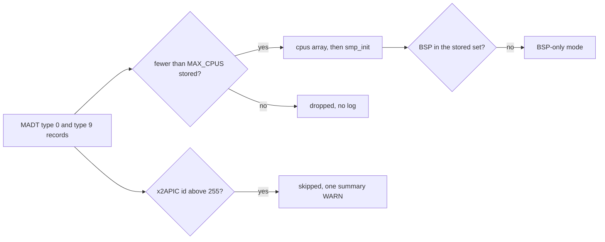

<!-- docs: covers=todo/16-architecture-ports/TODO-03-smp-scaling-processor-groups.md sources=include/kernel/acpi.h,src/kernel/acpi.c,include/kernel/smp.h,src/kernel/smp/smp.c,include/kernel/sched/dpc.h reviewed=2026-09-30 order=3 -->
# SMP Scaling and Processor Groups

## What is it?

SMP scaling is the plan to take the kernel past its current limit of 16 logical processors, up to 256 or more, using Windows-style processor groups of up to 64 CPUs each. Today the kernel runs on up to 16 CPUs, which covers desktops and laptops but not servers or many-core ARM parts. None of the five sections has started.

## How does it work?

**Today.** The limit is one constant, `MAX_CPUS 16`, in [`include/kernel/acpi.h`](../../include/kernel/acpi.h). Every per-CPU table is sized by it, starting with the `cpu_data[MAX_CPUS]` array of `struct per_cpu_data` in [`src/kernel/smp/smp.c`](../../src/kernel/smp/smp.c).

The ACPI MADT parser in [`src/kernel/acpi.c`](../../src/kernel/acpi.c) reads both Local APIC records (type 0) and Local x2APIC records (type 9). It keeps a processor record when its Enabled or Online Capable flag is set, and only while fewer than `MAX_CPUS` are stored; usable records past the sixteenth are dropped without a log line. A record that is only Online Capable still takes a slot, but `smp_init()` starts only Enabled processors. The walk also stops at the first record whose length is impossible, since firmware tables are untrusted input. After the walk the parser checks that the running bootstrap processor (BSP) is in the stored set; if it is not, for example because it was listed after the sixteenth usable record, it logs an error and falls back to BSP-only mode, starting no other processor. An x2APIC record whose ID is above 255 is skipped with one summary warning, `x2APIC CPUs skipped (ids up to N exceed xAPIC 8-bit addressing)`, because the kernel still sends IPIs in xAPIC mode, whose destination field is 8 bits.

There are two CPU counts, and neither is a slot bound. `smp_cpu_count()` is the live number of online CPUs and falls when one parks; `smp_cpu_present_count()` is what bringup discovered and never changes after `smp_init()`. Both are declared in [`include/kernel/smp.h`](../../include/kernel/smp.h). The online set is a `uint32_t` bitmask returned by `smp_online_mask()`, and `smp.c` pins `MAX_CPUS <= SMP_ONLINE_MASK_BITS` (32) with a `_Static_assert`, so raising the limit past 32 means widening that mask first.

Deferred procedure calls target one CPU by flat index: `KeSetTargetProcessorDpc(KDPC *dpc, uint32_t cpu_number)` in [`include/kernel/sched/dpc.h`](../../include/kernel/sched/dpc.h). There is no processor-group type anywhere in the tree.

**Planned.** Section 1 raises `MAX_CPUS` to 256 and moves the large per-CPU tables to dynamic allocation. Section 2 adds `PROCESSOR_NUMBER` (group plus number) and `GROUP_AFFINITY` (a 64-bit mask plus a group). Section 3 adds `KeSetTargetProcessorDpcEx`, which converts a group and number to the flat index, with a cross-CPU IPI for urgent DPCs. Section 4 wires group affinity into `NtSetInformationThread` and `NtSetInformationProcess`, and section 5 extends MADT parsing.



## What are its interfaces?

| Interface | Status |
| --- | --- |
| `MAX_CPUS` (16) | Shipped, `include/kernel/acpi.h` |
| `smp_cpu_count()`, `smp_cpu_present_count()`, `smp_cpu_is_online()`, `smp_online_mask()` | Shipped, `include/kernel/smp.h` |
| `KeSetTargetProcessorDpc(KDPC *, uint32_t)` | Shipped, `include/kernel/sched/dpc.h` |
| `PROCESSOR_NUMBER`, `GROUP_AFFINITY` | Planned, section 2 |
| `KeSetTargetProcessorDpcEx(KDPC *, PROCESSOR_NUMBER *)` | Planned, section 3 |
| Group affinity in `NtSetInformationThread` and `NtSetInformationProcess` | Planned, section 4 |

## How do I use it?

There is no configuration switch. QEMU's `-smp` sets the CPU count, and the boot-validation matrix already boots at one and two CPUs:

```bash
bash scripts/test-smoke-matrix.sh
```

A machine with more than 16 processors boots with at most 16, and possibly fewer: the first 16 usable MADT records are kept, those that are only Online Capable are not started, and if the BSP is not among them the kernel runs on the BSP alone. The parser logs each MADT record at debug level, and the BSP-only fallback at error level. Code that walks CPUs should iterate `MAX_CPUS` and filter with `smp_cpu_is_online()`, since slots are sparse.

## What is not implemented yet?

Nothing in this roadmap is implemented.

- [Raise MAX_CPUS and Dynamic Per-CPU Allocation](../../todo/16-architecture-ports/TODO-03-smp-scaling-processor-groups.md#1-raise-max_cpus-and-dynamic-per-cpu-allocation)
- [PROCESSOR_NUMBER Type](../../todo/16-architecture-ports/TODO-03-smp-scaling-processor-groups.md#2-processor_number-type)
- [KeSetTargetProcessorDpcEx](../../todo/16-architecture-ports/TODO-03-smp-scaling-processor-groups.md#3-kesettargetprocessordpcex)
- [GROUP_AFFINITY for Affinity APIs](../../todo/16-architecture-ports/TODO-03-smp-scaling-processor-groups.md#4-group_affinity-for-affinity-apis)
- [MADT Parsing for >64 LAPICs](../../todo/16-architecture-ports/TODO-03-smp-scaling-processor-groups.md#5-madt-parsing-for-64-lapics)

Three limits the roadmap did not name are filed in section 1: the 32-bit online mask that caps `MAX_CPUS` at 32, the silent drop of processors past the limit, and the BSP-only fallback when the BSP is listed after the sixteenth usable record. The parser itself has no 64-entry ceiling, so the real blockers for large machines are `MAX_CPUS` and x2APIC IPI delivery, which [x2APIC mode in the APIC routing roadmap](../../todo/04-drivers-hardware/TODO-02-apic-interrupt-routing.md#1-x2apic-mode----msr-register-access-opus) owns.

## How does it compare with Windows 11 and Linux?

Windows supports more than 64 processors through processor groups, `GROUP_AFFINITY` and the `DpcEx` APIs. Linux uses a `cpumask_t` sized at build time (up to 8192 CPUs) and `cpu_set_t` for affinity, and has no DPC model. Impossible OS follows the Windows model in sections 1 to 5 and today stops at 16 CPUs.

## See also

- [SMP scaling and processor groups roadmap](../../todo/16-architecture-ports/TODO-03-smp-scaling-processor-groups.md)
- [SMP Phase 2](../memory/smp-phase2.md)
- [IRQL and DPCs](../kernel/irql-dpc.md)
- [APIC Interrupt Routing](../hardware/apic-interrupt-routing.md)
