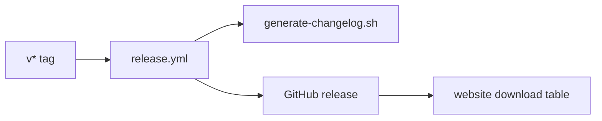

<!-- docs: covers=todo/15-installer-release/TODO-05-github-release-community.md sources=.github/workflows/release.yml,scripts/generate-changelog.sh,CONTRIBUTING.md,CHANGELOG.md,.github/PULL_REQUEST_TEMPLATE.md,.github/ISSUE_TEMPLATE/config.yml,CODE_OF_CONDUCT.md,project.json reviewed=2026-09-29T08:30 order=7 -->
# GitHub Releases and Community Launch

## What is it?

This roadmap plans the public launch: a release script and workflow, changelog discipline, a rewritten contribution guide, issue and pull request templates, a new README, a project website, community channels and a published roadmap synced to GitHub milestones. Much of the groundwork already exists, because the repository is public and has shipped release, site and community files for a while; the roadmap still describes several of them as new. None of its eight sections is marked done.

## How does it work?

**Today.** The repository already has:

- **A release workflow.** [`release.yml`](../../.github/workflows/release.yml) runs on any `v*` tag, marks `-alpha`, `-beta` and `-rc` tags as pre-releases, builds the images, regenerates the changelog, and publishes the GitHub release. When the tag is a stable one, it also deletes every pre-release among the 100 most recent releases, together with its tag, without comparing versions, so a newer release candidate is removed too. Tags follow the CalVer scheme in [`CONTRIBUTING.md`](../../CONTRIBUTING.md), for example `v26.3.18`.
- **A generated changelog.** [`CHANGELOG.md`](../../CHANGELOG.md) is written by [`generate-changelog.sh`](../../scripts/generate-changelog.sh) from git history, grouped by commit prefix. It is not a hand-kept "Keep a Changelog" file.
- **Community files.** A contribution guide, a security policy, a [code of conduct](../../CODE_OF_CONDUCT.md) (Contributor Covenant 2.1), a [pull request template](../../.github/PULL_REQUEST_TEMPLATE.md) with Description, Related TODO, Testing and Type of Change sections, and three issue forms (`bug-report.yml`, `feature-request.yml`, `hardware-report.yml`). The [issue chooser](../../.github/ISSUE_TEMPLATE/config.yml) turns off blank issues and links Discussions and the roadmap.
- **A website.** The documentation site and landing page are built from `docs/` and `gh-pages/` and deployed by workflow to <!-- project:site_url -->https://impossibleos.co<!-- /project -->, with project facts such as the release date kept only in [`project.json`](../../project.json) (see [Documentation Site](../infrastructure/documentation-site.md)).

Missing: `scripts/create-release.sh`, `lint-changelog.py`, the README sync scripts, `docs/roadmap.md`, `sync-milestones.sh`, `sync-issues.sh`, and a Discord server.

**Planned design.**

1. **Release workflow.** `create-release.sh` creates the annotated tag and GitHub release and hands artifact upload to the update server and SDK release scripts.
2. **Changelog.** An `[Unreleased]` section every pull request updates, checked by a lint in CI.
3. **Contributors.** A rewritten guide covering WSL2 set-up, build commands, style and review, YAML issue forms and a checklist in the pull request template.
4. **README and website.** A screenshot, a three-command quick start, a download table and a version button fed by the update manifest.
5. **Community and roadmap.** GitHub Discussions categories and a Discord server, and a public roadmap whose milestones are kept in sync with the TODO domains.



## What are its interfaces?

| Interface | Status |
| --- | --- |
| `release.yml`, CalVer tags | Shipped |
| `scripts/generate-changelog.sh`, generated `CHANGELOG.md` | Shipped |
| Contribution guide, code of conduct, security policy | Shipped |
| Issue forms, issue chooser, pull request template | Shipped |
| Website deploy from `docs/` and `gh-pages/` | Shipped |
| `create-release.sh` | Planned in section 1 |
| `lint-changelog.py` | Planned in section 2 |
| README sync scripts | Planned in section 5 |
| `docs/roadmap.md`, `sync-milestones.sh`, `sync-issues.sh` | Planned in section 8 |

## How do I use it?

To publish a release today, push an annotated tag:

```bash
git tag -a v26.3.18 -m "Release 26.3.18"
git push origin v26.3.18
```

The workflow builds, tests and publishes the release on its own. A stable tag deletes every listed pre-release and its tag, including release candidates newer than the stable version, so publish a stable maintenance release only when no pre-release needs to survive.

## Who owns what?

The repository setup page, [GitHub Repository Setup](../infrastructure/github-setup.md), already documents the release workflow, CalVer, templates and community files; this roadmap overlaps it on sections 1 to 4 and 7. The update server roadmap's section 2 plans a second workflow on the same `v*` tag. A reconcile item in [section 1](../../todo/15-installer-release/TODO-05-github-release-community.md#1-github-release-workflow-sonnet) asks for the shipped `release.yml` to be extended instead. [Section 3](../../todo/15-installer-release/TODO-05-github-release-community.md#3-contribution-guide-overhaul-sonnet) asks for DCO sign-off and "no direct pushes to `main`", which conflict with the project's zero-trailer commit policy and main-only workflow, so a reconcile item is filed there too.

## What is not implemented yet?

- [GitHub Release Workflow](../../todo/15-installer-release/TODO-05-github-release-community.md#1-github-release-workflow-sonnet): the workflow exists; `create-release.sh` does not
- [Changelog Discipline](../../todo/15-installer-release/TODO-05-github-release-community.md#2-changelog-discipline-sonnet): a hand-kept changelog would conflict with the generator
- [Contribution Guide Overhaul](../../todo/15-installer-release/TODO-05-github-release-community.md#3-contribution-guide-overhaul-sonnet)
- [Issue and PR Templates](../../todo/15-installer-release/TODO-05-github-release-community.md#4-issue--pr-templates-sonnet): the forms exist under hyphenated names
- [README Overhaul](../../todo/15-installer-release/TODO-05-github-release-community.md#5-readme-overhaul-sonnet)
- [Project Website](../../todo/15-installer-release/TODO-05-github-release-community.md#6-project-website-sonnet): the site exists; the roadmap still names an `impossible-os.dev` domain and a `docs/website/` folder
- [Community Channels](../../todo/15-installer-release/TODO-05-github-release-community.md#7-community-channels-sonnet)
- [Roadmap Publication and GitHub Milestones Sync](../../todo/15-installer-release/TODO-05-github-release-community.md#8-roadmap-publication--github-milestones-sync-sonnet)

## How does it compare with Windows 11 and Linux?

Windows releases are announced on the Windows blog and built internally, with no public contribution process. Linux publishes releases on kernel.org with release notes compiled from the merge window, and takes contributions by mailing list with a DCO sign-off. Impossible OS releases from a tag through a public workflow, generates its changelog from commit history, and publishes its roadmap in the repository; it takes contributions as GitHub pull requests.

## See also

- [GitHub Releases and Community Launch roadmap](../../todo/15-installer-release/TODO-05-github-release-community.md)
- [GitHub Repository Setup](../infrastructure/github-setup.md)
- [Update Server Infrastructure](update-server.md)
- [Documentation Site](../infrastructure/documentation-site.md)
