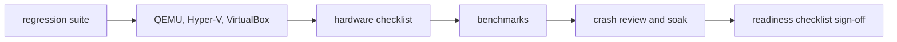

<!-- docs: covers=todo/15-installer-release/TODO-04-release-qa.md sources=scripts/test.sh,scripts/test-smoke.sh,scripts/test-smoke-matrix.sh,scripts/ci/boot-matrix.sh,scripts/release/boot-test-vbox.sh,scripts/release/boot-test-vhdx.sh,scripts/release/boot-test-iso.sh,.github/workflows/build.yml reviewed=2026-09-29 order=6 -->
# Release QA and Platform Certification

## What is it?

This roadmap is the quality gate a release must pass: a whole-OS regression suite, QEMU validation scenarios, Hyper-V and VirtualBox certification, a real hardware checklist run on at least three machines, performance benchmarks with regression thresholds, a release readiness checklist, and a crash analytics review with a 30-minute soak. None of its eight sections has shipped as specified, but much of the testing it wants already runs under other names.

## How does it work?

**Today.** The project already tests every push and has boot tests for every artifact format, through scripts the roadmap does not name:

- **Unit suites.** [`test.sh`](../../scripts/test.sh) boots the kernel test runner and the user-mode test programs; it runs after every kernel commit and in CI.
- **Boot to userspace.** [`test-smoke.sh`](../../scripts/test-smoke.sh) boots the image and checks for `Boot complete` and the `C:\>` prompt; [`test-smoke-matrix.sh`](../../scripts/test-smoke-matrix.sh) repeats that on TCG and KVM at one and two CPUs.
- **Artifact formats.** [`boot-matrix.sh`](../../scripts/ci/boot-matrix.sh) boots each release format that has been built, with per-format tests such as [`boot-test-iso.sh`](../../scripts/release/boot-test-iso.sh), [`boot-test-vhdx.sh`](../../scripts/release/boot-test-vhdx.sh) and [`boot-test-vbox.sh`](../../scripts/release/boot-test-vbox.sh), which boots the VDI in VirtualBox. It skips a leg whose artifact or tool is missing (ISO, VHDX, VDI, VirtualBox, a USB loop device without privileges) and always skips WHPX, and it reports PASS when no leg failed, so a PASS does not mean every leg ran.
- **CI.** [`build.yml`](../../.github/workflows/build.yml) builds and tests on every push to `main`; a hardware report issue form collects results from real machines.
- **WHPX.** `scripts/machines/run-qemu.ps1 -Accel whpx -Headless` boots the image under the Windows hypervisor from WSL.

What does not exist: `scripts/run-tests.sh`, `qemu-test.sh`, `hyperv-test.ps1`, `vbox-test.sh`, `benchmark.sh`, a `test.yml` workflow, a QA build profile, and the known-issues, hardware checklist and release checklist guides.

**Planned design.**

1. **Regression and QEMU.** An 11-area regression matrix (kernel init, memory stress, files, Registry, network, compositor, processes, syscalls) and eight QEMU scenarios from cold boot to a 30-minute idle soak.
2. **Hypervisor certification.** An unattended Hyper-V Gen 2 install with eight required checks, and a VirtualBox EFI run with an OVA import and guest additions detection.
3. **Hardware and performance.** A structured hardware checklist run on three or more machines from different manufacturers, and nine benchmarks written to a JSON file, warning at 10% and failing at 25% regression.
4. **Readiness and crash review.** A release checklist, filled in as a pull request template before a stable tag, where every item must be ticked, and a QA build with the memory sanitizer and lock checker enabled for a crash-free soak.



## What are its interfaces?

| Interface | Status |
| --- | --- |
| `scripts/test.sh`, `test-smoke.sh`, `test-smoke-matrix.sh` | Shipped |
| `scripts/ci/boot-matrix.sh` and the per-format boot tests | Shipped (run by hand, not yet in a workflow) |
| `build.yml` CI, hardware report issue form | Shipped |
| `run-tests.sh` regression matrix | Planned in section 1 |
| `qemu-test.sh` scenarios | Planned in section 2 |
| `hyperv-test.ps1`, `vbox-test.sh` | Planned in sections 3 and 4 |
| Hardware checklist | Planned in section 5 |
| `benchmark.sh` and `benchmark-{version}.json` | Planned in section 6 |
| Release checklist template | Planned in section 7 |
| QA build profile and crash review | Planned in section 8 |

## How do I use it?

Run what exists before a release:

```bash
bash scripts/build.sh
bash scripts/test.sh QUIET=1
bash scripts/test-smoke-matrix.sh
CI_PARITY=1 bash scripts/test.sh
```

The last line runs the suite under the same QEMU version and emulation mode CI uses.

## Who owns what?

The [Boot Validation and Certification Matrix](../boot/boot-validation-matrix.md) roadmap (`01-boot-platform/TODO-28`) owns the boot-platform subset (boot-path gates, repeat-boot flake detection, the boot support bundle) and consumes this roadmap's VM harness rather than duplicating it. The per-format boot tests belong to the boot media roadmap, documented in [Boot Artifacts](boot-artifacts.md). The [Machine Launcher and Debug Profile Matrix](../infrastructure/machine-matrix.md) leaves release-validation VM flows, Hyper-V certification, hardware certification and benchmarks to this file. Crash dumps come from the crash dump roadmap, sanitizers from the concurrency diagnostics roadmap (`03-memory-concurrency/TODO-10`), and the Win32 compatibility gate from [Win32 Compatibility Matrix](../sdk/win32-compat-matrix.md).

## What is not implemented yet?

- [Automated Regression Test Suite](../../todo/15-installer-release/TODO-04-release-qa.md#1-automated-regression-test-suite-sonnet), which should build on `test.sh`
- [QEMU Validation](../../todo/15-installer-release/TODO-04-release-qa.md#2-qemu-validation-sonnet)
- [Hyper-V Certification](../../todo/15-installer-release/TODO-04-release-qa.md#3-hyper-v-certification-sonnet), which needs the unattended installer
- [VirtualBox Certification](../../todo/15-installer-release/TODO-04-release-qa.md#4-virtualbox-certification-sonnet)
- [Real Hardware Test Checklist](../../todo/15-installer-release/TODO-04-release-qa.md#5-real-hardware-test-checklist-sonnet)
- [Performance Benchmarks](../../todo/15-installer-release/TODO-04-release-qa.md#6-performance-benchmarks-sonnet)
- [Release Readiness Checklist](../../todo/15-installer-release/TODO-04-release-qa.md#7-release-readiness-checklist-sonnet)
- [Crash Analytics Review](../../todo/15-installer-release/TODO-04-release-qa.md#8-crash-analytics-review-sonnet)

The roadmap's Implementation Order runs in a different order from its section numbers (benchmarks and crash review come before the hypervisor runs), so read the order table rather than the section numbers when planning.

## How does it compare with Windows 11 and Linux?

Microsoft certifies with the Windows Hardware Lab Kit and runs its own test labs and private performance tracking before each release. The Linux kernel relies on kselftest, KUnit, the Linux Test Project, KASAN builds and a public release-candidate cycle, with distributions certifying hardware separately. Impossible OS runs its unit suites in CI on every push and a single-configuration smoke boot after boot-path changes, with a four-leg boot matrix at section boundaries and a CI-parity run before each push; this roadmap adds the release-level pieces, and publishes the checklist rather than keeping it internal.

## See also

- [Release QA and Platform Certification roadmap](../../todo/15-installer-release/TODO-04-release-qa.md)
- [Boot Validation and Certification Matrix](../boot/boot-validation-matrix.md)
- [Boot Artifacts: Build, Verify, Write](boot-artifacts.md)
- [Machine Launcher and Debug Profile Matrix](../infrastructure/machine-matrix.md)
- [Unattended Installation and Deployment](unattended-install.md)
