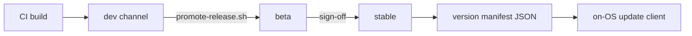

<!-- docs: covers=todo/15-installer-release/TODO-03-update-server.md sources=scripts/generate-changelog.sh,.github/workflows/release.yml,.github/workflows/pages.yml,project.json,gh-pages/CNAME,scripts/site/verify_live.py reviewed=2026-09-30T04:40 order=5 -->
# Update Server Infrastructure

## What is it?

This roadmap plans the server side of updates: a JSON version manifest per release channel, hosting for images and packages, a promotion pipeline from dev to beta to stable with rollback, an IPKG package repository and submission process, delta packages, a telemetry receiver and a public status page. It is the counterpart of the on-OS update client in [System Updates and IPKG Packages](../services/updates-packages.md). None of its eight sections has shipped; the only running release infrastructure is the GitHub release workflow and the documentation site.

## How does it work?

**Today.** Two pieces of release plumbing exist, neither of which is an update server:

- **GitHub releases.** [`release.yml`](../../.github/workflows/release.yml) runs when a `v*` tag is pushed: it builds the images, regenerates the changelog with [`generate-changelog.sh`](../../scripts/generate-changelog.sh), publishes a GitHub release, and on a stable tag deletes every listed pre-release and its tag, whatever its version, keeping only tags whose docs are not frozen yet.
- **The website.** [`pages.yml`](../../.github/workflows/pages.yml) builds and deploys the site on every push to `main`, and [`verify_live.py`](../../scripts/site/verify_live.py) checks the live copy byte for byte. Each release tag also freezes that release's documentation and publishes it at `docs/<version>/` beside `main` ([Documentation Site](../infrastructure/documentation-site.md#how-do-release-docs-stay-published-after-later-deploys)). The site's address comes from [`project.json`](../../project.json) and [`CNAME`](../../gh-pages/CNAME): <!-- project:site_url -->https://impossibleos.co<!-- /project -->.

There is no version manifest, CDN upload, promotion script, package index, telemetry endpoint or status page, and no update client in the OS polls for one.

**Planned design.**

1. **Version manifest.** A static JSON document per channel (stable, beta, dev) giving the latest version, download and delta URLs and checksums, served from the website.
2. **Hosting.** Disk images and ISOs as GitHub release assets; IPKG packages in object storage.
3. **Promotion.** `promote-release.sh` moves a build from dev to beta to stable after a sign-off checklist; `rollback-release.sh` reverses it; the changelog is generated from git history.
4. **Packages.** An `index.json` repository, `ipkg search`, `install`, `update` and `upgrade` on the client, and pull-request submission with signature checks and a QEMU install test.
5. **Deltas, telemetry and status.** File-level delta packages with a full-image fallback, an opt-in telemetry receiver, and a status page updated by a scheduled job.



## What are its interfaces?

| Interface | Status |
| --- | --- |
| `release.yml` on `v*` tags | Shipped |
| `scripts/generate-changelog.sh` | Shipped |
| Website deploy and live verification | Shipped |
| Version manifest JSON per channel | Planned in section 1 |
| `upload-release.sh` and hosting | Planned in section 2 |
| `promote-release.sh`, `rollback-release.sh` | Planned in section 3 |
| `index.json`, `ipkg` repository commands | Planned in sections 4 and 5 |
| `make-delta.sh`, delta apply | Planned in section 6 |
| Telemetry receiver, status page | Planned in sections 7 and 8 |

## How do I use it?

Only the changelog generator runs today:

```bash
bash scripts/generate-changelog.sh v0.1.0 HEAD
```

It rewrites `CHANGELOG.md` at the repository root, grouping commits by their conventional prefix.

## Who owns what?

The on-OS client (`update_check()`, download, apply and the IPKG installer) belongs to the [System Updates and IPKG Packages](../services/updates-packages.md) roadmap (`10-platform-services/TODO-03`). This file's sections 1, 4 and 6 change that client (a JSON manifest instead of INI, repository commands, delta apply); a reconcile item is filed in [section 1](../../todo/15-installer-release/TODO-03-update-server.md#1-version-manifest-api-sonnet) here and in section 1 of the client roadmap. The on-OS telemetry sender is the [long-term features](../services/long-term-features.md) roadmap's section 10. Release artifacts and signing are the release artifacts roadmap (`15-installer-release/TODO-01`), documented in [Boot Artifacts](boot-artifacts.md).

## What is not implemented yet?

- [Version Manifest API](../../todo/15-installer-release/TODO-03-update-server.md#1-version-manifest-api-sonnet)
- [CDN and Hosting](../../todo/15-installer-release/TODO-03-update-server.md#2-cdn--hosting-sonnet)
- [Release Promotion Pipeline](../../todo/15-installer-release/TODO-03-update-server.md#3-release-promotion-pipeline-sonnet), which should extend the shipped changelog script
- [IPKG Package Repository](../../todo/15-installer-release/TODO-03-update-server.md#4-ipkg-package-repository-sonnet)
- [Package Submission](../../todo/15-installer-release/TODO-03-update-server.md#5-package-submission-sonnet)
- [Update Delta Packages](../../todo/15-installer-release/TODO-03-update-server.md#6-update-delta-packages-sonnet)
- [Telemetry Pipeline](../../todo/15-installer-release/TODO-03-update-server.md#7-telemetry-pipeline-sonnet)
- [Status Page](../../todo/15-installer-release/TODO-03-update-server.md#8-status-page-sonnet)

The roadmap still names `impossible-os.dev` subdomains, a separate `impossible-os-updates` repository's `gh-pages` branch and SemVer-style versions such as `1.0.22100`. The live site is the address above, deployed by workflow rather than from a branch, and releases use the CalVer `vYY.M.D` tags described in [GitHub Repository Setup](../infrastructure/github-setup.md); both need settling before section 1 is built.

## How does it compare with Windows 11 and Linux?

Windows Update serves updates through rings and Windows Update for Business, with express deltas and the Microsoft Store and winget for apps. Linux distributions publish APT or DNF repositories, promote packages from unstable to testing to stable, and support deltas through tools such as rpm-ostree. The Impossible OS plan is deliberately small: static manifests on the project website, packages submitted as pull requests and tested in QEMU, and a promotion script with an explicit sign-off step.

## See also

- [Update Server Infrastructure roadmap](../../todo/15-installer-release/TODO-03-update-server.md)
- [System Updates and IPKG Packages](../services/updates-packages.md)
- [GitHub Releases and Community Launch](github-release-community.md)
- [Documentation Site](../infrastructure/documentation-site.md)
