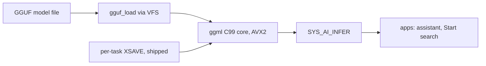

<!-- docs: covers=todo/18-future-research/TODO-05-ai-ml-runtime.md sources=Makefile,src/kernel/cpuid.c,src/kernel/gfx/gfx_simd_avx512.c,src/kernel/sched/task.c,include/kernel/sched/task.h,src/kernel/mm/memops_avx512.c,src/kernel/gfx/gfx_simd.c reviewed=2026-09-30 order=5 -->
# AI and ML Native Inference Runtime

## What is it?

This research spike asks whether Impossible OS can run machine-learning models, such as small language models and speech recognition, natively on the CPU without a Linux kernel underneath. It surveys runtimes (the `ggml` library, ONNX Runtime or a small custom one), the GGUF model format, a system call for background inference, and a later GPU backend. No inference code exists. Part of the CPU groundwork it depends on has shipped: the extended vector state is enabled and saved on every context switch, although per process rather than per thread.

## How does it work?

**Today.** Two things the spike's section 2 planned are partly in the kernel, delivered by the [x86-64 architecture roadmap](../kernel/x86-64-architecture.md):

- **Extended state is enabled.** `cpu_configure_xcr0()` in [`src/kernel/cpuid.c`](../../src/kernel/cpuid.c) sets XCR0 to include the AVX (YMM) state, and the AVX-512 opmask and ZMM states when the CPU has AVX-512F. Later in boot, `simd_enable_avx512()` in [`src/kernel/gfx/gfx_simd.c`](../../src/kernel/gfx/gfx_simd.c) measures whether AVX-512 work throttles the clock and, if it does, clears those AVX-512 bits from XCR0 again. The CPUID bit then still says AVX-512F while the state is off, so code choosing an AVX-512 path must test the active XCR0 (`g_cpu.xcr0_active`), not the CPUID bit.
- **Each process has one saved vector state.** `struct task` (the process) in [`include/kernel/sched/task.h`](../../include/kernel/sched/task.h) carries a single `xsave_area` next to its array of threads, allocated on first use: the first floating-point or SIMD instruction traps with `#NM`, and the handler in [`src/kernel/sched/task.c`](../../src/kernel/sched/task.c) allocates the area with `pmm_alloc_contiguous()`, loads a clean state and lets the instruction retry. If that allocation fails, the handler still marks the process as an FPU user but loads nothing, so the process runs on whatever register contents the previous process left and its own state is never saved; making that path fail closed is filed with the per-thread work below. On a context switch the outgoing process's state is saved with `XSAVEOPT` (or `XSAVE`) when it has used the FPU. Because the area belongs to the process, two threads of one process share it, so a multithreaded SIMD workload (which an inference thread pool is) can resume with a sibling thread's registers. Moving the area to `struct thread` is owned by [section 16 of the scheduler roadmap](../../todo/03-memory-concurrency/TODO-06-scheduler-enhancement.md#16-move-xsave--fpu-state-ownership-from-struct-task-to-struct-thread).

The spike's premise that kernel code never uses AVX is out of date: the kernel's memory copy has AVX2 and AVX-512 variants selected at run time ([`src/kernel/mm/memops_avx512.c`](../../src/kernel/mm/memops_avx512.c)), and the graphics blitters in [`src/kernel/gfx/gfx_simd.c`](../../src/kernel/gfx/gfx_simd.c) use SSE2 and AVX2. Those modules are compiled separately, with the vector flags the rest of the kernel turns off.

**Planned.** Seven research sections:

1. A runtime survey: `ggml` against ONNX Runtime against a custom runtime of about 5,000 lines, recommending the custom one first.
2. User-mode SIMD: an XCR0 mask, a per-thread XSAVE area exposed in the TEB, and an AVX2 benchmark.
3. A port of the `ggml` C99 core: its POSIX dependencies mapped to kernel services, a thread pool, AVX2 kernels.
4. GGUF model loading through the VFS, quantization formats, large allocations and a model cache.
5. OS integration: `SYS_AI_INFER`, `SYS_AI_MODEL_LOAD` and `SYS_AI_MODEL_UNLOAD`, an assistant app and semantic Start-menu search.
6. GPU inference through the `ggml` Vulkan backend, which waits on the [GPU compositor research](gpu-compositor.md).
7. A plan document and a QEMU prototype that produces one token from a small model.

## What are its interfaces?

None of the spike's interfaces exist: no `gguf_load()`, no `SYS_AI_*` calls, no `HKLM\SYSTEM\AI` settings and no `ai_assistant.exe`. The roadmap numbers the calls 95 to 97; system services are numbered through the SSDT, so real numbers would be assigned there. The shipped groundwork is `cpu_configure_xcr0()`, `task_alloc_xsave()` and the CPU feature bits `CPU_FEATURE_AVX2` and `CPU_FEATURE_XSAVEOPT` in `include/kernel/cpuid.h`.

## How do I use it?

There is nothing to run. The boot log's `cpu` lines report which vector extensions the processor offers, which is the first thing any of this work would check.

## What is not implemented yet?

- [Inference Runtime Options Survey](../../todo/18-future-research/TODO-05-ai-ml-runtime.md#1-inference-runtime-options-survey-sonnet)
- [SIMD Enablement for User Mode](../../todo/18-future-research/TODO-05-ai-ml-runtime.md#2-simd-enablement-for-user-mode-opus): XCR0 and per-process XSAVE with XSAVEOPT ship; per-thread save areas, the TEB field and the benchmark do not.
- [ggml C99 Kernel Port](../../todo/18-future-research/TODO-05-ai-ml-runtime.md#3-ggml-c99-kernel-port-opus)
- [GGUF Model Format and Loading](../../todo/18-future-research/TODO-05-ai-ml-runtime.md#4-gguf-model-format--loading-sonnet)
- [OS Integration Points](../../todo/18-future-research/TODO-05-ai-ml-runtime.md#5-os-integration-points-sys_ai_infer--apps-sonnet)
- [GPU Inference Research (Stretch)](../../todo/18-future-research/TODO-05-ai-ml-runtime.md#6-gpu-inference-research-stretch-sonnet)
- [Research Deliverables](../../todo/18-future-research/TODO-05-ai-ml-runtime.md#7-research-deliverables-sonnet)

Building inference apps also needs a C compiler in the SDK, which the [compiler SDK roadmap](../../todo/10-platform-services/TODO-09-compiler-sdk.md) owns.

## How does it compare with Windows 11 and Linux?

Windows 11 runs on-device models through ONNX Runtime, DirectML and the NPU on Copilot+ PCs, and uses them for AI-assisted search; Linux runs `llama.cpp` and ONNX Runtime on the CPU or GPU but has no kernel-level inference interface. Both save vector state per thread automatically; Impossible OS saves it per process today, and per-thread saving is scheduler work that a threaded inference runtime would depend on. The spike's distinguishing idea is inference as a system call, which neither Windows nor Linux exposes at the kernel boundary (section 5).

## See also

- [AI and ML runtime research roadmap](../../todo/18-future-research/TODO-05-ai-ml-runtime.md)
- [x86-64 Architecture Features](../kernel/x86-64-architecture.md), where XSAVE and the AVX memory copy ship
- [CPU Boot Sequencing](../boot/cpu-boot-sequencing.md)
- [GPU-Accelerated Compositor](gpu-compositor.md)
