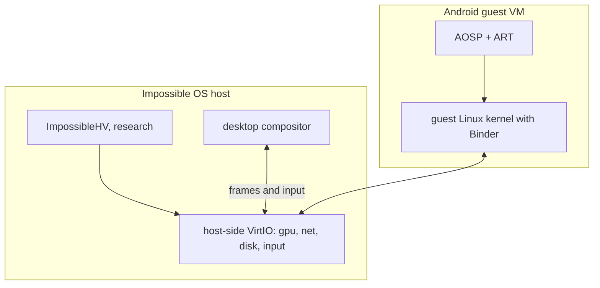

<!-- docs: covers=todo/18-future-research/TODO-06-android-app-compatibility.md sources=src/kernel/elf.c,include/kernel/elf.h,src/kernel/cpuid_platform.c,src/kernel/drivers/virtio reviewed=2026-09-30 order=6 -->
# Android App Compatibility (Research)

## What is it?

This research spike asks how Impossible OS could run Android apps (APK and AAB packages) without giving up its Win32-native design. Its working answer is to run a complete Android system as a guest in a virtual machine, as Windows Subsystem for Android and ChromeOS's ARCVM did, rather than porting Android's runtime into Win32. Nothing is built, and nothing can be until the hypervisor, GPU and ARM research underneath it progresses. There is no way to run an `.apk` on Impossible OS today.

## How does it work?

**Today.** None of Android's kernel interfaces exist: there is no Binder driver, no ashmem, no Zygote and nothing that reads Dalvik bytecode. The nearest shipped pieces are general-purpose:

- The kernel loads ELF programs with `elf_load()` in [`src/kernel/elf.c`](../../src/kernel/elf.c) (declared in [`include/kernel/elf.h`](../../include/kernel/elf.h)), but those programs call Impossible OS's own system calls; the Linux system call layer is still a plan, described in [Linux Compatibility Layer](../services/linux-compat.md).
- The VirtIO drivers in [`src/kernel/drivers/virtio/`](../../src/kernel/drivers/virtio/) are guest-side, for Impossible OS running inside a VM. An Android guest would need the host side.
- [`src/kernel/cpuid_platform.c`](../../src/kernel/cpuid_platform.c) detects which hypervisor Impossible OS runs under, but the kernel cannot yet host a guest of its own.

**Planned.** Eight research sections produce a plan document and, optionally, QEMU-only prototype notes:

1. A charter: goals, the minimum viable demo, non-goals, the security bar and exit criteria.
2. An options record. Option A, a full Android guest VM, is recommended first. Option B, a Waydroid-style container, would need Linux-like namespaces, cgroups, Binder and a Wayland peer. Option C, loading an APK's native libraries through a Win32 shim, is recorded as a dead end, because apps depend on ART, the Android framework and its permission model. Option D, remote streaming, is a fallback only.
3. Host kernel prerequisites: guest memory, the VirtIO device set, timers and networking.
4. The guest runtime: which AOSP branch, ART and `dex2oat`, update cadence and a guest kernel configuration.
5. Display, input and audio bridging into the desktop compositor.
6. ISA strategy: an ARM64 guest against an x86-64 AOSP build, and how NDK libraries are chosen.
7. Distribution: pure AOSP with sideloading, and why Google Mobile Services and Play Integrity stay out of reach.
8. Phased milestones with exit gates.

## What are its interfaces?

None exist. The plan's only concrete artifact is a document, `docs/architecture/android-app-compatibility-plan.md`, which has not been written. Its Unit Tests section plans a `scripts/verify-android-compat-plan.sh` check that the document has its required headings, and a skipped kernel test only once host-side launcher code exists.

## How do I use it?

There is nothing to run.

## What is not implemented yet?

Every section is open.

- [Research Charter and Success Criteria](../../todo/18-future-research/TODO-06-android-app-compatibility.md#1-research-charter-and-success-criteria-sonnet)
- [Architecture Options Record](../../todo/18-future-research/TODO-06-android-app-compatibility.md#2-architecture-options-record-sonnet)
- [Host Kernel Prerequisites](../../todo/18-future-research/TODO-06-android-app-compatibility.md#3-host-kernel-prerequisites-sonnet)
- [Guest Android Runtime Plan](../../todo/18-future-research/TODO-06-android-app-compatibility.md#4-guest-android-runtime-plan-sonnet)
- [Display and Input Bridging](../../todo/18-future-research/TODO-06-android-app-compatibility.md#5-display-and-input-bridging-sonnet)
- [ABI and ISA Strategy](../../todo/18-future-research/TODO-06-android-app-compatibility.md#6-abi-and-isa-strategy-sonnet)
- [Distribution and Ecosystem Stance](../../todo/18-future-research/TODO-06-android-app-compatibility.md#7-distribution-and-ecosystem-stance-sonnet)
- [Milestones, Exit Gates, and Deliverables](../../todo/18-future-research/TODO-06-android-app-compatibility.md#8-milestones-exit-gates-and-deliverables-sonnet)

Its prerequisites are themselves research: [the hypervisor](hypervisor.md) for Option A, [the GPU compositor](gpu-compositor.md) for a composited Android display, and [the ARM64 port study](multi-arch-port.md) for an ARM64 guest.

## How does it compare with Windows 11 and Linux?

Windows 11 ran Android apps through Windows Subsystem for Android, a Hyper-V guest with the Amazon Appstore, until Microsoft deprecated it in 2025; emulators remain. Linux runs Android userspace in containers with Waydroid and Anbox-class tools, while ChromeOS moved from containers to ARCVM virtual machines for isolation. Neither offers certified Google Play outside Google's own devices. Impossible OS has no Android path; the spike recommends the VM route with a clear security boundary and no commitment to Google Mobile Services (sections 2 and 7).

## See also

- [Android app compatibility research roadmap](../../todo/18-future-research/TODO-06-android-app-compatibility.md)
- [Linux Compatibility Layer](../services/linux-compat.md)
- [Hypervisor Abstraction and Guest Support](../hardware/hypervisor-abstraction.md)
- [Type-1 Hypervisor (ImpossibleHV)](hypervisor.md)
