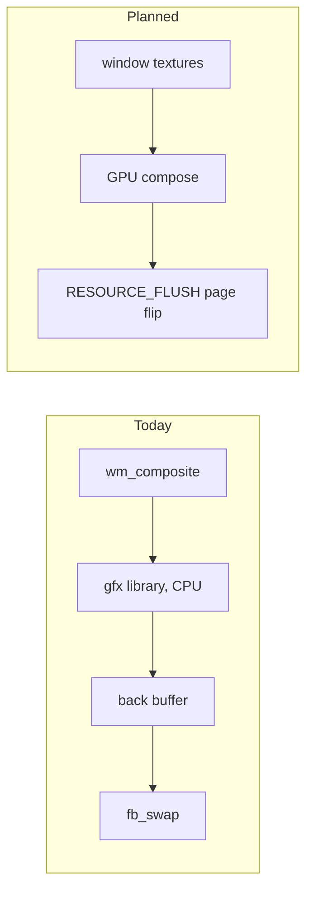

<!-- docs: covers=todo/18-future-research/TODO-03-gpu-compositor.md sources=src/desktop/wm.c,include/desktop/wm.h,src/kernel/main/compositor.c,include/kernel/drivers/framebuffer.h,src/kernel/drivers/framebuffer.c,src/kernel/gfx reviewed=2026-09-30 order=3 -->
# GPU-Accelerated Compositor

## What is it?

This research spike chooses how the desktop compositor should move from the CPU to a GPU, with a 4K desktop at 120 Hz as the target. It weighs a VirtIO-GPU driver against native AMD and Intel drivers, studies a CPU Vulkan path through Mesa, and sketches a kernel GPU memory and fence interface. Nothing from it is built. The compositor that ships today draws every frame on the CPU.

## How does it work?

**Today.** `compositor_run()` in [`src/kernel/main/compositor.c`](../../src/kernel/main/compositor.c) is the kernel's first task. When something on screen changes it calls `wm_composite()` in [`src/desktop/wm.c`](../../src/desktop/wm.c), which repaints the whole scene into a back buffer with the software graphics library in [`src/kernel/gfx/`](../../src/kernel/gfx/) (blending, blur, gradients and SIMD blits). The frame reaches the screen through `fb_swap()` or `fb_swap_rect()` from [`include/kernel/drivers/framebuffer.h`](../../include/kernel/drivers/framebuffer.h). Window bodies are filled with a solid colour, and an active title bar uses a Mica tint computed once from the wallpaper and cached per window (`mica_color`). There is no per-frame blur to save: `wm.c` allocates an `acrylic_cache` buffer (declared in [`include/desktop/wm.h`](../../include/desktop/wm.h)) for dialog windows, but nothing fills or draws it yet, which is filed in the window manager roadmap.

There is exactly one display output. `fb_get_output_count()` in [`src/kernel/drivers/framebuffer.c`](../../src/kernel/drivers/framebuffer.c) returns 1, because the firmware GOP framebuffer and the Bochs adapter each expose a single scanout; its comment names a virtio-gpu multi-output driver as the thing that will change that. No virtio-gpu driver exists in the tree.

**Planned.** Six sections:

1. Compare three routes: VirtIO-GPU (recommended first: about 2,000 lines, no IOMMU needed because the hypervisor is the DMA boundary), native AMD and Intel drivers (12 to 18 months or more), and a DRM/KMS-style layer.
2. Plan the software 3D path: keep TinyGL now, then Mesa softpipe, then lavapipe (CPU Vulkan).
3. Survey the AMD DCN and Intel Arc display engines, documentation only.
4. Design `src/kernel/gpu/` behind an `ENABLE_GPU` flag: GPU buffer allocation, command submission, fences and four system calls.
5. Design the GPU compositor: every window becomes a texture, a CPU fallback stays, and a `display_plane_ops_t` table abstracts scanout planes.
6. Produce the plan and a VirtIO-GPU spike that draws a rectangle in QEMU.

## What are its interfaces?

The shipped ones are the CPU path's: `wm_composite()`, `fb_swap()`, `fb_swap_rect()`, `fb_get_backbuffer()` and `fb_get_output_count()`. The planned ones are `gpu_alloc()` and `gpu_buf_t`, the `SYS_GPU_MAP`, `SYS_GPU_SUBMIT`, `SYS_GPU_WAIT` and `SYS_GPU_QUERY` calls, a fence object, and `display_plane_ops_t` in `include/kernel/gpu/display.h`, all in sections 4 and 5. The roadmap numbers the four calls 90 to 93; system services are really numbered through the SSDT, so those numbers would be assigned there.

## How do I use it?

There is no GPU path to switch on. The CPU compositor runs on every boot; its frame timing and behaviour are described in [Compositor](../desktop/compositor.md).

## What is not implemented yet?

Every section is open.

- [GPU Access Strategy Options](../../todo/18-future-research/TODO-03-gpu-compositor.md#1-gpu-access-strategy-options-sonnet)
- [TinyGL to Mesa lavapipe Upgrade Research](../../todo/18-future-research/TODO-03-gpu-compositor.md#2-tinygl--mesa-lavapipe-upgrade-research-sonnet)
- [Display Engine Research (AMD DCN + Intel Arc)](../../todo/18-future-research/TODO-03-gpu-compositor.md#3-display-engine-research-amd-dcn--intel-arc-sonnet)
- [Vulkan Kernel Driver Architecture](../../todo/18-future-research/TODO-03-gpu-compositor.md#4-vulkan-kernel-driver-architecture-opus)
- [Compositor GPU Path Design](../../todo/18-future-research/TODO-03-gpu-compositor.md#5-compositor-gpu-path-design-opus)
- [Research Deliverables](../../todo/18-future-research/TODO-03-gpu-compositor.md#6-research-deliverables-sonnet)

The VirtIO-GPU driver itself is also planned as a loadable module in [section 4 of the GPU and display drivers roadmap](../../todo/04-drivers-hardware/TODO-17-gpu-display-drivers.md#4-virtio-gpu-display-module-opus), behind a `display_device_t` table. This spike's `display_plane_ops_t` would be a second display abstraction for the same hardware; reconciling the two is filed in section 5 here, so the research builds on the driver plan rather than beside it. Native-GPU work also waits on an IOMMU driver, which [the hypervisor research](hypervisor.md) records as a prerequisite.

## How does it compare with Windows 11 and Linux?

Windows 11's Desktop Window Manager composites on the GPU through Direct3D and flips frames without a CPU copy, with WARP as its software rasterizer. Linux compositors such as Mutter and KWin use OpenGL or Vulkan over DRM atomic mode setting and page flips, with Mesa's lavapipe as CPU Vulkan. Impossible OS composites on the CPU today; sections 2, 4 and 5 plan softpipe and lavapipe, a GPU memory and fence interface, and a VirtIO-GPU page-flip path. The planned advantage is that the CPU compositor stays as the fallback, so the GPU path is purely additive.

## See also

- [GPU compositor research roadmap](../../todo/18-future-research/TODO-03-gpu-compositor.md)
- [Compositor](../desktop/compositor.md), the CPU compositor that ships today
- [GPU and Display Drivers](../hardware/gpu-display-drivers.md)
- [Type-1 Hypervisor (ImpossibleHV)](hypervisor.md), which owns the IOMMU analysis
