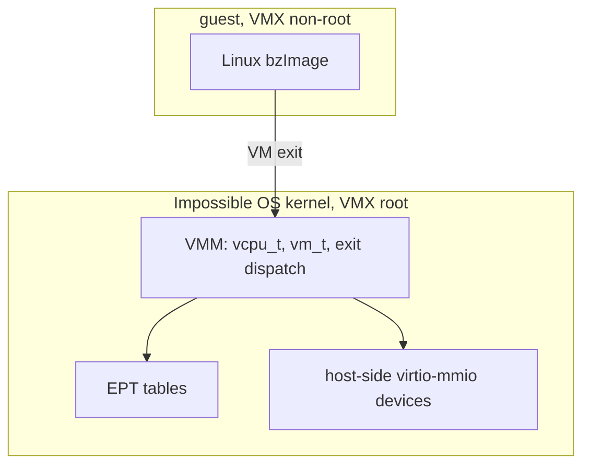

<!-- docs: covers=todo/18-future-research/TODO-02-hypervisor.md sources=src/kernel/cpuid.c,include/kernel/cpuid.h,src/kernel/cpuid_platform.c,include/kernel/msr.h,src/kernel/drivers/virtio reviewed=2026-09-30 order=2 -->
# Type-1 Hypervisor (ImpossibleHV)

## What is it?

ImpossibleHV is a research spike for a hypervisor built into the kernel, so Impossible OS could run Windows, Linux and other guests the way Linux runs them under KVM. The design is "Type-1.5": the host kernel itself runs in Intel VMX root mode (or AMD SVM host mode) and each guest runs in non-root mode, with no separate hypervisor binary. None of it is built. What exists today is the other direction: Impossible OS detecting and cooperating with a hypervisor it runs under.

## How does it work?

**Today.** The kernel already knows whether the CPU can host guests and whether it is a guest itself.

- [`src/kernel/cpuid.c`](../../src/kernel/cpuid.c) sets `CPU_FEATURE_VMX` (CPUID leaf 1, ECX bit 5) and `CPU_FEATURE_SVM` (leaf `0x80000001`, ECX bit 2), declared in [`include/kernel/cpuid.h`](../../include/kernel/cpuid.h). At boot it logs AMD-V details from leaf `0x8000000A` (revision, nested paging, ASID count) and, on Intel, reads `IA32_FEATURE_CONTROL` (MSR `0x3A`) through `msr_try_read()` from [`include/kernel/msr.h`](../../include/kernel/msr.h) to log whether VT-x is locked and enabled. Nothing ever executes `VMXON` or `VMRUN`.
- [`src/kernel/cpuid_platform.c`](../../src/kernel/cpuid_platform.c) checks the hypervisor-present bit and the vendor string at leaf `0x40000000` to tell bare metal from Hyper-V, VMware, VirtualBox and QEMU, and records Hyper-V enlightenments (TSC, APIC-frequency and TLB-flush hypercall support) in `hv_flags`.
- The drivers in [`src/kernel/drivers/virtio/`](../../src/kernel/drivers/virtio/) (block and input) are guest-side: they let Impossible OS use devices a host provides. A hypervisor needs the opposite, host-side device emulation, which is a separate code path.

**Planned.** Seven research sections, all behind a compile-time `ENABLE_HYPERVISOR` flag so a normal build carries no hypervisor code:

1. A VT-x and AMD-V gap analysis: feature detection, the VMCS fields and VM-exit reasons the design needs, and a dual-vendor strategy.
2. A minimal VMM design: `vmx_init()`, a VMCS region from `pmm_alloc_contiguous()`, `vcpu_t` and `vm_t`, and host state.
3. A proof of concept that boots a Linux `bzImage` guest with a 128 MiB EPT identity map and forwards its COM1 output.
4. Host-side virtio emulation (virtio-mmio, split rings, block and network).
5. Snapshot and live-migration research.
6. GPU passthrough research through VT-d or AMD-Vi, which concludes it is not feasible until an IOMMU driver, PCIe hot-plug and MSI-X remapping exist.
7. A design document, a guest matrix and a phased plan.

## What are its interfaces?

No hypervisor interface exists. The shipped pieces the spike builds on are `cpu_has(CPU_FEATURE_VMX)` and `cpu_has(CPU_FEATURE_SVM)`, `msr_try_read()`, `platform_detect()`, `pmm_alloc_contiguous()` and `vmm_map_page()`. The planned ones (`vmx_init()`, `vmcs_setup()`, `vmread` and `vmwrite` helpers, and the `HYPERVISOR=1` build flag) are named in sections 2 and 7.

## How do I use it?

There is nothing to run. To see what the CPU offers, boot the image and read the `cpu` lines in the serial log, for example `Intel VT-x: locked=yes, enabled=yes` on Intel or `AMD-V: rev 1, NPT=yes, ASIDs=...` on AMD. Under QEMU these lines appear only when the virtual CPU exposes VMX or SVM.

## What is not implemented yet?

Every section is open, and `src/kernel/hypervisor/` does not exist.

- [Intel VT-x / AMD-V Gap Analysis](../../todo/18-future-research/TODO-02-hypervisor.md#1-intel-vt-x--amd-v-gap-analysis-opus)
- [Minimal Hypervisor Design](../../todo/18-future-research/TODO-02-hypervisor.md#2-minimal-hypervisor-design-type-15-vmm-opus)
- [Minimal Linux Guest Proof-of-Concept](../../todo/18-future-research/TODO-02-hypervisor.md#3-minimal-linux-guest-proof-of-concept-opus)
- [virtio Device Emulation Design](../../todo/18-future-research/TODO-02-hypervisor.md#4-virtio-device-emulation-design-host-side-opus)
- [Snapshot and Live Migration Research](../../todo/18-future-research/TODO-02-hypervisor.md#5-snapshot--live-migration-research-opus)
- [GPU Passthrough Research](../../todo/18-future-research/TODO-02-hypervisor.md#6-gpu-passthrough-research-vt-d--amd-vi-sonnet)
- [Research Deliverables](../../todo/18-future-research/TODO-02-hypervisor.md#7-research-deliverables-sonnet)

The IOMMU driver that GPU passthrough needs has no owner yet; section 6 records it as a prerequisite, not a plan.

## How does it compare with Windows 11 and Linux?

Windows 11 ships Hyper-V, a Type-1 hypervisor that also underpins its virtualization-based security, with second-level address translation, synthetic VMBus devices, checkpoints, live migration and Discrete Device Assignment for GPUs. Linux ships KVM as a kernel module with EPT, relies on QEMU for virtio devices and snapshots, and passes GPUs through with VFIO and IOMMU groups. Impossible OS has none of these (sections 2 to 6). The planned difference is the build flag: without `ENABLE_HYPERVISOR` the kernel carries none of the code, and a later phase would run Impossible OS as its own guest.

## See also

- [Type-1 hypervisor research roadmap](../../todo/18-future-research/TODO-02-hypervisor.md)
- [Hypervisor Abstraction and Guest Support](../hardware/hypervisor-abstraction.md), the guest side that ships today
- [x86-64 Architecture Features](../kernel/x86-64-architecture.md)
- [Secure Boot, TPM 2.0 and Measured Boot research](secure-boot-tpm.md), whose virtual TPM is a companion to this work
