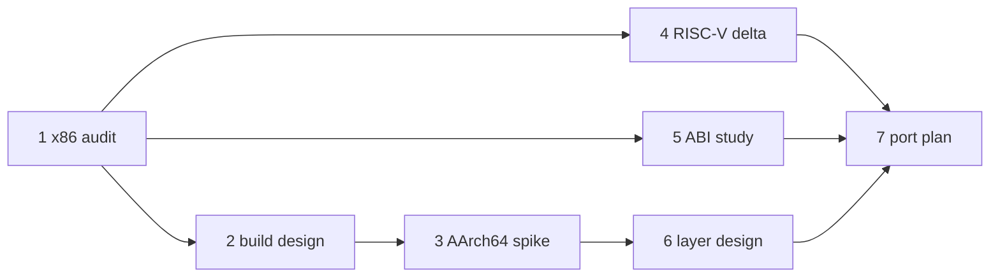

<!-- docs: covers=todo/18-future-research/TODO-01-multi-arch-port.md sources=Makefile,include/kernel/eif.h,include/kernel/cpu_security.h,src/kernel/mm/memops_sse.c,src/kernel/gfx/gfx_simd.c reviewed=2026-09-30 order=1 -->
# ARM64 and RISC-V Architecture Port

## What is it?

This is a research spike that scopes what porting Impossible OS to 64-bit ARM (AArch64) and RISC-V (RV64GC) would cost before anyone commits to it. It audits every x86-64-specific construct, prototypes a throwaway AArch64 kernel, compares calling conventions and produces an effort estimate. None of the research has been done. The implementation plan it would feed already exists as the [architecture ports](../ports/index.md) roadmaps.

## How does it work?

**Today.** The kernel is x86-64 only. The [`Makefile`](../../Makefile) compiles with `--target=x86_64-elf -mcmodel=kernel` and turns off MMX and SSE for kernel code. The spike's premise that SIMD is therefore confined to graphics does not hold: the same Makefile builds a separate SSE2 module with `-msse2`, used by [`src/kernel/mm/memops_sse.c`](../../src/kernel/mm/memops_sse.c) as well as [`src/kernel/gfx/gfx_simd.c`](../../src/kernel/gfx/gfx_simd.c), plus AVX2 and AVX-512 variants selected at run time. Section 1's audit has to count those memory-copy paths, not only the graphics ones.

Two small pieces already anticipate a second architecture. The EIF executable header in [`include/kernel/eif.h`](../../include/kernel/eif.h) defines `EIF_ARCH_X86_64` and `EIF_ARCH_AARCH64`, so a native binary already records which CPU it targets. And the user-copy helpers `copy_from_user` and `copy_to_user` live in [`include/kernel/cpu_security.h`](../../include/kernel/cpu_security.h), an x86-specific header that architecture-neutral code includes only to reach them; giving them a neutral home is the first item of section 1.

**Planned.** Seven sections, all research:

1. An x86-64 gap analysis: every `cli`, `rdmsr`, `invlpg`, `iretq`, port I/O and APIC access, mapped to its ARM64 and RISC-V equivalent, with a lines-of-code estimate (target: under 5% architecture-specific).
2. Multi-architecture build design: an `ARCH=` variable, per-architecture linker scripts and a CI job that builds every architecture.
3. A minimal AArch64 kernel on the QEMU `virt` machine that prints over the PL011 UART, kept on a throwaway branch.
4. A RISC-V gap analysis: privilege levels, OpenSBI, the PLIC and CLINT, and Sv48 paging.
5. ABI questions: Win64 against AAPCS64 and LP64D, PE machine type `0xAA64`, `va_list` and packed structures.
6. An AArch64 layer design: GIC operations table, PSCI processor bringup and the core refactors.
7. The deliverables: an x86 inventory, a port plan with effort estimates, and the spike's results.



## What are its interfaces?

It defines none. It is a study whose outputs are documents and a spike branch, not code on `main`.

## How do I use it?

There is nothing to run. To see how x86-specific the tree is today, the audit method in section 1 starts from a search like this:

```bash
rg -l 'rdmsr|wrmsr|invlpg|iretq|__asm__' src/kernel include/kernel
```

## What is not implemented yet?

No section has started, and the planned `docs/architecture/multi-arch-port-plan.md` does not exist.

- [x86-64 Gap Analysis](../../todo/18-future-research/TODO-01-multi-arch-port.md#1-x86-64-gap-analysis-opus)
- [Build System Multi-Arch](../../todo/18-future-research/TODO-01-multi-arch-port.md#2-build-system-multi-arch-sonnet)
- [AArch64 Boot Path (Minimal Kernel Prototype)](../../todo/18-future-research/TODO-01-multi-arch-port.md#3-aarch64-boot-path-minimal-kernel-prototype-opus)
- [RISC-V (RV64GC) Gap Analysis](../../todo/18-future-research/TODO-01-multi-arch-port.md#4-risc-v-rv64gc-gap-analysis-sonnet)
- [ABI Considerations](../../todo/18-future-research/TODO-01-multi-arch-port.md#5-abi-considerations-sonnet)
- [AArch64 Port Plan](../../todo/18-future-research/TODO-01-multi-arch-port.md#6-aarch64-port-plan-srcarcharm64-layer-design-opus)
- [Research Deliverables](../../todo/18-future-research/TODO-01-multi-arch-port.md#7-research-deliverables-sonnet)

The spike and the active ports roadmaps disagree on layout. This file proposes `src/arch/arm64/` and `ARCH=arm64`; the [abstraction layer](../ports/arch-abstraction-layer.md) plans `src/kernel/arch/aarch64/` and `ARCH=aarch64`. The active roadmap is the one to follow, and the spike's section 7 should adopt its names rather than a second scheme.

## How does it compare with Windows 11 and Linux?

Windows 11 ships natively on ARM64 and has announced RISC-V work; Linux supports ARM64 as a first-tier architecture and RISC-V in mainline, keeps per-architecture documentation under `Documentation/arch/`, and builds every architecture in CI. Impossible OS has none of these yet (sections 2 to 7). The spike's argument for doing it early is that the x86 code is still concentrated in a known set of files, which gets harder to say every month the tree grows.

## See also

- [ARM64 and RISC-V port research roadmap](../../todo/18-future-research/TODO-01-multi-arch-port.md)
- [Architecture Abstraction Layer](../ports/arch-abstraction-layer.md) and [AArch64 Kernel Port](../ports/aarch64-kernel-port.md)
- [x86-64 Architecture Features](../kernel/x86-64-architecture.md)
- [Android App Compatibility](android-app-compatibility.md), which depends on an ARM64 decision
