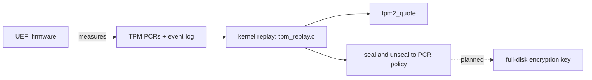

<!-- docs: covers=todo/18-future-research/TODO-04-secureboot-tpm.md sources=src/kernel/entropy.c,src/kernel/tpm_transport.c,src/kernel/tpm_replay.c,include/kernel/tpm_seal.h,src/kernel/tpm_attest.c,scripts/sign-efi.sh,scripts/test-swtpm.sh reviewed=2026-09-30 order=4 -->
# Secure Boot, TPM 2.0 and Measured Boot (Research)

## What is it?

This research spike scoped an enterprise security chain for Impossible OS: a self-owned UEFI Secure Boot key hierarchy, TPM 2.0 measured boot, full-disk encryption sealed to the TPM, a virtual TPM for hypervisor guests, and a remote-attestation story. It was written before the TPM work started. Much of what it asked for has since shipped under [TPM Measured Boot and Attestation](../boot/tpm-measured-boot.md) and the [Secure Boot hardening roadmap](../../todo/01-boot-platform/TODO-02-uefi-hardening-secureboot.md), so this page separates what is done elsewhere from what is still only research.

## How does it work?

**Shipped elsewhere.** The active boot-platform roadmaps own the working code:

- **TPM transport and entropy.** [`src/kernel/tpm_transport.c`](../../src/kernel/tpm_transport.c) talks to the TPM, and `entropy_collect_tpm()` in [`src/kernel/entropy.c`](../../src/kernel/entropy.c) pulls 64 bytes from `TPM2_GetRandom` once during boot, rejects stuck output, and feeds the kernel random generator. The spike's section 1 asked for a feed every 30 minutes; the boot-time feed ships and the periodic one does not.
- **Measured boot, by replay.** The firmware measures boot components into PCRs and writes an event log. The kernel reads the PCRs, replays the log with `tpm_pcr_extend()` in [`src/kernel/tpm_replay.c`](../../src/kernel/tpm_replay.c) (a software model of the TPM's extend, not a TPM command) and compares the results. Neither the loader nor the kernel extends a PCR itself today. The shipped PCR plan assigns the kernel ABI manifest, which identifies the system-call and structure interface, to PCR 11. That does not replace the spike's image measurements: hashing the kernel, each module and the first user process into PCRs 8 to 10 identifies the executables themselves, and none of it exists yet.
- **Sealing and quotes.** Secrets are sealed to a PCR policy, and [`include/kernel/tpm_seal.h`](../../include/kernel/tpm_seal.h) already declares `tpm_seal_fde_key()` and `tpm_unseal_fde_key()` as the hook a disk-encryption consumer would call. `tpm2_quote()` in [`src/kernel/tpm_attest.c`](../../src/kernel/tpm_attest.c) produces signed PCR quotes with an attestation key.
- **Secure Boot signing.** Boot binaries are signed for the shim and MOK path by [`scripts/sign-efi.sh`](../../scripts/sign-efi.sh); the procedure is in [Secure Boot Keys](../guides/secure-boot-keys.md).
- **Development TPM.** [`scripts/test-swtpm.sh`](../../scripts/test-swtpm.sh) boots QEMU with `swtpm` and a CRB TPM device and runs the security suite, which covers the spike's swtpm setup item.

**Still research.** Five pieces have no code: measuring the kernel, module and first-process images into PCRs (section 2), enrolling a self-generated Platform Key, Key Exchange Key and `db` (section 3), whole-disk AES-256-XTS encryption with a TPM-sealed volume key and an Argon2 recovery key (section 4), a per-guest virtual TPM for ImpossibleHV (section 5), and the planning document (section 6).



## What are its interfaces?

The shipped interfaces are documented on their owners' pages: [TPM Measured Boot and Attestation](../boot/tpm-measured-boot.md) for transport, replay, seal and quote, and [PCR Allocation](../boot/pcr-allocation.md) for which event lands in which PCR. The spike's own planned interfaces (`enroll-secureboot-keys.sh`, an `fde.c` block layer with `cng_aes256xts_*` helpers, `bitlocker.cpl`, `vtpm_t` and `attest.exe`) do not exist.

## How do I use it?

For the parts that ship, run the TPM suite against a software TPM:

```bash
bash scripts/test-swtpm.sh
```

It needs `swtpm` installed on the host. The research sections have nothing to run.

## What is not implemented yet?

- [TPM 2.0 CSPRNG Integration + swtpm Dev Setup](../../todo/18-future-research/TODO-04-secureboot-tpm.md#1-tpm-20-csprng-integration--swtpm-dev-setup-opus): the boot-time feed and swtpm testing ship; the periodic reseed and a separate `start-swtpm.sh` do not.
- [Measured Boot Chain (PCR 8 to 10 Extensions)](../../todo/18-future-research/TODO-04-secureboot-tpm.md#2-measured-boot-chain-pcr-810-extensions-opus): quotes ship under [section 13 of the TPM roadmap](../../todo/01-boot-platform/TODO-13-tpm-measured-boot-attestation.md#13-attestation-key-provisioning-and-tpm2-quote), but the image measurements are open. The loader's hash of the kernel image stays owned by this section, as the TPM roadmap's section 16 records; the kernel's own runtime measurement belongs to [Boot-Time Kernel Integrity Check in the security hardware roadmap](../../todo/04-drivers-hardware/TODO-04-security-hardware.md#7-boot-time-kernel-integrity-check-opus).
- [UEFI Secure Boot PK/KEK/db Key Hierarchy](../../todo/18-future-research/TODO-04-secureboot-tpm.md#3-uefi-secure-boot-pkkekdb-key-hierarchy-opus): not started; the shim path is [Secure Boot Shim Chain-Loading](../../todo/01-boot-platform/TODO-02-uefi-hardening-secureboot.md#6-secure-boot-shim-chain-loading).
- [AES-256-XTS Full Disk Encryption (FDE)](../../todo/18-future-research/TODO-04-secureboot-tpm.md#4-aes-256-xts-full-disk-encryption-fde-opus): not started beyond the sealing hook; per-file encryption is a separate plan in the IXFS roadmap.
- [vTPM for ImpossibleHV Guests](../../todo/18-future-research/TODO-04-secureboot-tpm.md#5-vtpm-for-impossiblehv-guests-sonnet): not started; it waits on [the hypervisor](hypervisor.md).
- [Research Deliverables](../../todo/18-future-research/TODO-04-secureboot-tpm.md#6-research-deliverables-sonnet): not started.

## How does it compare with Windows 11 and Linux?

Windows 11 requires Secure Boot and a TPM, seals BitLocker keys to PCRs, uses the TPM's generator, attests through its Health Attestation service and gives Hyper-V guests a virtual TPM. Linux chains through shim and MOK, measures with IMA, seals LUKS2 keys with `clevis`, attests with `tpm2-quote` and Keylime, and runs `swtpm` for guests. Impossible OS has the shim chain, replay-based measured boot, sealing and quotes; it lacks image measurement, enterprise key enrollment, disk encryption and a virtual TPM (sections 2 to 5).

## See also

- [Secure Boot, TPM and measured boot research roadmap](../../todo/18-future-research/TODO-04-secureboot-tpm.md)
- [TPM Measured Boot and Attestation](../boot/tpm-measured-boot.md) and [PCR Allocation](../boot/pcr-allocation.md)
- [Secure Boot Keys](../guides/secure-boot-keys.md)
- [Early Entropy and Random Seed](../boot/early-entropy-random-seed.md)
