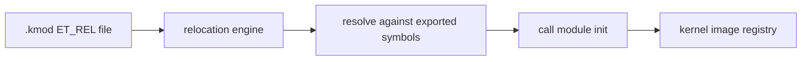

<!-- docs: covers=todo/12-user-platform-sdk/TODO-03-elf-reloc-kernel-modules.md sources=include/kernel/elf.h,src/kernel/elf.c,include/kernel/kimage.h reviewed=2026-09-29 order=3 -->
# ELF Relocations and Kernel Modules

## What is it?

This roadmap plans loadable code: an ELF relocation engine, a `.kmod` kernel module format with a loader, `EXPORT_SYMBOL` so modules can call the kernel, `dlopen()` and `dlsym()` for Linux programs, lazy binding through the GOT and PLT, module hot-swap, and the `lsmod`, `insmod`, `rmmod` and `modprobe` commands. None of it has shipped. The kernel image is linked as one static ELF file today, and a second roadmap already plans the same module loader under other names.

## How does it work?

**Today.** The ELF loader in [`elf.c`](../../src/kernel/elf.c) accepts executables (`ET_EXEC`) and position-independent executables (`ET_DYN`) and maps their program segments. It applies no relocations and has no dynamic linker, so a program must be fully linked before it runs. [`elf.h`](../../include/kernel/elf.h) defines the file and program headers, not the section, symbol and relocation records a relocatable object needs.

The kernel image registry already reserves an image type for modules: `KIMAGE_TYPE_KMOD` in [`kimage.h`](../../include/kernel/kimage.h), described as an ELF relocatable kernel module. Nothing produces or loads one yet.

**Planned design.**

1. **Relocation engine.** Parse section headers, the symbol table and `.rela` sections of an `ET_REL` object and apply the x86-64 relocation types a module needs.
2. **Module format and loader.** A `.kmod` is an `ET_REL` object carrying a `kmod_info` descriptor; the loader allocates the image with `pmm_alloc_contiguous()`, relocates it, resolves its imports and calls its init function.
3. **Symbol export.** An `EXPORT_SYMBOL` table in its own linker section that the loader searches by name.
4. **User-space dynamic loading.** `dlopen()`, `dlsym()` and lazy GOT and PLT binding for the Linux compatibility layer.
5. **Tooling.** Module hot-swap as a stretch goal, and shell commands to list, load and unload modules.



## What are its interfaces?

| Interface | Status |
| --- | --- |
| ELF loader for `ET_EXEC` and `ET_DYN` | Shipped, no relocations |
| `KIMAGE_TYPE_KMOD` image type | Shipped (reserved; unused) |
| `elf_apply_rela()` and the relocation engine | Planned in section 1 |
| `kmod_load()`, `kmod_unload()` | Planned in section 3 |
| `EXPORT_SYMBOL`, `ksym_lookup()` | Planned in section 4 |
| `dlopen()`, `dlsym()`, `dlclose()` | Planned in section 5 |
| `lsmod`, `insmod`, `rmmod`, `modprobe` | Planned in section 8 |

## How do I use it?

Nothing in this roadmap can be used yet. The ELF loader it builds on is covered by the executable tests:

```bash
bash scripts/test.sh SUITE=exec
```

## Who owns what?

The [Kernel Module System](../hardware/kernel-modules.md) roadmap (`04-drivers-hardware/TODO-05`) plans a kernel symbol table and `EXPORT_SYMBOL` in its section 1 and an ELF relocatable module loader in its section 4, using `module_load()`, `include/kernel/ksymtab.h` and a `.ksymtab` section. This file plans the same pieces as `kmod_load()`, `ksym_lookup()` and `src/kernel/kmod.c`. Only one design can ship, so a reconcile item is filed in [section 1](../../todo/12-user-platform-sdk/TODO-03-elf-reloc-kernel-modules.md#1-elf-relocation-engine-opus) here and in section 1 of that file; neither side has been chosen. The user-space half (sections 5 and 6) has no competing owner and belongs with the [Linux ELF Compatibility](../services/linux-compat.md) layer.

## What is not implemented yet?

- [ELF Relocation Engine](../../todo/12-user-platform-sdk/TODO-03-elf-reloc-kernel-modules.md#1-elf-relocation-engine-opus)
- [Kernel Module Format `.kmod`](../../todo/12-user-platform-sdk/TODO-03-elf-reloc-kernel-modules.md#2-kernel-module-format-kmod-sonnet)
- [Kernel Module Loader](../../todo/12-user-platform-sdk/TODO-03-elf-reloc-kernel-modules.md#3-kernel-module-loader-opus)
- [Kernel Symbol Export](../../todo/12-user-platform-sdk/TODO-03-elf-reloc-kernel-modules.md#4-kernel-symbol-export-export_symbol-opus)
- [`dlopen` and `dlsym` for Linux Compat](../../todo/12-user-platform-sdk/TODO-03-elf-reloc-kernel-modules.md#5-dlopen--dlsym-for-linux-compat-sonnet)
- [GOT and PLT Lazy Binding](../../todo/12-user-platform-sdk/TODO-03-elf-reloc-kernel-modules.md#6-got--plt-lazy-binding-opus)
- [Module Hot-Swap](../../todo/12-user-platform-sdk/TODO-03-elf-reloc-kernel-modules.md#7-module-hot-swap-stretch-sonnet)
- [Module Shell Commands](../../todo/12-user-platform-sdk/TODO-03-elf-reloc-kernel-modules.md#8-lsmod--insmod--rmmod--modprobe-shell-commands-sonnet)

## How does it compare with Windows 11 and Linux?

Windows loads drivers as PE `.sys` files and resolves them against the `ntoskrnl.exe` export table; it has no ELF path at all. Linux loads `.ko` files, which are `ET_REL` objects relocated by `arch/x86/kernel/module.c`, resolves them against `EXPORT_SYMBOL` and `kallsyms`, and manages them with `lsmod`, `insmod` and `modprobe`. The Impossible OS plan follows the Linux module model for native modules while the kernel image itself stays ELF permanently; PE drivers are a separate loader in the module system roadmap.

## See also

- [ELF Relocations and Kernel Module System roadmap](../../todo/12-user-platform-sdk/TODO-03-elf-reloc-kernel-modules.md)
- [Kernel Module System](../hardware/kernel-modules.md)
- [Kernel Image and Module Registry](../kernel/kernel-image-module-registry.md)
- [Binary Format System](../kernel/binary-format-system.md)
- [Linux ELF Compatibility](../services/linux-compat.md)
