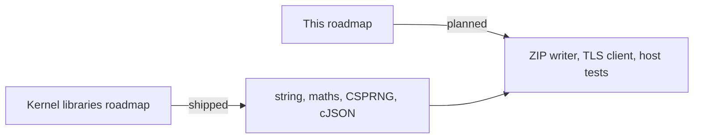

<!-- docs: covers=todo/12-user-platform-sdk/TODO-01-kernel-libraries.md sources=include/libc/string.h,src/libc/string.c,include/libc/math.h,include/kernel/csprng.h,src/kernel/csprng.c,include/kernel/json.h,src/kernel/test/test_klibs.c,Makefile reviewed=2026-09-29 order=1 -->
# Embedded Libraries for Developers

## What is it?

This roadmap is the developer-facing view of the third-party code compiled into Impossible OS: the freestanding string and maths library, miniz, Monocypher and the kernel random generator, cJSON, a Mbed TLS subset and the STB image and font headers. Most of what it lists has already shipped under the kernel libraries roadmap, [Kernel Embedded Libraries](../kernel/kernel-libraries.md), with different file names from the ones this file uses. What is still missing is a ZIP writer, a TLS client, one home for the STB headers and a host-side library test script.

## How does it work?

**Today.** The libraries are compiled into the kernel image:

- **Strings and formatting.** `snprintf()`, `vsnprintf()`, `memchr()`, `strrchr()` and the rest live in [`string.h`](../../include/libc/string.h) and [`string.c`](../../src/libc/string.c), under `src/libc/`, not the `src/libs/libc/` this roadmap names.
- **Maths.** `kmath_sin()`, `kmath_tan()`, `kmath_atan2()`, `kmath_asin()`, `kmath_exp()`, `kmath_log()`, `kmath_log2()`, `kmath_log10()`, `kmath_round()`, `kmath_trunc()` and `kmath_cbrt()` are in [`math.h`](../../include/libc/math.h). The older double helpers in `include/kernel/kmath.h` stay for the font rasterizer.
- **Random numbers.** `csprng_fill()` in [`csprng.h`](../../include/kernel/csprng.h) fills a buffer from the kernel generator in [`csprng.c`](../../src/kernel/csprng.c), which is built on the vendored Monocypher. User mode reaches it through the native call `NtGetRandom` (service `0x03D8`), not a `SYS_GETRANDOM` number.
- **JSON.** cJSON is vendored in `src/libs/cjson/`; kernel code uses the small wrapper in [`json.h`](../../include/kernel/json.h) (`json_int()`, `json_bool()`, `json_free()` and friends).
- **Images.** `stb_image.h`, `stb_image_write.h` and `stb_truetype.h` sit in `include/` and are instantiated once each in the image, image-save and font code; `image_save_png()` and `image_save_bmp()` write files.
- **Vendored but not built.** miniz and Mbed TLS are in `src/libs/`, but the [`Makefile`](../../Makefile) excludes both directories from the kernel build, so neither is linked today.

**Planned design.** Keep each library in one place, then add what developers still lack: a ZIP writer and streaming deflate on top of miniz, a TLS 1.2 client built from the Mbed TLS subset with a CA bundle, a single `src/libs/stb/` home, and `scripts/test-libs.sh` so the libraries can be tested on the host.



## What are its interfaces?

| Interface | Status |
| --- | --- |
| `snprintf()`, `vsnprintf()`, `memchr()`, `strrchr()` | Shipped in `src/libc/` |
| `kmath_*` float maths in `include/libc/math.h` | Shipped |
| `csprng_fill()`, `NtGetRandom` | Shipped |
| cJSON and the `json_*` wrapper | Shipped |
| `image_save_png()`, `image_save_bmp()` | Shipped |
| `zip_create()` and the other ZIP writer calls | Planned in section 3 |
| `tls_connect()`, CA bundle | Planned in section 6 |
| `scripts/test-libs.sh` | Planned in section 8 |

## How do I use it?

Kernel code includes the header and calls the function; there is nothing to link separately. The library tests run inside the kernel test runner:

```bash
bash scripts/test.sh SUITE=exec
```

The `klibs:` suites registered in [`test_klibs.c`](../../src/kernel/test/test_klibs.c) cover string edge cases, LZ4 round trips and the JSON wrapper, among others.

## Who owns what?

The kernel libraries roadmap, `02-kernel-core/TODO-03`, owns this ground. It shipped strings (its section 1), maths (2), Monocypher and the CSPRNG (5) and cJSON (6). miniz (4) and Mbed TLS (7) are vendored there with their ports deferred: miniz still needs a caller-owned workspace allocator before it can be compiled, and its first consumer is HTTP gzip decoding. This file's ZIP writer and TLS client depend on those ports. This file restates the owner's sections with other paths. That overlap is filed as a rescope item in this roadmap's [section 1](../../todo/12-user-platform-sdk/TODO-01-kernel-libraries.md#1-string-library-consolidation-sonnet), which keeps only the deltas.

## What is not implemented yet?

- [String Library Consolidation](../../todo/12-user-platform-sdk/TODO-01-kernel-libraries.md#1-string-library-consolidation-sonnet): `strcasestr()`, `itoa()` and `strtoull()` are not confirmed present
- [Math Library Extension](../../todo/12-user-platform-sdk/TODO-01-kernel-libraries.md#2-math-library-extension-sonnet): the functions shipped; the checklist is not yet closed against them
- [miniz ZIP Writer and Stream Extension](../../todo/12-user-platform-sdk/TODO-01-kernel-libraries.md#3-miniz-zip-writer--stream-extension-sonnet)
- [monocypher, CSPRNG and SYS_GETRANDOM](../../todo/12-user-platform-sdk/TODO-01-kernel-libraries.md#4-monocypher--csprng--sys_getrandom-opus): shipped as `NtGetRandom` under the kernel libraries roadmap
- [cJSON](../../todo/12-user-platform-sdk/TODO-01-kernel-libraries.md#5-cjson-sonnet): shipped; the roadmap's lowercase file names and `cJSON_InitHooks()` set-up do not match the tree
- [Mbed TLS Subset](../../todo/12-user-platform-sdk/TODO-01-kernel-libraries.md#6-mbed-tls-subset-opus)
- [STB Consolidation and stb_image_write](../../todo/12-user-platform-sdk/TODO-01-kernel-libraries.md#7-stb-consolidation--stb_image_write-sonnet)
- [Library Integration Tests and README](../../todo/12-user-platform-sdk/TODO-01-kernel-libraries.md#8-library-integration-tests--readme-sonnet)

## How does it compare with Windows 11 and Linux?

Windows builds its kernel against the MSVC runtime and ships deflate through LZNT1 and Cabinet.dll, random numbers through `BCryptGenRandom` and TLS through Schannel. Linux keeps its own `lib/string.c`, an in-tree zlib and `get_random_bytes()`, and leaves TLS to user space. Impossible OS takes the permissive upstreams directly (miniz, Monocypher, cJSON, Mbed TLS, STB) and exposes randomness through one native call. Unlike either, it has a JSON parser in the kernel for configuration and health reports.

## See also

- [Kernel Embedded Libraries roadmap](../../todo/12-user-platform-sdk/TODO-01-kernel-libraries.md)
- [Kernel Embedded Libraries](../kernel/kernel-libraries.md)
- [SSH Client](../apps/ssh-client.md), which uses Monocypher
- [System Updates and IPKG Packages](../services/updates-packages.md), which will use the ZIP writer
