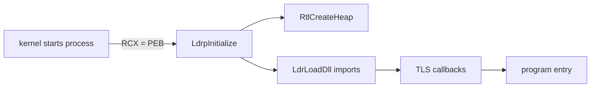

<!-- docs: covers=todo/12-user-platform-sdk/TODO-04-ntdll-user-runtime.md sources=include/kernel/ob/teb.h,include/kernel/ob/peb.h,src/kernel/pe.c,include/kernel/sched/task.h,src/kernel/sched/task.c,user/lib/crt0.asm,src/kernel/test/test_peb_teb.c reviewed=2026-09-29 order=4 -->
# NTDLL and the User-Mode Runtime

## What is it?

This roadmap plans `ntdll.dll`, the user-mode library every Windows program loads first: the process heap (`RtlAllocateHeap`), the DLL loader (`LdrLoadDll`), thread-local storage, vectored exception handling, process start-up, C library shims, fibers, local atom tables and the user side of the notification facility (WNF). `kernel32` calls such as `HeapAlloc()` and `LoadLibrary()` are meant to forward here. None of the ten sections has shipped, but the kernel already provides the structures and hand-off ntdll will build on.

## How does it work?

**Today: the kernel side.** Several pieces ntdll needs are already in place:

- **TEB and PEB.** The thread and process environment blocks are defined in [`teb.h`](../../include/kernel/ob/teb.h) and [`peb.h`](../../include/kernel/ob/peb.h) with their offsets pinned by static asserts. The TEB matches Windows x64 (`ProcessEnvironmentBlock` at `gs:[0x60]`, `LastErrorValue` at `gs:[0x68]`, 64 `TlsSlots` at `0x1480`), as do the PEB's `Ldr` at `0x18` and `ProcessParameters` at `0x20`. The PEB's version fields and TLS bitmap do not: they sit at the 32-bit offsets (`OSMajorVersion` at `0xA4` rather than `0x118`, `TlsBitmap` at `0x230`), a known defect deferred in the PEB roadmap's [section 17](../../todo/02-kernel-core/TODO-11-peb-teb-user-abi.md#17-peb-x64-version-field-offsets). The loader list types (`PEB_LDR_DATA`, `LDR_DATA_TABLE_ENTRY`) exist, but the loader data is still a placeholder.
- **TLS slots.** The kernel allocates slots per process with `tls_alloc(pid)` and `tls_free(pid, index)` ([`task.h`](../../include/kernel/sched/task.h)).
- **Start-up hand-off.** A new process's first thread starts with the PEB address in `RCX`, the Win64 first argument, where a future `LdrpInitialize` will read it ([`task.c`](../../src/kernel/sched/task.c)). Today's ELF [`crt0.asm`](../../user/lib/crt0.asm) ignores it. Threads created later with `uthread_create()` start with `RCX` zero and their argument in `RDI`.
- **Import binding.** The PE loader knows 96 `ntdll` export names and binds each import to its native service number through `pe_ntdll_export_ssdt()` ([`pe.c`](../../src/kernel/pe.c)). That is a lookup table, not a loaded DLL.

**Planned design.** A real `ntdll.dll` mapped into every process: a free-list process heap with coalescing, a recursive PE DLL loader that maintains the PEB loader list (the roadmap's draft adds a module to the list only after resolving its imports, so two DLLs importing each other would recurse without bound; section 3 now carries the in-progress marking, depth cap and unwinding), PE TLS callbacks on top of the kernel slots, a VEH list tried before frame-based SEH, a PE start-up routine that reads `ProcessParameters`, fibers switched by a small assembly routine, per-process atom tables and WNF publish and subscribe.



## What are its interfaces?

| Interface | Status |
| --- | --- |
| `TEB`, `PEB`, `PEB_LDR_DATA`, `LDR_DATA_TABLE_ENTRY` layouts | Shipped (kernel headers; PEB version fields at 32-bit offsets; loader data is a placeholder) |
| `tls_alloc()`, `tls_free()` | Shipped (kernel) |
| PEB in `RCX` at process entry | Shipped (later threads get `RCX` zero) |
| `pe_ntdll_export_ssdt()` and the 96-name import table | Shipped |
| `RtlCreateHeap()`, `RtlAllocateHeap()`, `RtlFreeHeap()` | Planned in section 2 |
| `LdrLoadDll()`, `LdrGetProcedureAddress()` | Planned in section 3 |
| `AddVectoredExceptionHandler()` | Planned in section 5 |
| `ConvertThreadToFiber()`, `SwitchToFiber()` | Planned in section 8 |
| `RtlCreateAtomTable()`, WNF subscribe and publish | Planned in sections 9 and 10 |

## How do I use it?

There is no `ntdll.dll` to load yet. The kernel structures it relies on are tested by the ABI suite:

```bash
bash scripts/test.sh SUITE=abi
```

The `PEB/TEB:` suites in [`test_peb_teb.c`](../../src/kernel/test/test_peb_teb.c) check every pinned offset and the TLS slot allocator.

## Who owns what?

The TEB and PEB layouts belong to the [PEB, TEB and the User-Mode ABI](../kernel/peb-teb-user-abi.md) roadmap, which shipped them; this file's sections 1 and 4 extend them and should not redefine them (the roadmap's own struct sketch omits `ClientId` and places `TlsBitmap` at `0x70`, which the real header does not). Ring-0 exception dispatch belongs to [Exception Dispatch and SEH](../kernel/exception-dispatch-seh.md); the ring-3 half (`KiUserExceptionDispatcher`, VEH and SEH walking) is this file's section 5. The kernel-side PE loader and export tables belong to the [Win32 PE Loader](../services/win32-pe-loader.md) and [Win32 API Surface](../services/win32-api-surface.md) roadmaps. Global atoms and kernel WNF belong to [Atom, NLS and Locale Subsystem](../kernel/atom-nls-locale.md) and [Kernel Notification Facility](../kernel/kernel-notification-facility.md).

## What is not implemented yet?

- [ntdll.dll Structure and TEB and PEB Extensions](../../todo/12-user-platform-sdk/TODO-04-ntdll-user-runtime.md#1-ntdlldll-structure--teb--peb-extensions-sonnet)
- [RtlHeap Process Heap Allocator](../../todo/12-user-platform-sdk/TODO-04-ntdll-user-runtime.md#2-rtlheap-process-heap-allocator-opus)
- [LdrLoadDll (PE DLL Loader)](../../todo/12-user-platform-sdk/TODO-04-ntdll-user-runtime.md#3-ldrloaddll-pe-dll-loader-opus)
- [Thread-Local Storage](../../todo/12-user-platform-sdk/TODO-04-ntdll-user-runtime.md#4-thread-local-storage-tls-sonnet): kernel slots exist; PE TLS callbacks do not
- [Vectored Exception Handling](../../todo/12-user-platform-sdk/TODO-04-ntdll-user-runtime.md#5-vectored-exception-handling-veh-opus)
- [Process Startup (CRT0)](../../todo/12-user-platform-sdk/TODO-04-ntdll-user-runtime.md#6-process-startup-crt0-sonnet)
- [User-Mode libc Shims](../../todo/12-user-platform-sdk/TODO-04-ntdll-user-runtime.md#7-user-mode-libc-shims-sonnet)
- [Fiber API](../../todo/12-user-platform-sdk/TODO-04-ntdll-user-runtime.md#8-fiber-api-opus)
- [Local Atom Tables](../../todo/12-user-platform-sdk/TODO-04-ntdll-user-runtime.md#9-local-atom-tables-rtlatomtable-sonnet)
- [WNF User Runtime](../../todo/12-user-platform-sdk/TODO-04-ntdll-user-runtime.md#10-wnf-user-runtime-rtlpublish--rtlsubscribe-sonnet)

## How does it compare with Windows 11 and Linux?

On Windows, `ntdll.dll` provides the low-fragmentation heap, the loader and its PEB list, TLS, vectored handlers and fibers, and every process loads it. Linux splits the same jobs between glibc (`malloc()`, `pthread_key_create()`, `makecontext()`), the dynamic linker `ld-linux.so` and signals. Impossible OS follows the Windows layout so unmodified PE programs find what they expect at the same offsets; the TEB and the first PEB fields already match, and the PEB's version fields and TLS bitmap must move to their x64 offsets before a Win64 program can read them.

## See also

- [NTDLL and User-Mode Runtime roadmap](../../todo/12-user-platform-sdk/TODO-04-ntdll-user-runtime.md)
- [PEB, TEB and the User-Mode ABI](../kernel/peb-teb-user-abi.md)
- [Win32 PE Loader](../services/win32-pe-loader.md)
- [Exception Dispatch and SEH](../kernel/exception-dispatch-seh.md)
- [Native API and the SSDT](../kernel/native-api-ssdt.md)
