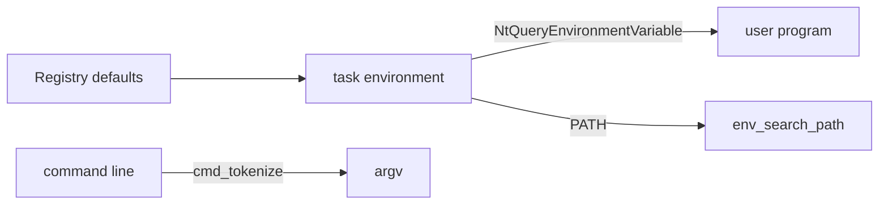

<!-- docs: covers=todo/12-user-platform-sdk/TODO-02-env-vars-process-abi.md sources=include/kernel/env.h,src/kernel/env.c,include/kernel/env_searchpath.h,src/kernel/nt/nt_env.c,include/kernel/nt/service_numbers.h,user/include/stdlib.h,user/lib/stdlib.c,user/cmd.c reviewed=2026-09-29 order=2 -->
# Environment Variables and Process ABI for Developers

## What is it?

This roadmap is the developer contract for a process's environment and command line: how variables are stored and read, how `%VAR%` and `%1` to `%9` expand, how `PATH` finds a command, how a command line becomes `argv`, and which shell commands show and change variables. The kernel side has largely shipped under the kernel's [Environment Variables](../kernel/environment-variables.md) roadmap. What this file still adds is path-template expansion, a shell command cache, a `.profile` start-up script and the `set`, `env` and `where` commands.

## How does it work?

**Today.** Each task owns a private environment in the kernel:

- **Storage.** [`env.h`](../../include/kernel/env.h) provides `env_get_copy()`, `env_set()`, `env_unset()`, `env_copy()` and `env_free()`. There is deliberately no public `env_get()` returning a pointer, because a pointer into another task's block could change under the caller; callers get a copy.
- **Defaults and expansion.** `env_init_defaults()` seeds a new task from the Registry, and `env_expand()` expands `%VAR%` with a depth and size budget.
- **Native calls.** User mode reads and writes variables through `NtQueryEnvironmentVariable` (`0x03DD`) and `NtSetEnvironmentVariable` (`0x03DE`), listed in [`service_numbers.h`](../../include/kernel/nt/service_numbers.h) and registered by [`nt_env.c`](../../src/kernel/nt/nt_env.c). There are no `SYS_GETENV` or `SYS_SETENV` numbers.
- **Search path.** `env_search_path()` and the `SearchPathW`/`SearchPathA` entry points in [`env_searchpath.h`](../../include/kernel/env_searchpath.h) resolve a file name against a search path; `PATHEXT` extension ordering lives in `env.c`.
- **Command lines.** The kernel has `CommandLineToArgvW()` with the Windows quoting rules. In user mode, [`cmd_tokenize()`](../../user/include/stdlib.h) in [`stdlib.c`](../../user/lib/stdlib.c) splits a line in place using the same rules, and the shell, [`cmd.c`](../../user/cmd.c), uses it for every command.

**Planned design.** On top of that: `env_expand_path()` for `%1` to `%9` file-association templates, an eight-entry command lookup cache in the shell, a `.profile` script run at shell start, and the `set`, `env` and `where` commands.



## What are its interfaces?

| Interface | Status |
| --- | --- |
| `env_get_copy()`, `env_set()`, `env_unset()`, `env_copy()`, `env_free()` | Shipped (kernel) |
| `env_expand()`, `env_init_defaults()` | Shipped (kernel) |
| `NtQueryEnvironmentVariable`, `NtSetEnvironmentVariable` | Shipped |
| `SearchPathW()`, `SearchPathA()`, `CommandLineToArgvW()` | Shipped (kernel) |
| `cmd_tokenize(char *line, char **argv, int max_argc)` | Shipped (user libc); the roadmap's `const char *` signature differs |
| `env_expand_path()` | Planned in section 3 |
| Shell command cache, `.profile`, `set`, `env`, `where` | Planned in sections 5, 7 and 8 |

## How do I use it?

Run the environment tests in the kernel runner:

```bash
bash scripts/test.sh SUITE=abi
```

In the shell, `echo` works today; it does not expand `%VAR%` yet, and `set`, `env` and `where` are not built-in commands.

## Who owns what?

`02-kernel-core/TODO-22` owns and shipped storage, defaults, expansion, the native calls, the search path and `CommandLineToArgvW()`. This file restates much of that with names the kernel did not adopt (`env_get()`, `SYS_GETENV`, `src/desktop/terminal.c`). A rescope item in [section 1](../../todo/12-user-platform-sdk/TODO-02-env-vars-process-abi.md#1-per-process-environ-storage-sdk-contract-sonnet) keeps only the parts no other roadmap covers. The initial user stack that carries `argc`, `argv` and `envp` belongs to the [PEB, TEB and the User-Mode ABI](../kernel/peb-teb-user-abi.md) roadmap.

## What is not implemented yet?

- [Per-Process Environ Storage (SDK Contract)](../../todo/12-user-platform-sdk/TODO-02-env-vars-process-abi.md#1-per-process-environ-storage-sdk-contract-sonnet): shipped in the kernel under different names
- [System Default Variables](../../todo/12-user-platform-sdk/TODO-02-env-vars-process-abi.md#2-system-default-variables-sonnet): shipped as `env_init_defaults()`
- [`%VAR%` Expansion and `env_expand_path`](../../todo/12-user-platform-sdk/TODO-02-env-vars-process-abi.md#3-var-expansion--env_expand_path-sonnet): `env_expand_path()` does not exist
- [SYS_GETENV, SYS_SETENV, SYS_UNSETENV](../../todo/12-user-platform-sdk/TODO-02-env-vars-process-abi.md#4-sys_getenv--sys_setenv--sys_unsetenv-sonnet): shipped as `Nt` calls
- [PATH-Based Command Lookup and Session Cache](../../todo/12-user-platform-sdk/TODO-02-env-vars-process-abi.md#5-path-based-command-lookup--session-cache-sonnet): the cache and shell lookup are missing
- [argv and argc Process ABI and `cmd_tokenize`](../../todo/12-user-platform-sdk/TODO-02-env-vars-process-abi.md#6-argv--argc-process-abi--cmd_tokenize-sonnet)
- [Shell `.profile` Startup Script](../../todo/12-user-platform-sdk/TODO-02-env-vars-process-abi.md#7-shell-profile-startup-script-sonnet)
- [`set`, `echo`, `env` and `where` Shell Commands](../../todo/12-user-platform-sdk/TODO-02-env-vars-process-abi.md#8-set--echo--env--where-shell-commands-sonnet)

## How does it compare with Windows 11 and Linux?

Windows keeps the environment as a UTF-16 block behind `PEB->ProcessParameters`, seeds it from two Registry hives, expands `%VAR%` with `ExpandEnvironmentStrings()` and splits command lines with `CommandLineToArgvW()`. Linux passes `envp[]` to `execve()`, seeds from `/etc/environment` and `~/.profile`, and leaves expansion to the shell. Impossible OS follows the Windows model, including the dual-hive defaults and the quoting rules, and adds a copy-only kernel API so no caller can hold a pointer into a block that may change.

## See also

- [Environment Variables and Process ABI roadmap](../../todo/12-user-platform-sdk/TODO-02-env-vars-process-abi.md)
- [Environment Variables](../kernel/environment-variables.md)
- [PEB, TEB and the User-Mode ABI](../kernel/peb-teb-user-abi.md)
- [Native API and the SSDT](../kernel/native-api-ssdt.md)
