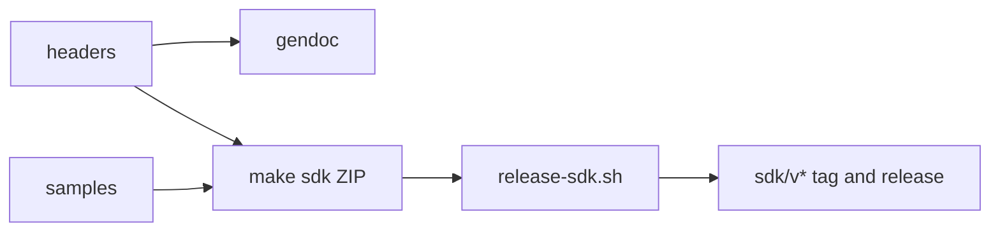

<!-- docs: covers=todo/12-user-platform-sdk/TODO-06-sdk-distribution.md sources=sdk/README.md,sdk/build.sh,sdk/include/impossible/windows.h,sdk/examples/hello.c,sdk/docs/api-reference.md,include/kernel/version.h reviewed=2026-09-29 order=6 -->
# SDK Distribution and Developer Experience

## What is it?

This roadmap plans how developers get and use the Impossible OS SDK: a `make sdk` ZIP with a SHA-256 checksum, API documentation generated from the headers, seven code samples, a sampling profiler, a small unit test framework (`itest.h`), debugger improvements, an `ixui-new` project template and a release pipeline that tags and publishes SDK versions. None of the eight sections has shipped. Today the `sdk/` folder holds one header, one example, a hand-written API reference and the host tools build.

## How does it work?

**Today.** The [`sdk/`](../../sdk/README.md) folder contains:

- **One header.** [`impossible/windows.h`](../../sdk/include/impossible/windows.h) declares the Win32 file API (`CreateFile()`, `WriteFile()`, `CloseHandle()` and related calls). There is no `impossible.h`, `ixui.h` or `itest.h`.
- **One example.** [`hello.c`](../../sdk/examples/hello.c), the program the README's quick start shows.
- **A reference page.** [`api-reference.md`](../../sdk/docs/api-reference.md), written by hand.
- **An empty library folder.** `sdk/lib/` holds only a placeholder, so the `-limpossible` in the README's build line has nothing to link against.
- **Host tools.** [`sdk/build.sh`](../../sdk/build.sh) builds every tool under `sdk/src/` that has a Makefile (today the IXFS mount tool) into `sdk/tools/`, and ends with `=== SDK BUILD OK ===`.

None of the roadmap's scripts or tools exist: no `make sdk`, `make docs` or `make sdk-upload` target, no `scripts/sdk-package.sh`, `release-sdk.sh` or `bump-version.sh`, no `tools/gendoc.c`, and no `sdk/samples/`.

**Planned design.**

1. **Packaging.** `make sdk` collects headers, import libraries, documents and samples into one versioned ZIP with a checksum. The version comes from `VERSION_MAJOR`, `VERSION_MINOR` and `VERSION_PATCH` in [`version.h`](../../include/kernel/version.h).
2. **Documentation.** `gendoc` reads header comments and writes an API reference, which the documentation site will publish under `docs/sdk/api/`.
3. **Samples and templates.** Seven samples from console to GUI, and `ixui-new` to start a GUI project from them.
4. **Profiler, tests and debugger.** A 1000 Hz timer-driven sampling profiler, `itest.h` tests registered automatically through a linker section, and unwind-table stack traces in the debugger with a frame-pointer fallback.
5. **Release pipeline.** `release-sdk.sh` tags `sdk/v*`, builds and uploads the ZIP; the OS keeps an `sdk-info` record of the installed version.



## What are its interfaces?

| Interface | Status |
| --- | --- |
| `sdk/include/impossible/windows.h` | Declarations only |
| `sdk/examples/hello.c`, `sdk/docs/api-reference.md` | Shipped |
| `bash sdk/build.sh [clean]` (host tools) | Shipped |
| `make sdk`, `scripts/sdk-package.sh` | Planned in section 1 |
| `gendoc` | Planned in section 2 |
| `sdk/samples/` | Planned in section 3 |
| Profiler, `itest.h` | Planned in sections 4 and 5 |
| `ixui-new` | Planned in section 7 |
| `release-sdk.sh`, `sdk-info` | Planned in section 8 |

## How do I use it?

Build the host tools shipped in the SDK folder:

```bash
bash sdk/build.sh
```

To build a program for the OS today, follow the host build described in [Compiler and SDK](../services/compiler-sdk.md): add it to the kernel `Makefile`'s userland target and run `bash scripts/build.sh`. The README's standalone `clang-19` line does not link yet, because the library it names is missing.

## Who owns what?

- The [Compiler and SDK](../services/compiler-sdk.md) roadmap (`10-platform-services/TODO-09`) owns the headers, import libraries, the on-OS compiler, the SDK installer (its section 9) and the SDK documents (section 10). This file's sections 1 and 2 extend those; the two roadmaps both describe an SDK installer and ZIP.
- The [long-term features](../services/long-term-features.md) roadmap (`10-platform-services/TODO-12`) owns the user-mode debugger (its section 2) that section 6 extends.
- The SDK build system roadmap (`14-host-tools/TODO-01`) owns `sdk/build.sh`, which is documented in [Development Tooling](../infrastructure/development-tooling.md).
- The documentation site roadmap's section 24 publishes the generated reference per SDK tag.

## What is not implemented yet?

- [SDK Packaging](../../todo/12-user-platform-sdk/TODO-06-sdk-distribution.md#1-sdk-packaging-make-sdk-sonnet)
- [SDK Documentation](../../todo/12-user-platform-sdk/TODO-06-sdk-distribution.md#2-sdk-documentation-gendocc-sonnet)
- [Code Samples](../../todo/12-user-platform-sdk/TODO-06-sdk-distribution.md#3-code-samples-sonnet): the roadmap puts them in `sdk/samples/`; the existing example lives in `sdk/examples/`
- [Sampling Profiler](../../todo/12-user-platform-sdk/TODO-06-sdk-distribution.md#4-sampling-profiler-opus)
- [Unit Test Framework](../../todo/12-user-platform-sdk/TODO-06-sdk-distribution.md#5-unit-test-framework-itesth-sonnet)
- [Debugger Enhancements](../../todo/12-user-platform-sdk/TODO-06-sdk-distribution.md#6-debugger-enhancements-opus)
- [IxUI Starter Templates](../../todo/12-user-platform-sdk/TODO-06-sdk-distribution.md#7-ixui-starter-templates-ixui-new-sonnet)
- [SDK Release Pipeline](../../todo/12-user-platform-sdk/TODO-06-sdk-distribution.md#8-sdk-release-pipeline-sonnet)

## How does it compare with Windows 11 and Linux?

The Windows SDK is a multi-gigabyte installer or a WinGet package, with reference documentation on Microsoft Learn, profiling through ETW and VTune and debugging in WinDbg. Linux distributions install toolchains with `apt install build-essential` or its equivalent, document APIs with man pages and Doxygen, and profile with `perf`. The Impossible OS plan is a single small ZIP with its checksum, a reference generated from the same headers it ships, and a built-in profiler and test framework.

## See also

- [SDK Distribution and Developer Experience roadmap](../../todo/12-user-platform-sdk/TODO-06-sdk-distribution.md)
- [Compiler and SDK](../services/compiler-sdk.md)
- [Win32 API Surface](../services/win32-api-surface.md)
- [Development Tooling](../infrastructure/development-tooling.md)
