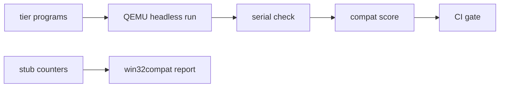

<!-- docs: covers=todo/12-user-platform-sdk/TODO-07-win32-compat-matrix.md sources=src/kernel/pe.c,include/kernel/sched/syscall.h,user/test/test_win32.c reviewed=2026-09-29 order=7 -->
# Win32 Compatibility Matrix and Bring-Up Ladder

## What is it?

This roadmap is how Impossible OS will measure Windows compatibility instead of claiming it: a per-DLL coverage tracker, a ladder of test tiers from "a program can exit" to full Win32 windows and eventually WinUI 3, counters that record which unimplemented functions real programs call, and a CI gate that fails a build when the score drops. It is tracking and test infrastructure only; the APIs themselves are implemented by other roadmaps. None of its thirteen sections has shipped.

## How does it work?

**Today.** There is no tracker, ladder or score. The nearest thing to a compatibility inventory is the PE loader's export tables in [`pe.c`](../../src/kernel/pe.c): 14 `kernel32` names and 96 `ntdll` names that an imported function can bind to. The user-mode Win32 test, [`test_win32.c`](../../user/test/test_win32.c), exercises the small Win32 shim in the user libc. The base "unimplemented function" logger this roadmap extends, `win32_unimpl_stub()`, is specified by the Win32 API surface roadmap but not written, and the `src/win32/` directory it lives in does not exist.

**Planned design.**

1. **Coverage tracker.** `sdk/docs/win32-compat.md` with one table per DLL (`kernel32`, `user32`, `gdi32`, `ntdll`, `advapi32`, `shell32`, `msvcrt`, `comdlg32`) and a status per function: implemented, stub, partial or missing. A host script, `tools/compat-scan.sh`, refreshes the status from the code.
2. **Stub counters.** Each stub call also increments a counter in a shared-memory map named `Win32CompatCounters`, created with `SYS_SHMEM_CREATE` ([`syscall.h`](../../include/kernel/sched/syscall.h)); `win32compat report` prints the 40 most-called missing functions.
3. **Bring-up ladder.** `sdk/compat/tier1/` to `tier8/`, each with small test programs and an expected serial line, run headless in QEMU by `run_tier.sh`.
4. **CI gate.** `make compat-check` runs the tiers, records a score in the Registry (`HKLM\SYSTEM\Win32Compat\Score`) and fails when any enabled tier fails; tiers whose API gate is not met are skipped.

The tiers, each gated on the API work beneath it:

| Tier | Target |
| --- | --- |
| 1 | Process exit only |
| 2 | Console input and output |
| 3 | File input and output |
| 4 | Processes and the Registry |
| 5 | Memory and synchronization |
| 6 | `MessageBox()` and basic GUI |
| 7 | Full Win32 windows and controls |
| 8 | Extended Win32 surface |
| 9 | WinRT, DirectX, WinUI 3 and Windows App SDK apps |



## What are its interfaces?

| Interface | Status |
| --- | --- |
| PE loader export tables (14 `kernel32`, 96 `ntdll`) | Shipped |
| `win32_unimpl_stub()` base logger | Planned in the Win32 API surface roadmap, section 9 |
| `sdk/docs/win32-compat.md`, `compat_stub()`, `win32compat.exe` | Planned in section 1 |
| `sdk/compat/` and `run_tier.sh` | Planned in section 2 |
| Tier programs 1 to 9 | Planned in sections 3 to 10 and 13 |
| `make compat-check`, `scripts/compat-check.sh` | Planned in section 12 |

## How do I use it?

Nothing in this roadmap runs yet. The current Win32 shim is tested with the user-mode test programs that the kernel test run launches:

```bash
bash scripts/test.sh
```

## Who owns what?

The functions each tier needs come from other roadmaps: the PE loader and ring-3 execution from the [Win32 PE Loader](../services/win32-pe-loader.md) roadmap, the exports and the base stub logger from the [Win32 API Surface](../services/win32-api-surface.md) roadmap, the runtime from [NTDLL and the User-Mode Runtime](ntdll-user-runtime.md), and windows and messages from the [Win32 Subsystem Server](win32-subsystem.md). This file owns only the measurement. Its gate references are loose in places: the Tier 2 gate is written as two different section pairs, and some "TODO-07" gates mean the PE loader roadmap (`10-platform-services/TODO-07`), not this file.

## What is not implemented yet?

- [API Coverage Tracker](../../todo/12-user-platform-sdk/TODO-07-win32-compat-matrix.md#1-api-coverage-tracker-sonnet)
- [Bring-Up Ladder Framework](../../todo/12-user-platform-sdk/TODO-07-win32-compat-matrix.md#2-bring-up-ladder-framework-sonnet)
- Tiers [1](../../todo/12-user-platform-sdk/TODO-07-win32-compat-matrix.md#3-tier-1----process-exit-only-sonnet), [2](../../todo/12-user-platform-sdk/TODO-07-win32-compat-matrix.md#4-tier-2----console-io-sonnet), [3](../../todo/12-user-platform-sdk/TODO-07-win32-compat-matrix.md#5-tier-3----file-io-sonnet), [4](../../todo/12-user-platform-sdk/TODO-07-win32-compat-matrix.md#6-tier-4----process--registry-sonnet), [5](../../todo/12-user-platform-sdk/TODO-07-win32-compat-matrix.md#7-tier-5----memory--sync-sonnet), [6](../../todo/12-user-platform-sdk/TODO-07-win32-compat-matrix.md#8-tier-6----messagebox--basic-gui-sonnet), [7](../../todo/12-user-platform-sdk/TODO-07-win32-compat-matrix.md#9-tier-7----full-win32-window--controls-sonnet), [8](../../todo/12-user-platform-sdk/TODO-07-win32-compat-matrix.md#10-tier-8----extended-win32-surface-sonnet) and [9](../../todo/12-user-platform-sdk/TODO-07-win32-compat-matrix.md#13-tier-9----winrt--directx--winui-3--windows-app-sdk-apps-opus)
- [Stub Call Log Analysis](../../todo/12-user-platform-sdk/TODO-07-win32-compat-matrix.md#11-stub-call-log-analysis-sonnet)
- [CI Compatibility Gate](../../todo/12-user-platform-sdk/TODO-07-win32-compat-matrix.md#12-ci-compatibility-gate-sonnet)

## How does it compare with Windows 11 and Linux?

Windows needs no ladder of its own; Microsoft tracks application compatibility privately and exposes stub calls through ETW and Application Verifier. On Linux, Wine publishes its AppDB and logs every call with `WINEDEBUG=+relay`, and ReactOS runs its own test bot. Impossible OS combines those ideas: a public, generated coverage table, a published ladder with explicit gates, and a CI gate that stops a failing tier from landing unnoticed.

## See also

- [Win32 Compatibility Matrix roadmap](../../todo/12-user-platform-sdk/TODO-07-win32-compat-matrix.md)
- [Win32 API Surface](../services/win32-api-surface.md)
- [Win32 PE Loader](../services/win32-pe-loader.md)
- [user32 Export Master Table](../services/user32-exports.md)
- [Release QA and Platform Certification](../release/release-qa.md)
