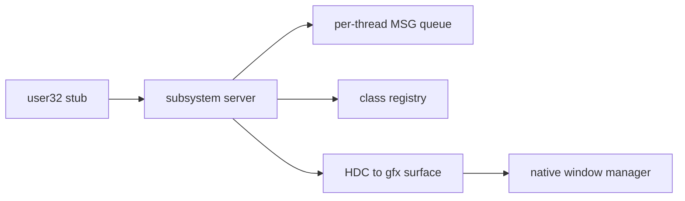

<!-- docs: covers=todo/12-user-platform-sdk/TODO-05-win32-subsystem.md sources=include/desktop/wm.h,include/desktop/controls.h,include/kernel/sched/syscall.h,include/kernel/ipc/alpc_port.h reviewed=2026-09-29 order=5 -->
# Win32 Subsystem Server

## What is it?

This roadmap plans the Win32 subsystem server, the Impossible OS counterpart of Windows `csrss.exe` and the window-manager half of `win32k`: per-thread message queues, a window class registry, window procedure dispatch with `DefWindowProc()`, the device-context painting model, accelerators, subclassing, cross-process messages, common dialogs and the Windows 11 visual opt-in calls such as `DwmSetWindowAttribute()`. It is the architecture that the planned `user32` and `gdi32` stubs delegate to. None of its nine sections has shipped.

## How does it work?

**Today.** The native desktop has its own window manager and controls, which the subsystem will wrap rather than replace:

- **Windows.** `wm_create_window()` in [`wm.h`](../../include/desktop/wm.h) creates a compositor window.
- **Controls.** [`controls.h`](../../include/desktop/controls.h) defines four control types: `CTRL_BUTTON`, `CTRL_LABEL`, `CTRL_TEXTBOX` and `CTRL_SCROLLBAR`. The list box and combo box the roadmap expects as built-in classes do not exist yet.
- **IPC.** Pipes (`SYS_PIPE`) and shared memory (`SYS_SHMEM_CREATE`, `SYS_SHMEM_MAP`) are in [`syscall.h`](../../include/kernel/sched/syscall.h), and ALPC ports are in [`alpc_port.h`](../../include/kernel/ipc/alpc_port.h).

There is no message queue, no `HWND` table, no class registry and no `RegisterClassExA()`, `DefWindowProc()` or `BeginPaint()` anywhere in the tree. The syscall numbers 60 to 77 this roadmap assigns to message calls are not defined.

**Planned design.**

1. **Architecture and queues.** A server thread, later a user-mode process, holds a 1000-entry `MSG` ring per thread; `GetMessage()` blocks on a wait call.
2. **Classes and dispatch.** 256 global and 64 per-process classes, built-in classes backed by the native controls, and `DefWindowProc()` for the standard messages.
3. **Painting.** An `HDC` maps to a `gfx_surface_t`; `InvalidateRect()` accumulates a dirty region and `BeginPaint()` clips to it.
4. **Filters, subclassing and properties.** Accelerator tables, message filters, `SetWindowLongPtr()` subclassing and `SetProp()`.
5. **Cross-process messages and dialogs.** `SendMessage()` and `WM_COPYDATA` across processes with a five-second timeout, then `ChooseColor()`, `ChooseFont()` and the file dialogs.
6. **Windows 11 opt-in.** `dwmapi` and `uxtheme` calls that map to the native renderer, and a personalization broadcast.

## What are its interfaces?

| Interface | Status |
| --- | --- |
| `wm_create_window()`, `CTRL_*` controls | Shipped (native desktop) |
| Pipes, shared memory, ALPC ports | Shipped (kernel) |
| `GetMessage()`, `PostMessage()`, `SendMessage()` and the message queue | Planned in section 1 |
| `RegisterClassExA()`, built-in classes | Planned in section 2 |
| `DefWindowProc()` | Planned in section 3 |
| `BeginPaint()`, `EndPaint()`, `InvalidateRect()` | Planned in section 4 |
| `ChooseColor()`, `ChooseFont()`, `GetOpenFileNameA()` | Planned in section 8 |
| `DwmSetWindowAttribute()` and `uxtheme` calls | Planned in section 9 |

## How do I use it?

Nothing in this roadmap can be called yet. Native desktop programs use the window manager and control calls directly; Win32 GUI programs have no path to the screen until the subsystem and the `user32` stubs land.

## Who owns what?

Several roadmaps meet here, and this file states that it does not re-specify the others:

- The `user32` and `gdi32` stubs are the [Win32 API Surface](../services/win32-api-surface.md) roadmap's sections 10 and 11, and the Win32 GDI and USER32 stubs roadmap (`08-graphics-ui/TODO-14`) owns the GDI object table in its section 2.
- The dialogs themselves are `08-graphics-ui/TODO-06` section 8; this file only adapts the Win32 structures.
- The [ALPC and Message Ports](../kernel/alpc-message-ports.md) roadmap's section 10 defines the CSRSS ApiPort bootstrap and places the server at `src/apps/csrss/csrss.c`, talking over ALPC. This file says `src/user/csrss/` over pipes and shared memory. That is filed as a reconcile item in [section 1](../../todo/12-user-platform-sdk/TODO-05-win32-subsystem.md#1-win32-subsystem-architecture--message-queue-opus).

## What is not implemented yet?

- [Win32 Subsystem Architecture and Message Queue](../../todo/12-user-platform-sdk/TODO-05-win32-subsystem.md#1-win32-subsystem-architecture--message-queue-opus)
- [Window Class Registry and Built-in Classes](../../todo/12-user-platform-sdk/TODO-05-win32-subsystem.md#2-window-class-registry--built-in-classes-sonnet)
- [WndProc Dispatch and DefWindowProc](../../todo/12-user-platform-sdk/TODO-05-win32-subsystem.md#3-wndproc-dispatch--defwindowproc-sonnet)
- [Win32 Painting Model](../../todo/12-user-platform-sdk/TODO-05-win32-subsystem.md#4-win32-painting-model-hdc--dirty-rect-opus)
- [Message Filters and Accelerator Tables](../../todo/12-user-platform-sdk/TODO-05-win32-subsystem.md#5-message-filters--accelerator-tables-sonnet)
- [Window Subclassing and Property Store](../../todo/12-user-platform-sdk/TODO-05-win32-subsystem.md#6-window-subclassing--property-store-sonnet)
- [Inter-Process Window Messaging](../../todo/12-user-platform-sdk/TODO-05-win32-subsystem.md#7-inter-process-window-messaging-opus)
- [Common Dialog Boxes](../../todo/12-user-platform-sdk/TODO-05-win32-subsystem.md#8-common-dialog-boxes-sonnet)
- [Win11 Visual Opt-In Surface](../../todo/12-user-platform-sdk/TODO-05-win32-subsystem.md#9-win11-visual-opt-in-surface-dwmapi-uxtheme-personalization-broadcast-opus)

## How does it compare with Windows 11 and Linux?

Windows keeps message queues, window classes and device contexts in `win32k.sys`, with `csrss.exe` handling console and process bookkeeping, and exposes Windows 11 styling through `DwmSetWindowAttribute()`. Linux has no single equivalent: X11 delivers expose events and Wayland delivers damage, and toolkits such as GTK and Qt supply classes and dispatch. Impossible OS plans the Windows programming model on top of its own compositor, so a Win32 program's `WM_PAINT` draws into the same surfaces native windows use and picks up the same theme.

## See also

- [Win32 Subsystem Server roadmap](../../todo/12-user-platform-sdk/TODO-05-win32-subsystem.md)
- [Win32 API Surface](../services/win32-api-surface.md)
- [user32 Export Master Table](../services/user32-exports.md)
- [ALPC and Message Ports](../kernel/alpc-message-ports.md)
- [Controls design spec](../design/controls.md)
